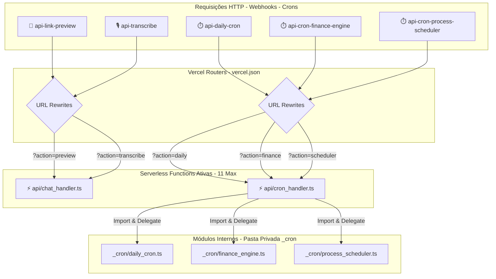
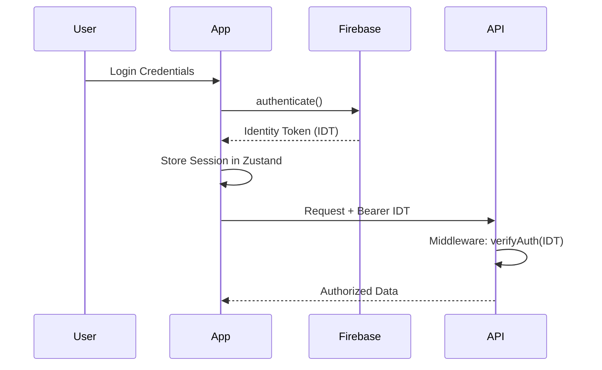
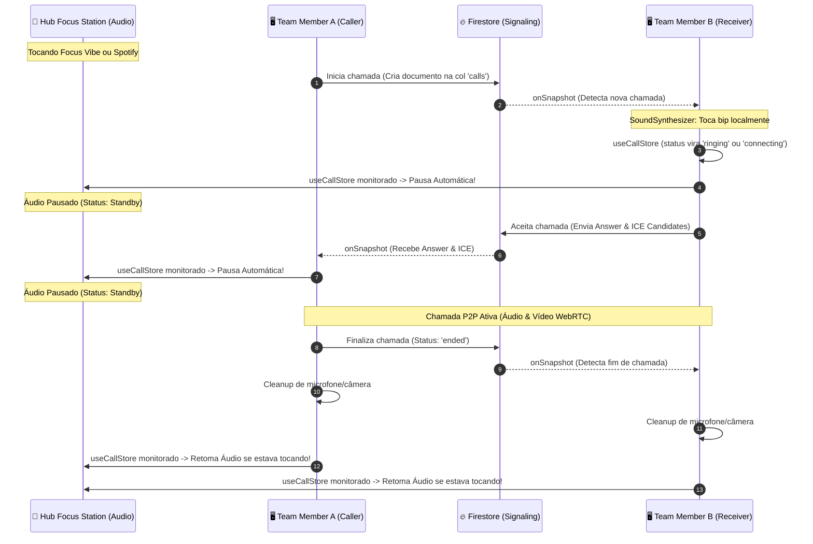

# <p align="center">🔐 HUB CENTRAL — INTELLIGENCE ECOSYSTEM</p>

<p align="center">
  
  
  
</p>

---

## 🏗️ Technical Architecture

O Hub Central utiliza uma arquitetura baseada em **Domain-Driven Design (DDD)** no Frontend e **Serverless Micro-services** no Backend, com uma camada de **Event-Driven Automation** para processos financeiros.

### 📚 Documentação Técnica Aprofundada
- **[Guia de Arquitetura & Padrões](docs/ARCHITECTURE.md)**: Detalhamento de DDD, Camadas e Regras de Engenharia.
- **[Referência de API & Webhooks](docs/API.md)**: Documentação completa dos endpoints e automações.


---

## 🌐 Ecossistema de APIs

O Hub Central integra-se com provedores líderes de mercado para garantir escalabilidade, inteligência e autonomia total.

### 💳 Financeiro & Pagamentos (Asaas)
- **Escopo:** Geração de boletos, cartões, faturamento recorrente e antecipação.
- **Automação:** O Hub processa webhooks do Asaas para atualizar status de faturas e liberar acessos instantaneamente.

### 🤖 Inteligência Artificial (Google Gemini)
- **Escopo:** Processamento de linguagem natural e análise inteligente de dados.
- **Integração:** Utilizado para geração de insights, resumos de atividades e assistente inteligente dentro do ecossistema.

### 📧 Comunicação & E-mail (Resend)
- **Escopo:** Transmissão de e-mails transacionais e de marketing.
- **Funcionalidades:** Disparo de boas-vindas, envio de faturas, convites de equipe, comunicados internos e alertas de aniversário com templates dinâmicos.

### 📚 Inteligência Bibliográfica (Open Library)
- **Escopo:** Utilizada pelo módulo **Nexus** para catalogação manual e automática.
- **Funcionalidade:** Fornece metadados de obras (autor, título, descrição) e busca de capas via `cover_id`, eliminando a dependência do Google Books.

### ☁️ Documentos & Media (Google Drive, Cloudflare R2, Cloudinary & ImgBB)
- **Google Drive:** Integração transparente para visualização de PDFs e manuais. O Hub transforma automaticamente links de compartilhamento em links de `preview` otimizados.
- **Cloudflare R2:** Provedor de armazenamento em nuvem S3-compatible utilizado para guardar arquivos pesados de PDFs e documentos da biblioteca, além de servir como repositório central de mídias de chat (áudios, imagens, PDFs e planilhas).
  > [!IMPORTANT]
  > **Configuração Obrigatória de CORS para R2:** Para que o visualizador de PDF inteligente (Premium Reader) consiga fazer o download dos arquivos via AJAX e renderizá-los com sincronia de progresso e controles avançados de zoom, você **deve** configurar a política de CORS no bucket correspondente no painel do Cloudflare R2.
  > 
  > Devido ao validador rígido de segurança do R2 (que rejeita o curinga `"*"` para origens gerais e o método `OPTIONS`), utilize as origens específicas do seu ambiente local e de produção:
  > ```json
  > [
  >   {
  >     "AllowedOrigins": [
  >       "http://localhost:3000",
  >       "http://localhost:5173",
  >       "https://hubsymples.com.br",
  >       "https://www.hubsymples.com.br",
  >       "https://app.hubsymples.com.br",
  >       "https://hubcrm.hubsymples.com.br"
  >     ],
  >     "AllowedMethods": [
  >       "GET",
  >       "HEAD",
  >       "PUT",
  >       "POST"
  >     ],
  >     "AllowedHeaders": [
  >       "*"
  >     ],
  >     "ExposeHeaders": [
  >       "Content-Length",
  >       "Content-Range",
  >       "Accept-Ranges"
  >     ],
  >     "MaxAgeSeconds": 3600
  >   }
  > ]
  > ```
  > 
  > 🧠 **Leitor Premium & Sincronização Estritamente Manual (Strict Manual Sync):** A fim de evitar qualquer tipo de sobregravação acidental e garantir autonomia total do usuário, a atualização automática de progresso foi desabilitada a partir da navegação do visualizador. O Nexus Premium Reader agora conta com sincronização estritamente manual: o progresso atualiza e salva de forma 100% confiável somente quando o usuário interage com o Companion ou altera ativamente os controles de página no painel do CRM. Os logs de atividade correspondentes são persistidos no Firestore sob uma regra de segurança robusta na subcoleção `activity_logs` (liberada explicitamente no `firestore.rules`), o que garante a perfeita exibição em tempo real do Heatmap de Atividades, Streak de Sabedoria e demais métricas de consistência no Dashboard, eliminando qualquer quebra ou bloqueio silencioso do banco. Para máxima precisão e foco de status, o Nexus removeu os estados intermediários obsoletos ("Quero Ler" e "Abandonados"). Livros cadastrados entram diretamente no status "Lendo Agora" (`reading`) e são automaticamente classificados como "Finalizados" (`finished`) assim que o progresso do usuário atinge o total de páginas do livro. O visualizador continua otimizado para rodar com Range Requests e streams desabilitados, garantindo compatibilidade absoluta com políticas CORS do Cloudflare R2.
  >
  > 💬 **Integração no Hub Chat, Mensagens de Voz, Drag & Drop & Fixação Inteligente:** O Hub Chat utiliza o Cloudflare R2 como repositório de mídias de chat. Os usuários podem enviar imagens de alta resolução, planilhas de relatórios, PDFs, vídeos demonstrativos e áudios gravados de voz diretamente no chat. Os uploads são assinados de forma segura e dinâmica no backend por meio de *Presigned URLs* com tempo de expiração de 10 minutos e servidos globalmente de forma ultraveloz sob o domínio customizado **`storage.hubsymples.com.br`**, protegendo chaves privadas e ocultando a infraestrutura com marca corporativa.
  >   - 🎙️ **Mensagens de Voz Premium & Transcrição Inteligente Nativa:** Gravação nativa de áudio (usando `MediaRecorder` nativo) revestida em uma interface de **Glassmorphism Premium** com desfoque de fundo e uma incrível **Waveform de onda sonora em tempo real** desenhada com gradientes fluidos e dinâmicos que acompanham perfeitamente o tema ativo selecionado no CRM (seja azul, verde, laranja, cyberpunk, branco-elite, etc.). Conta com **Transcrição de Voz Inteligente em tempo real e silenciosa** (utilizando a Web Speech API no idioma `pt-BR`) rodando em paralelo à gravação física. A transcrição é persistida diretamente no Firestore e exibida de forma espetacular em um acordeão translúcido expansível **"📝 Ver Transcrição"** integrado ao player da mensagem, com botão de cópia de texto direta em um clique. Os arquivos WebM gravados salvam sua duração em segundos codificada no nome para decodificação instantânea via Regex.
  >   - 🎤 **Digitação por Voz Premium (Speech-to-Text):** Adição de um botão de microfone na barra de ferramentas superior do editor de texto que, ao ser ativado, dita e escreve textos em tempo real no campo de entrada à medida que o usuário fala, oferecendo feedback em *pulse* visual e toasters intuitivos de toggle de estado.
  >   - 📌 **Mensagens Fixadas Interativas & Inteligentes (Pinned Jumps):** A barra de mensagens fixadas no topo do Hub Chat agora detecta e formata dinamicamente qualquer tipo de mensagem fixada (como enquetes, áudios, imagens, aprovações, bots e mídias), exibindo descrições elegantes e eliminando o travamento em "Carregando...". Toda a barra de mensagens fixadas é interativa e clicável: ao clicar em um fixado, a tela realiza um scroll suave até a mensagem correspondente no chat e aplica um elegante efeito visual de piscar e expandir em *Amber Pulse* (classe `.animate-highlight-message`) para que o usuário localize a mensagem instantaneamente.
  >   - 📥 **Drag & Drop Inteligente:** Suporte completo para arrastar e soltar imagens, áudios, PDFs, vídeos e planilhas em qualquer parte do contêiner de mensagens do chat, acionando o upload dinâmico em tempo real com overlays visuais reflexivos e feedback instantâneo via toasters de status.
  >   - ↩️ **Encaminhamento de Mensagens Nativo:** Modal nativo elegante para encaminhar qualquer tipo de mensagem (mídias, enquetes, aprovações, bot e blocos de código) para outros canais ou grupos ativos do workspace, com cabeçalho indicativo `↩️ Encaminhada de...` preservando a origem de quem enviou.
  >   - 📝 **Markdown Text Render:** Processamento de markdown ultraleve no frontend convertendo de forma segura e limpa citações, negrito, itálicos, tags e blocos de código em JSX interativo e com realce visual.
  >   - 👥 **"Lido por" Detalhado (Hover Tooltip):** Exibição detalhada de quem visualizou a mensagem, exibindo avatares e nomes em tempo real diretamente do mapa reativo de leituras do Firestore no canal, eliminando redundância de escrita e melhorando consideravelmente o desempenho e o feedback da equipe.
  >   - 💾 **Rascunhos Persistentes de Mensagens (Local Drafts):** Salva e restaura rascunhos de mensagens em tempo real por chat de forma automatizada no `localStorage` por meio do middleware Zustand, evitando perdas acidentais de textos ao fechar abas, dar F5 ou alternar rapidamente entre canais do CRM.
  >   - 🔴 **Divisor Dinâmico de Novas Mensagens:** Um divisor translúcido e premium em gradiente vermelho vibrante posicionado na primeira mensagem não lida de uma sessão, sumindo com animação suave assim que o usuário rola a tela ou clica para interagir com o chat, garantindo clareza sem poluição visual.
  >   - 🚀 **Superpoderes do Hub Chat (Fases 2 & 3):**
  >     - 📥 **Seleção Múltipla & Ações em Lote (Duplo Clique):** Seleção ágil de múltiplas mensagens ativada com um **duplo clique** sobre a bolha da mensagem. Suporta ações em lote direto na barra inferior (Copiar textos, Excluir em massa e Encaminhar mensagens selecionadas para múltiplos chats simultaneamente).
  >     - 🚨 **Mensagens Prioritárias & Alertas Urgentes:** Envio de mensagens com nível de prioridade "Urgente". Mensagens prioritárias ganham um destaque vibrante em vermelho neon pulsante com o badge interativo `🚨 URGENTE` abaixo do texto.
  >     - 📋 **Checklist Inline Colaborativo:** Criação inline de checklists colaborativos reativos e interativos usando `/checklist` ou através do seletor. Atualizações em tempo real com estado persistido no Firestore.
  >     - 🔗 **Preview Rico de Links (Open Graph):** Detecção inteligente de URLs de internet em mensagens normais de texto com renderização enriquecida (título, descrição, imagem de capa e domínio principal) abaixo da mensagem, estilo cartões de redes sociais.
  >     - ⚡ **Gerenciador de Templates Rápidos Customizáveis:** Barra de ferramentas no editor contendo o botão de atalhos rápidos (⚡) integrado a um **modal premium de gerenciamento** (cadastro e exclusão de templates recorrentes em tempo real). Conta com fallback resiliente de alta qualidade para inicialização do sistema, permitindo que a equipe crie respostas rápidas instantaneamente.
  >     - ↩️ **Atalho de Resposta Inteligente:** Um novo botão flutuante "Responder" (usando o ícone `<Reply size={14} />`) adicionado à barra de ações rápida de cada mensagem, permitindo contextualizar a conversa instantaneamente de forma visual e simples.
  >     - 🔍 **Busca Global Integrada & Exportação de Histórico:** Localização de mensagens na conversa por meio de busca global na janela do chat (atalho `Ctrl+Shift+F`), com destaques visuais e navegação ágil com scroll automático, além da funcionalidade de exportar todo o histórico de conversas em formato `.txt` formatado.
  >     - ⬇️ **Scroll Rápido Teams Style:** Botão flutuante premium ("Ir para o fim") desenhado com glassmorphism e animações táteis do Framer Motion. Surge de forma fluida no canto inferior direito quando o usuário rola significativamente para cima (>350px), deslizando suavemente até o final das mensagens com apenas um toque.
  >     - 🔔 **Sincronização Ativa de Notificações de Bots:** Correção definitiva no listener do Firestore e na store do Zustand que marca chats como lidos automaticamente ao abrir a conversa ou receber mensagens de bots (como o comando `/ajuda`) em tempo real, zerando definitivamente notificações fantasma na barra lateral.
  >
  > 🛠️ **Configuração Local do Servidor (.env):** Para que o servidor local (emulação da Vercel) consiga fazer o upload e a assinatura das URLs para o R2 com sucesso, certifique-se de copiar as credenciais do R2 para o seu arquivo `.env` local na raiz do projeto, baseado nas chaves especificadas no arquivo `.env.example`.
- **Cloudinary:** Provider principal para ativos de longo prazo e alta qualidade. Utilizado para o upload e armazenamento de **fotos de perfil dos usuários** e **capas de livros na biblioteca Nexus**, garantindo estabilidade e redimensionamento dinâmico.
- **ImgBB:** CDN secundária focada em ativos transacionais leves. Utilizada para imagens do **Quadro Branco (Canvas Editor)**, anexos de **Tickets de Suporte** e logos temporários de onboarding.

### 🛡️ Monitoramento & Uptime (UptimeRobot & Sentry)
- **UptimeRobot:** Monitoramento de disponibilidade de serviços e sites, com status de saúde exibido no dashboard administrativo.
- **Sentry:** Rastreamento de erros e monitoramento de performance em tempo real, garantindo que falhas sejam identificadas e corrigidas antes de afetarem o usuário final.

### 🔐 Persistência & Identidade (Firebase)
- **Firestore:** Banco NoSQL em tempo real para sincronia multi-usuário.
- **Auth:** Gestão de sessões segura com suporte a MFA e persistência em memória.

### ⚡ Performance & Caching (Upstash Redis)
- **Escopo:** Camada de cache ultrarrápida e controle de taxa de requisições (Rate Limiting).
- **Finalidade:** Garante a estabilidade da API contra ataques de força bruta e melhora a latência de dados frequentes.

### ⏱️ Automação & Agendamento (Cron-Job.org)
- **Papel Crítico:** Diferente dos crons internos da Vercel, o **Cron-Job.org** atua como o metrônomo externo do sistema para tarefas de alta precisão e frequência.
- **Fluxos Automatizados:**
    - **Reconciliação Financeira:** Disparo periódico para consultar status de faturas no Asaas e garantir que o Firestore esteja em sincronia absoluta.
    - **Lembretes de Régua:** Ativação de gatilhos para disparo de e-mails/mensagens de cobrança ou boas-vindas com base em intervalos de tempo.
    - **Heartbeat de Sistema:** Verificação de integridade de serviços críticos e limpeza de estados temporários no Redis.
    - **Sincronia de Metas:** Recálculo de progressos globais para o dashboard do Nexus Hub.

### 📈 Observabilidade (Axiom)
- **Escopo:** Centralização de logs estruturados do cliente e servidor para auditoria e depuração técnica profunda.

### 🧠 Nexus Intelligence Hub v10.0 (High-Performance Analytics Engine)
- **Escopo:** Cérebro Operacional do Hub, evoluído para um ecossistema de dados inteligentes e gamificação.
- **Nexus Analytics Dashboard (Premium Insights):**
    - **Wisdom Streak:** Contador de dias consecutivos de atividade (leitura ou notas) para incentivo à consistência.
    - **Knowledge Heatmap:** Visualização anual estilo GitHub que destaca o volume de produção (Páginas Lidas + Notas Criadas com pesos diferenciados).
    - **Topics Radar (Spider Chart):** Gráfico de teia que mapeia as áreas de maior foco baseado no volume de páginas consumidas por categoria.
    - **Retention Ranking:** Métrica avançada que identifica quais obras geraram mais insights (Insights/100 Páginas), priorizando a retenção de conhecimento sobre o volume.
    - **Monthly Volume:** Gráfico comparativo em tempo real entre "Páginas Lidas" vs "Notas Criadas".
    - **Cruise Speed:** Estimativa de velocidade de leitura média por sessão, com bônus adaptativo por consistência (Streak).
- **Arquitetura Dual-View:**
    - **Neural Dashboard:** Visão sintetizada de Metas Críticas, Tarefas Ativas e Notas Recentes (Daily Briefing).
    - **Integrated Explorer:** Navegação hierárquica por pastas e notas com Drag & Drop e suporte a links bidirecionais `[[Link]]`.
- **Gerenciamento Total (CRUD):** 
    - Controle completo (Criar, Editar, Renomear, Excluir) de Notas, Pastas, Tarefas e Metas diretamente pela interface principal.
- **Reading Companion (Anotador Imersivo):**
    - Interface de leitura assistida com barra lateral de insights integrada ao visualizador de PDF ou ao painel de progresso manual.
    - **Speech-to-Text Integration:** Criação de notas e insights via voz em tempo real (pt-BR).
    - **Contextual Insights:** Exibição automática de "backlinks" e notas anteriores relacionadas à obra em leitura.
    - **Sincronia de Progresso:** Atualização instantânea da página atual diretamente pelo companion.
    - **Visualizador PDF Inteligente (Rastreamento Automático):** Leitor PDF customizado e de alto desempenho (PDF.js CDN) com controles *glassmorphic*, atalhos de teclado, zoom integrado e sincronização inteligente via `postMessage`. O leitor salva automaticamente o progresso no Firestore de forma debouncada e restaura a sessão de leitura na última página ao abrir o documento, contando com um *fallback* transparente e imediato para o visualizador padrão do Google Drive caso ocorram restrições de CORS.
    - **Painel de Foco Estético (Leitura Externa — Kindle & Livros Físicos):** Interface HUD glassmorphic de altíssimo nível estético com capas em 3D, controle e ajuste manual de páginas lidas (passos de -5, -1, +1, +5) e barra de progresso visual. Habilita o rastreamento inteligente de streak, velocidade de cruzeiro e heatmap para leitores de dispositivos físicos ou e-readers com suporte nativo a links de referência hospedados no Google Drive.
- **Biblioteca Nexus Premium:**
    - Catalogação imersiva com busca automática de capas e metadados via Open Library.
    - **Gestão de Progresso:** Acompanhamento visual da leitura com atualização instantânea.
    - **Neural Greeting & Weather:** Saudação dinâmica e clima local integrado ao dashboard.
    - **Categorias Dinâmicas:** Gestão completa de taxonomia personalizada.
    - **PDI Kanban Premium (Meu PDI):** Sistema de metas e objetivos interativo 100% reativo e livre de race-conditions.
      - **Edição Inline de Elite:** Suporte à edição instantânea via duplo clique direto no título do card ou clicando no ícone de lápis (`Edit3`) no hover.
      - **Exclusão Premium:** Botão de lixeira (`Trash2`) com efeito hover premium para remoção imediata e atrativa.
      - **Atualizações Atômicas:** Manipulação de array de itens no Firestore com atualização em tempo real de forma atômica síncrona, eliminando perdas por concorrência de escrita ao arrastar cards rapidamente.
      - **Perfil Altamente Reativo:** Sincronização em tempo real do perfil via listener ativo (`onSnapshot`), com pausa inteligente de reescrita local de `formData` enquanto o usuário está ativamente editando os campos de texto, impedindo perda de foco ou de caracteres.
      - **Modais com Altura Inteligente:** Padronização robusta de múltiplos modais do chat (Criação de Canais, Grupos, Lembretes, Aprovações e Configurações) com contêineres `max-h-[90vh] flex flex-col` e rolagem interna customizada, garantindo que nenhum modal seja cortado em telas de menor resolução.

## 🎨 Personalização & Temas Estéticos Premium

O Hub Central conta com um motor de personalização visual dinâmico que permite ao usuário adaptar o CRM ao seu estilo de trabalho, promovendo foco e bem-estar através de experiências visuais imersivas e micro-animações de partículas de altíssimo nível.

### 🌟 Temas Estéticos Disponíveis
- **⚪ Branco Elite (`branco-elite`) [NEW]:** Um tema claro super clean e sofisticado. Sobrescreve as propriedades de fundo tradicionais para oferecer um visual minimalista iluminado, com cartões elevados em glassmorphism e sombras extremamente suaves que reduzem a fadiga ocular. Conta com partículas de luz branca e cinza flutuando serenamente no background.
- **🥈 Prata Platinum (`prata-platinum`) [NEW]:** Um visual metálico futurista de altíssimo padrão, combinando fundos titânio/grafite escuro com realces em platina e cristais metálicos flutuantes que simulam reflexos dinâmicos.
- **⚫ Preto Absoluto (`preto-absoluto`) [NEW]:** Um tema escuro AMOLED de luxo absoluto. Fundo inteiramente preto puro (`#000000`) integrado a cartões elevados em cinza-escuro (`#09090b`), bordas douradas e estrelas cintilantes e brasas douradas flutuando lentamente pelo ecossistema.
- **🌐 Cyberpunk (`cyberpunk`):** Interface com brilho neon ciano e lilás, equipada com linhas de varredura (scanlines) retrô e animações eletrizantes.
- **🌿 Forest (`forest`):** Visual natural e orgânico, com folhas verdes flutuando suavemente pelo painel em um fundo verde-floresta escuro.
- **❄️ Nordic (`nordic`):** Uma experiência limpa com textura de geada e flocos de neve flutuando em um fundo azul-glacial elegante.
- **🌌 Midnight (`midnight`):** Um céu estrelado e imersivo com constelações cintilantes em tons de violeta e azul escuro profundo.
- **🎀 Barbie (`barbie`):** Estética vibrante em rosa neon com corações e brilhos em 3D flutuando no background.
- **🕶️ Minimalista (`minimalist`):** Visual monocromático de alto contraste focado exclusivamente na eficiência operacional.

### 📊 Tabela Comparativa de Experiências Visuais (Temas)
| Tema Premium | ID Técnico | Paleta de Cores Predominante | Partículas de Background | Proposta de Experiência / UX |
| :--- | :--- | :--- | :--- | :--- |
| **⚪ Branco Elite** | `branco-elite` | Neve translúcida, Cinza suave, Platina | Flocos de luz branca e cinza | Minimalista, clean e ideal para reduzir cansaço visual diurno |
| **🥈 Prata Platinum** | `prata-platinum` | Titânio metálico, Grafite escuro, Platina | Cristais metálicos de platina reflexivos | Sofisticação futurista industrial, acabamento premium e metálico |
| **⚫ Preto Absoluto** | `preto-absoluto` | Preto AMOLED (`#000000`), Ouro, Grafite | Brasa de carvão e estrelas douradas | Luxo AMOLED absoluto com contraste extremo e conforto noturno |
| **🌐 Cyberpunk** | `cyberpunk` | Ciano Neon, Violeta Elétrico, Magenta | Scanlines de TV retrô e fagulhas neon | Imersão futurista e vibrante para foco e foco operacional noturno |
| **🌿 Forest** | `forest` | Verde Floresta, Oliva Escuro, Esmeralda | Folhas verdes flutuando serenamente | Calma orgânica natural e relaxamento mental durante tarefas complexas |
| **❄️ Nordic** | `nordic` | Azul Glacial, Geada Translúcida, Branco Polar| Flocos de neve caindo levemente | Limpeza nórdica elegante, foco cristalino e bem-estar |
| **🌌 Midnight** | `midnight` | Violeta Profundo, Azul Escuro, Índigo | Estrelas cadentes e constelações ativas| Sky celestial estrelado e inspiração profunda em sessões noturnas |
| **🎀 Barbie** | `barbie` | Rosa Vibrante, Rosa Chiclete, Lilás | Corações 3D e brilhos flutuando | Expressividade divertida, dinâmica, calorosa e viva |
| **🕶️ Minimalista** | `minimalist` | Monocromático, Escala de cinzas, P&B | Nenhuma (Foco estrito em texto) | Foco utilitário absoluto na eficácia de dados de negócio |

---

## 📂 Project Structure

O projeto segue uma estrutura de **Monorepo Híbrido** para garantir a sincronia de contratos entre cliente e servidor.

```text
├── shared/             # [NEW] Single Source of Truth (Pure Types & Constants)
├── api/                # Serverless Functions (Backend Logic)
│   ├── _logic/         # Business Logic decoupling (Asaas, Auth)
│   ├── _utils/         # Shared utilities (Auth, DB, Audit)
│   └── handlers/       # Domain-specific endpoint handlers
├── src/
│   ├── domains/        # Business Domains (CRM, Nexus, Wiki, Finance)
│   ├── types/          # Frontend-specific types & Zod Schemas
│   ├── store/          # Zustand State Management
│   ├── lib/            # Shared libraries (Logger, API Client)
│   └── hooks/          # Global & Domain Hooks
├── tests/              # E2E & Unit Test Suites
└── firestore.rules     # Granular Security Rules
```

---

## 💳 Event-Driven Financial Autonomy

O sistema de faturamento é 100% autônomo e orientado a eventos.

- **Webhook Synchronization:** O sistema processa payloads do Asaas em tempo real.
- **Auto-Sync Logic:**
    - `PAYMENT_CREATED`: Atualiza automaticamente o `invoiceUrl` e `paymentStatus` no Firestore assim que uma fatura é gerada.
    - `PAYMENT_RECEIVED`: Calcula a próxima data de vencimento (`nextDueDate`) com base no ciclo (Mensal/Anual) e atualiza o status global do cliente.
- **Custom Pricing:** Suporte a negociações customizadas com campos de mensalidade e setup que sobrescrevem os valores padrão da oferta, garantindo faturamento preciso no Asaas.
- **Persona Filtering:** Inteligência no Portal do Cliente que agrupa produtos por CPF/CNPJ mas filtra automaticamente cards cancelados e faturas "lixo" de testes anteriores.
- **Zero Polling:** A interface do usuário reflete o status financeiro instantaneamente via listeners do Firestore, sem necessidade de recarregar a página ou fazer requisições manuais ao Asaas.
- **Serverless Consolidation:** Otimização de recursos na Vercel através de handlers unificados (como o `system_handler` para rotas de utilidades do sistema, o `chat_handler` para as APIs de chat e transcrição, e o `cron_handler` que consolida os 3 cron-jobs do ecossistema: auditoria diária, motor financeiro e agendador de processos), garantindo o funcionamento do sistema completo com apenas 11 funções físicas, dentro do limite de 12 Serverless Functions do plano Hobby da Vercel.



---

## 🏗️ Unified Type System (Shared Types)

Implementamos uma camada de tipos compartilhados (`/shared`) que elimina o "Technical Debt" de duplicidade.

- **Contracts:** Interfaces de `Client`, `Lead`, `Transaction` e `UserProfile` são definidas uma única vez.
- **Type Safety:** Mudanças na estrutura de dados no Backend quebram o build do Frontend em tempo de compilação, garantindo integridade total do contrato.
- **Zod Integration:** O Frontend consome os tipos puros e adiciona camadas de validação `zod` para formulários e inputs.

---

## 🔐 Authentication & Security Flow

O fluxo de autenticação é híbrido: Firebase Auth para identidade e JWT/Custom Tokens para integração com APIs externas.



### Security Conventions
1. **RBAC (Role-Based Access Control):** Centralizado no hook `usePermissions`. Proibido checar strings de roles diretamente no JSX.
2. **Privacy Shield:** Dados de perfil são restritos a membros da mesma organização via Firestore Rules.
3. **Audit Log:** Toda ação mutável na API deve invocar `logActivity`.

---

## 📊 State Management Patterns

Utilizamos **Zustand 5.0** com persistência seletiva e versionamento de cache.

- **Selective Persistence:** Apenas metadados e configurações são salvos no `localStorage`. Dados sensíveis (como Notas) são mantidos apenas em memória e sincronizados em tempo real com o Firestore.
- **Middleware:** Persistência configurada com `version` para garantir migrações de esquema seguras entre deploys.
- **Atomic Selectors:** Sempre utilize seletores atômicos `const value = useStore(state => state.value)` para evitar re-renderizações desnecessárias.

---

## ⚡ Master Level Evolution

Esta versão marca a transição para o padrão **Enterprise Master**, com foco em três pilares:

### 🚀 Performance (Lazy Listeners)
Para garantir latência zero em organizações com milhares de registros, implementamos o carregamento sob demanda:
- **Zero Overload:** Os módulos de Financeiro, Wiki, Suporte e Pessoas não consomem banda até serem acessados.
- **Lifecycle Management:** Listeners são ativados no `mount` da View e destruídos no `unmount`, garantindo que o banco de dados em tempo real não drene recursos em abas inativas.

### 🛡️ Hard Security (Firestore Hardening)
- **Isolation by Ownership:** Regras de segurança no Firestore garantem que um usuário só possa ler Leads/Clientes atribuídos a ele (`assignedTo == uid`), a menos que seja um Administrador com permissões explícitas.
- **Privacy First:** Dados sensíveis (como Notas do Nexus) foram excluídos da persistência local para evitar exposição no `localStorage` do navegador.

### 👁️ Observability (Axiom Shield)
- **Centralized Logs:** Substituição de todos os `console.error` pelo sistema `Logger.error`, enviando stack traces em tempo real para o Axiom.
- **Global Hijack:** Captura automática de erros não tratados (`uncaught exceptions`) e rejeições de promises no nível de aplicação.

### 🌐 Client Portal Security (Public API Shield)
- **Token-Based Auth:** Acesso ao portal público é restrito via `publicToken`. Links gerados sem token ou com token inválido são bloqueados pela API `portal_finance`.
- **API Consolidation:** O portal não lê mais diretamente do Firestore via `onSnapshot` público. Todas as informações (faturamento, chamados, marketplace) são servidas por uma API centralizada que sanitiza os dados antes de expô-los.
- **Auto-Sync:** Ao converter um lead ou criar um cliente, o sistema gera automaticamente os tokens de segurança e sincroniza o primeiro link de pagamento do Asaas.

### 📞 WebRTC P2P Real-time Calls (Áudio & Vídeo)
Implementação de chamadas de voz e vídeo ponto a ponto (P2P) integradas nativamente na interface de chat do HubCRM:
- **Firestore Signaling:** Troca eficiente de pacotes SDP e candidatos ICE agrupados e serializados dinamicamente via arrays (reduzindo dezenas de leituras/escritas e mantendo o consumo de dados mínimo).
- **Tons Sintetizados (HTML5 AudioContext):** Tons de discagem e bips gerados de forma puramente matemática e local no navegador, garantindo 100% de confiabilidade sem necessidade de carregar arquivos de áudio estáticos de servidores externos.
- **Glassmorphism Overlay & PiP Interno:** Modal translúcido pulsante para aceitar chamadas e interface de overlay completa com modo Picture-in-Picture (PiP) interno flutuante, permitindo navegar livremente pelo CRM durante a chamada ativa.
- **Hardware Cleanup Rigoroso:** Ao encerrar a chamada, os streams de câmera e microfone são rigidamente desligados de imediato para total privacidade.

### 🎵 Hub Focus Station (Focus Vibe Lofi & Integração Premium Spotify)
Integração global e persistente de áudio para produtividade e bem-estar operacional, com design deslumbrante e acoplamento de estados inteligentes:
- **Focus Vibe Lofi Nativa (Lofi Focus Beats):** Um canal instrumental de Lofi relaxante servido diretamente via streaming estável para manter o foco total, operado de forma puramente nativa através de áudio HTML5 local.
- **Super Feature — Integração Premium Spotify com IFrame API Oficial:** Para eliminar por definitivo qualquer bloqueio de TI e firewalls corporativos restritos em transmissões tradicionais de áudio, o Hub Focus Station integrou o ecossistema oficial de **Embed do Spotify** de forma híbrida utilizando a **Spotify Embed IFrame API**.
  - **Sincronização em Tempo Real de Reprodução**: Graças à injeção dinâmica e controle de eventos do Spotify (`playback_update`), o CRM sabe exatamente quando a música está tocando ou pausada de fato dentro do reprodutor do Spotify.
  - **Ícone Giratório Dinâmico**: O ícone de Headphones minimizado (Dynamic Island) permanece preto e estático ao carregar ou selecionar a playlist, e **só fica verde e girando quando você dá o Play real no player**. Ao pausar dentro do player, o ícone volta a ficar preto e estático instantaneamente.
  - **Playlist Padrão da Empresa (Hub SiYmples):** A central de foco vem pré-configurada em destaque com a playlist colaborativa oficial da empresa (`https://open.spotify.com/playlist/5kVEIXiuRnwkh5EEfLuFXF`).
  - **Playlists Customizadas ilimitadas:** Os usuários podem colar livremente qualquer link de playlist pública do Spotify para salvar, editar ou excluir suas próprias seleções dentro do CRM, com persistência automática no `localStorage`.
  - **Reprodução Híbrida Inteligente:** Ao dar play em uma playlist do Spotify, a aba de áudio nativa local é pausada imediatamente e o CRM renderiza dinamicamente o reprodutor de Embed compacto oficial do Spotify com estilo Glassmorphism.
  - **Requisito de Conta:** Para escutar as músicas completas e sem restrições, o usuário só precisa estar logado na sua própria conta do Spotify no mesmo navegador onde o CRM está aberto.
- **Navegação Contínua Ininterrupta:** Widget flutuante com design ultrapremium em Glassmorphism (Dynamic Island style) que pode ser arrastado ou minimizado. Por coexistência simultânea de estados no DOM (controlados por opacidade e escala CSS), o áudio do Spotify e das Vibes Locais permanece tocando de forma ininterrupta nas trocas de páginas ou rotas internas e mesmo quando o widget é minimizado.
- **Pausa Inteligente WebRTC:** Sincronização automática com o `useCallStore`. O reprodutor de áudio (local ou o controle do widget) suspende a reprodução automaticamente ao iniciar ou receber uma ligação telefônica P2P de áudio/vídeo e retoma o estado inicial assim que a chamada é encerrada.
- **Neon Spectrum Visualizer:** Barras animadas nativamente em CSS com gradientes fluidos neon que pulsam harmonicamente sincronizadas com o estado de áudio (`isPlaying`), simulando um visualizador de espectro sem os problemas tradicionais de segurança CORS de streams externos.



### ⌨️ Tabela de Atalhos Rápidos do Ecossistema
| Atalho / Ação Visual | Ação Executada no CRM | Contexto de Aplicação |
| :--- | :--- | :--- |
| **`Ctrl` + `Shift` + `F`** | Abre o Modal de Busca Global no Histórico | Janela de Chat Ativa |
| **`ArrowUp` (Seta para Cima)** | Ativa edição rápida da última mensagem enviada pelo usuário | Campo de entrada de texto vazio |
| **`Escape` (ESC)** | Cancela o modo de resposta, de edição de mensagem, de seleção múltipla e fecha popups/modais | Interface Global / Ativa |
| **`Double Click` (Duplo Clique)** | Seleciona mensagem para Ações em Lote (excluir, copiar ou encaminhar em massa) | Bolha de Mensagem no Chat |
| **`Double Click` (Duplo Clique)** | Abre o campo de edição inline instantâneo para alterar o objetivo | Título de card no Kanban de PDI |
| **`/checklist`** | Insere o atalho para criação de bloco de tarefas colaborativas | Campo de texto do Chat |
| **`Enter`** | Confirma e salva a edição de texto inline do card no Firestore | Modo de Edição Inline no PDI |

---

## 🧪 Testing & CI/CD Strategy

A qualidade do código é assegurada por testes unitários e de integração de alta cobertura usando **Vitest**:

1. **Unit & Integration Testing (Vitest):** Focado em testar lógicas puras de negócio, estados do Zustand, formatação de dados e rotas serverless do Asaas.
   - **Comando para executar:** `npm test` (roda `vitest run`)
   - **Suítes de Testes Principais:**
     - **[crmSlice.test.ts](src/tests/crmSlice.test.ts):** Valida a lógica de churn (`isChurnRisk`), regras de renovação de combos (`isComboNearRenewal`) e geração segura de tokens criptográficos (`publicToken`).
     - **[nexusStore.test.ts](src/tests/nexusStore.test.ts):** Testa lógicas puras do Nexus Hub como atualização e remoção de categorias de livros e atualização do status de progresso de leitura.
     - **[webhook.test.ts](src/tests/webhook.test.ts):** Cobre os comportamentos de segurança e integridade do endpoint serverless de Webhooks do Asaas (idempotência, autenticação via Token, busca de clientes e handlers de eventos).

### CI/CD Pipeline
- **Linting:** Pre-commit hooks validam tipos e estilo via ESLint + Prettier.
- **Preview Deploy:** Toda PR gera um ambiente de preview na Vercel com logs do Axiom ativos para depuração pré-merge.
- **Production:** Deploy automático após aprovação de testes E2E.

---

## 🛠️ Getting Started

### Prerequisites
- Node.js (Latest LTS)
- Firebase CLI
- Vercel CLI (para local API testing)

### Installation
```bash
npm install
npm run dev
```

### Environment Variables
Copie o `.env.example` para `.env` e preencha as chaves do Firebase, Axiom e Upstash.

---

> [!CAUTION]
> **PROPRIEDADE INTELECTUAL HUB SYMPLES LTDA**
> Software proprietário. Uso restrito a colaboradores autorizados.

<p align="center">
  <sub>Hub Central © 2026 — Engenharia de Software Enterprise.</sub>
</p>
