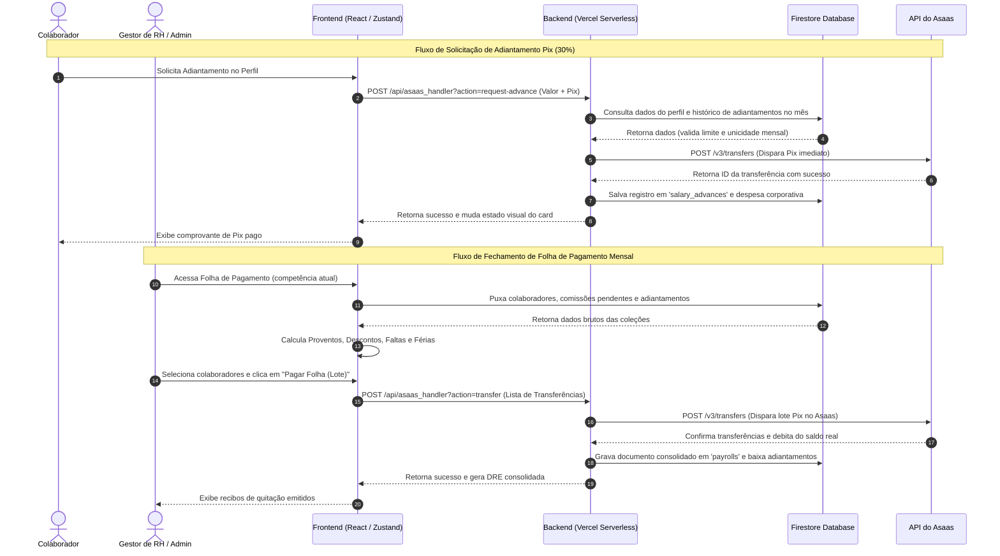

# 🔐 HUB CENTRAL — CRM ENTERPRISE

Plataforma corporativa de CRM de alta performance construída sob a arquitetura de **Modular Domain-Driven Design (DDD)** no Frontend e **Serverless Micro-services** no Backend. O sistema foi desenvolvido para centralizar a operação de vendas, gestão de equipes, conformidade ética (Compliance) e automação financeira integrada a bancos reais.

---

## 🎯 Índice
1. [Recursos Premium Atuais](#-recursos-premium-atuais)
2. [Comparativo de Regimes (CLT vs PJ)](#%EF%B8%8F-comparativo-de-regimes-clt-vs-pj)
3. [Arquitetura Técnica & Fluxo de Dados](#%EF%B8%8F-arquitetura-t%C3%A9cnica--fluxo-de-dados)
4. [Persistência & Modelagem no Firestore](#-persist%C3%AAncia--modelagem-no-firestore)
5. [Stack Tecnológica](#%EF%B8%8F-stack-tecnol%C3%B3gica)
6. [Configuração de Variáveis de Ambiente](#-configura%C3%A7%C3%A3o-de-vari%C3%A5veis-de-ambiente-env)
7. [Como Rodar e Validar o Projeto](#-como-rodar-e-validar-o-projeto)

---

## 💎 Recursos Premium Atuais

### 1. 💵 Folha de Pagamento & Adiantamento Salarial Automatizados via Asaas
Integração ponta a ponta com a API do Asaas para automatizar a folha de pagamento corporativa da empresa, mitigando erros contábeis e operacionais:
*   **Fechamento Mensal em Lote (`PayrollPanel`):** Consolidação automática dos proventos de colaboradores (salário proporcional, comissões de negócios fechados no CRM e horas extras integradas ao ponto eletrônico) e descontos (faltas CLT com DSR, coparticipações de plano de saúde, VT/VR e adiantamentos de 30% ativos).
*   **Portal de Adiantamento Salarial:** O colaborador visualiza de forma segura em seu perfil o limite disponível (exatamente 30% do seu salário base) e pode solicitar um Pix imediato. O backend do CRM dispara a transferência Pix segura no Asaas, cria o registro de adiantamento (`salary_advances`) e lança uma despesa contábil. A amortização ocorre de forma automática no fechamento da folha do mês correspondente.
*   **Módulo de Férias CLT (Art. 130 e 145 CLT):**
    *   *Desconto de Faltas Aquitivas:* Redução proporcional de dias de férias gozadas baseada na tabela legal:
        
        | Faltas no Período Aquisitivo | Dias de Férias Concedidos |
        | :---: | :---: |
        | Até 5 faltas | 30 dias |
        | De 6 a 14 faltas | 24 dias |
        | De 15 a 23 faltas | 18 dias |
        | De 24 a 32 faltas | 12 dias |
        | Mais de 32 faltas | Perda do direito |
        
    *   *Adiantamento Financeiro:* Agendamento de Pix antecipado contendo o líquido de férias (Dias de Gozo + 1/3 Constitucional - impostos retidos) com disparo obrigatório **2 dias antes** do início do gozo.
    *   *Dedução de Retorno:* O fechamento da folha mensal seguinte identifica de forma automática o período de férias gozado e desconta a proporção de dias que já foi paga de forma antecipada no salário normal.
*   **Rescisão Automatizada (CLT & PJ):** Módulo que calcula com base na admissão e desligamento os saldos de salário, 13º proporcional, férias vencidas/proporcionais acrescidas de 1/3, avisos prévios indenizados/trabalhados e apresenta cards informativos sobre guias governamentais externas (como a multa de 40% do FGTS).
*   **Sincronização de Saldo Bancário:** Monitoramento em tempo real do caixa corporativo do Asaas integrado ao módulo de Fluxo de Caixa Projetado (`CashFlowProjected.tsx`), alimentando o Saldo Inicial automaticamente.

### 2. 📊 CFO Simulator & DRE Table Reativa
Painel de BI financeiro inteligente que converte dados fiscais e operacionais em inteligência estratégica:
*   **Preferências Fiscais da Organização:** Cadastro administrativo de Porte de Empresa (MEI, ME, EPP, LTDA) e Regime Tributário (Simples Nacional Anexos III ou V, Lucro Presumido).
*   **Simulador de Contratação & Pró-labore:** Painel de cálculo com algoritmo de Gross-up que projeta o custo bruto da empresa (incluindo INSS patronal, RAT, Terceiros) a partir do salário líquido desejado no bolso pelo sócio/administrador, aplicando tabelas progressivas vigentes de INSS e IRRF brasileiro.
*   **Diagnóstico do Fator R:** Gráfico reativo demonstrando a meta de 28% do faturamento acumulado em folha de pagamento, necessária para enquadrar empresas de tecnologia no Simples Nacional do Anexo V (Alíquota de 15.5%) para o Anexo III (Alíquota de 6.0%).
*   **DRE Gerencial Reativa:** Consolidação contábil automática que cruza os dados do perfil de funcionários (salários, regimes e descontos de benefícios) para lançar despesas de pessoal e impostos devidos na DRE sem necessidade de digitação manual de caixa.

### 3. 📜 Contratos Digitais (Signature Gate)
Segurança jurídica avançada na admissão e manutenção de colaboradores:
*   **Templates Dinâmicos:** Criação e edição de contratos corporativos padrão usando Markdown e variáveis automáticas (`{NOME_COLABORADOR}`, `{SALARIO}`, `{TIPO_CONTRATO}`).
*   **Classificação de Documentos:** Suporte a três tipos integrados ao ERP: Contrato de Trabalho CLT (`work_clt`), Contrato de Prestação de Serviços PJ (`work_pj`) e Termo de Responsabilidade Patrimonial de Ativo (`asset_term`).
*   **Onboarding Automático por Convite:** Integração do fluxo de convite de colaboradores com o acervo contratual. O administrador pré-define qual contrato (CLT/PJ) deve ser atrelado ao e-mail de convite; ao aceitar o convite e criar a conta no primeiro login, o colaborador é direcionado diretamente ao Signature Gate correspondente.
*   **Signature Gate & Abas de Triagem:** Bloqueador de tela em Glassmorphism que impede o acesso ao CRM se houver documentos pendentes, exigindo leitura ativa, CPF/RG e assinatura. A Central de Documentos do colaborador organiza e separa os itens assinados/pendentes em três sub-abas ("Contratos CLT", "Contratos PJ" e "Termos de Equipamentos").
*   **Carimbo Jurídico Digital:** Ao assinar, é gerado um selo holográfico incorporado ao contrato com Hash Criptográfico SHA-256, endereço IP do assinante, timestamp Unix, sistema operacional do usuário e fonte cursiva elegante, em conformidade com a MP nº 2.200-2/2001.

### 4. 🛡️ Ouvidoria & Linha Ética
Canal corporativo seguro voltado para compliance corporativo em conformidade com a **Lei nº 14.457/2022**:
*   **Garantia de Anonimato Real:** O backend do Firestore descarta o `userId` e o `IP` de manifestações anônimas, impossibilitando rastreamento de autoria.
*   **Acompanhamento por Chave de Protocolo:** Manifestantes anônimos recebem uma chave única (`ETH-XXXXXX`) para consultar o andamento e conversar de forma bidirecional e segura com o RH/Compliance.
*   **Painel Administrativo do RH:** Triagem das denúncias com classificação de status (`Recebido`, `Em Análise`, `Resolvido`) e chat interno dedicado para resposta ao manifestante de forma segura.

### 5. 🎥 Loom Nativo & Recursos de UX
*   **Loom Widget:** Gravador de tela e webcam global embutido no cabeçalho do CRM. Efetua a captura via Web APIs do navegador, gera o arquivo de vídeo e faz o upload assíncrono otimizado para o **Cloudflare R2 Object Storage** via *Presigned URLs* locais, copiando o link final para a área de transferência com 1 clique.
*   **Física de Emojis:** Sistema de micro-interações que reproduz física de gravidade e vetores com emojis reais na tela do chat através do `canvas-confetti`.
*   **Glow para Comunicados:** Efeitos visuais vibrantes em neon âmbar para destacar bolhas de mensagens corporativas marcadas como `[AVISO]`.
*   **Acessibilidade e Contraste Premium:** Todas as abas, botões, filtros e campos selecionados do CRM utilizam uma regra de contraste global robusta no CSS. Ao serem marcados com a classe de destaque primário (`bg-primary-500`), o texto e os ícones internos são forçados a exibir-se em branco claro (`#ffffff`), eliminando o contraste baixo de textos escuros indesejados.

### 6. 🤖 Conciliação Bancária Inteligente & Robô Contábil (Asaas)
Fluxo financeiro sem erro humano e categorização contábil autônoma:
*   **Captura Diária de Extrato (Cron Job):** Sincronização automatizada diária que consome o extrato da API do Asaas e importa as despesas reais do caixa (taxas bancárias, faturas de servidores, compras com cartão corporativo, etc.) para o CRM.
*   **Robô Contábil com Aprendizado Contínuo:** Utiliza correspondência de similaridade textual e padrões de descritivos históricos de despesas da organização para auto-classificar os lançamentos nos centros de custos corretos de forma autônoma.
*   **Painel de Conciliação em Lote:** Central de controle financeiro reativa que apresenta de forma ágil lançamentos inéditos classificados como *"A Categorizar"*. O gestor pode classificar os itens pendentes com base em sugestões da IA e o robô aprende dinamicamente com as novas associações contábeis.
*   **Rastreabilidade Resiliente de Webhooks (`TRANSFER_CONFIRMED` & `TRANSFER_FAILED`):** Interceptação de eventos de transferências Pix na API Asaas que atualiza e estorna automaticamente adiantamentos de salários, férias e folhas de pagamento no banco de dados do CRM caso o Pix falhe ou seja rejeitado pelo banco receptor.

### 7. 📢 Mural de Comunicados Gerenciável & Central Comunitária (Bento Grid)
Integração e cultura corporativa de alto impacto:
*   **Central Hub Matinal (Home):** Layout bento-grid de abertura do CRM com visual Glassmorphism contendo cotações em tempo real, calendário de animes (lançamento geek) com busca inteligente (autocomplete Jikan), agenda semanal de reuniões em tempo real (`FeedSchedule.tsx`) e o Desafio da Trivia Geral (`FeedTrivia.tsx`) reformulado com 40 perguntas locais em Português do Brasil, que premia o colaborador com 50 Hub Coins por acerto uma vez ao dia com trava de persistência no Firestore.
*   **Mural de Avisos Dinâmico (Admin CRUD):** Painel administrativo que permite criar, editar e excluir comunicados, com opção de destaque urgente em Glow Neon âmbar.
*   **Tempo de Expiração Automatizado:** Cada aviso possui configuração de validade em dias e sai do ar de forma autônoma após expirar.
*   **Celebrações do Mês Reais:** Listagem em tempo real dos aniversariantes da empresa integrados com perfis do Firestore, incluindo disparo de confete ao festejar com os aniversariantes de hoje.

### 8. 🏷️ Módulo de Gestão de Ativos Corporativos & QR Code
Módulo especializado integrado a Pessoas & Cultura para controle patrimonial físico distribuído aos colaboradores (MacBooks, celulares, cadeiras, periféricos, etc.):
*   **Controle e Atribuição Patrimonial:** Cadastro completo com data de aquisição/compra, especificações técnicas detalhadas, número de série e geração de código de patrimônio unificado (`CRM-AST-XXXXXX`).
*   **Termos de Responsabilidade Patrimonial:** Vínculo obrigatório de um Termo de Responsabilidade cadastrado no momento da atribuição de um ativo a um colaborador, gerando o documento digital do tipo `asset_term` correspondente para assinatura no perfil.
*   **Geração Inteligente de QR Code de Posse:** Quando o ativo é vinculado a um colaborador (status *Em uso*), o sistema gera um QR Code dinâmico que aponta para um portal de visualização pública.
*   **Impressão Térmica de Etiquetas (50x30mm):** Layout otimizado em CSS `@media print` para impressoras térmicas físicas de patrimônio. A etiqueta divide-se em duas metades: à esquerda, o QR Code de alta precisão; à direita, a marca da empresa, nome do ativo, código patrimonial, nome do colaborador portador e seu cargo.
*   **Portal Público de Patrimônio:** Rota livre de autenticação e exposta de forma segura no Firestore (`allow get: if true`) que permite que qualquer pessoa ou câmera de celular escaneie o equipamento e visualize imediatamente quem é a empresa proprietária do item, a data de aquisição do patrimônio e a identificação do colaborador responsável atualmente pela sua custódia (com nome, cargo e data/hora do recebimento).

---

## ⚖️ Comparativo de Regimes (CLT vs PJ)

O sistema de Ponto Eletrônico e Fechamento de Folha processa e valida dados de forma diferente com base no regime de contratação:

| Característica | Regime CLT (Consolidação das Leis do Trabalho) | Regime PJ (Prestador de Serviço) |
| :--- | :--- | :--- |
| **Flexibilidade de Ponto** | Rígido. Bloqueia o expediente ao bater a saída normal ou as horas extras autorizadas. | Livre. Não bloqueia o expediente e permite reabertura imediata a qualquer momento. |
| **Hora Extra** | Exige aprovação prévia em minutos pelo RH. Controlado por um worker que expira em background. | Não aplicável. Horas de prestação de serviços baseadas em entregas ou contratos fixos. |
| **Adiantamento Salarial** | Permitido até 30% do salário contratual. Amortizado em folha. | Permitido de acordo com limite prévio (30% do contrato), amortizado no fechamento. |
| **Férias / Recesso** | Remuneradas com 1/3 constitucional. Faltas injustificadas reduzem os dias de direito (Art. 130). | Descrito no histórico financeiro como recesso remunerado contratual (se aplicável). |
| **Deduções Legais** | INSS, IRRF retidos na fonte e coparticipações/descontos de benefícios. | Apenas retenções contratuais de prestação de serviços. |
| **Rescisão** | Multas de aviso prévio, 13º proporcional, férias proporcionais + 1/3 e cálculo do FGTS. | Multa de quebra contratual baseada em valores fixos ou porcentagem (conforme contrato). |

---

## ⚙️ Arquitetura Técnica & Fluxo de Dados

O sistema opera de forma integrada utilizando reatividade no frontend e processamento serverless no backend:



---

## 🗄️ Persistência & Modelagem no Firestore

O banco de dados é sustentado por 6 coleções fundamentais, protegidas por regras de acesso baseadas em regras de negócio (RBAC) em `firestore.rules`:

### 1. Coleção `/profiles/{uid}` (Cadastro e Contratos)
Armazena a ficha funcional e dados bancários criptografados para recebimento:
```typescript
interface UserProfile {
  uid: string;
  email: string;
  displayName: string;
  role: 'admin' | 'manager' | 'employee';
  contractType?: 'CLT' | 'PJ';
  salary?: number;
  pixKeyType?: 'CPF' | 'CNPJ' | 'EMAIL' | 'PHONE' | 'RANDOM';
  pixKey?: string;
  bankAccount?: {
    bankCode: string;
    bankName?: string;
    agency: string;
    account: string;
    accountDigit: string;
    accountType: 'CHECKING' | 'SAVINGS';
    holderName: string;
    holderCpfCnpj: string;
  };
  benefitDeductions?: {
    healthInsuranceCopay?: number;
    mealVoucherDiscount?: number;
    transportVoucherDiscount?: number;
  };
  resignationDetails?: {
    resignationDate: string;
    reason: 'dismissal_without_cause' | 'dismissal_with_cause' | 'employee_resignation' | 'pj_termination';
    noticeType: 'worked' | 'indemnified' | 'none';
    penaltyPercentage?: number;
  };
}
```

### 2. Coleção `/organizations/{orgId}/payrolls` (Folha Consolidada)
Registra o histórico e recibo de pagamentos efetuados nas folhas de competência mensal:
```typescript
interface PayrollPeriod {
  id: string;               // Ex: "2026-06"
  month: string;            // Formato "YYYY-MM"
  startDate: number;        // Timestamp início apuração
  endDate: number;          // Timestamp término apuração
  paymentDate: number;      // Data do Pix Asaas
  status: 'draft' | 'paid';
  totalPaid: number;        // Saldo líquido total pago em lote
  createdAt: number;
  items: PayrollItem[];
}
```

### 3. Coleção `/organizations/{orgId}/salary_advances` (Controle de Pix de 30%)
Mantém o rastreamento dos adiantamentos salariais solicitados para evitar duplicidades no mês:
```typescript
interface SalaryAdvance {
  id: string;
  userId: string;
  userName: string;
  amount: number;           // Valor adiantado (máx. 30% do salário)
  month: string;            // Competência (Ex: "2026-06")
  createdAt: number;
  status: 'pending_repayment' | 'repaid';
  asaasTransferId?: string; // ID retornado pelo gateway de pagamento
}
```

### 4. Coleção `/organizations/{orgId}/vacation_payments` (Controle de Férias CLT)
Documenta e controla os pagamentos antecipados de recesso/férias de funcionários:
```typescript
interface VacationPayment {
  id: string;
  userId: string;
  vacationId: string;       // ID da ausência correspondente em 'vacations'
  daysCount: number;        // Dias de recesso (gozo)
  grossAmount: number;      // Valor bruto (Salário proporcional + 1/3)
  netAmount: number;        // Valor líquido pago 2 dias antes das férias
  paymentDate: number;      // Timestamp do pagamento
  status: 'pending' | 'paid' | 'failed';
}
```

---

## 🛠️ Stack Tecnológica

*   **Interface (Frontend):** React 19, TypeScript, Vite, Tailwind CSS (Vanilla CSS para componentes complexos).
*   **Gerenciamento de Estado & Cache de Dados:** React Query (TanStack Query v5) para sincronização e cache lazy em tempo real do Firestore, e Zustand 5.x para estados reativos leves de UI e preferências (otimizado para evitar conexões duplicadas e reduzir leituras no banco).
*   **Persistência & Real-time:** Firebase Firestore & Firebase Auth SDK.
*   **Bancos & APIs Financeiras:** Asaas REST API (Integração de Contas, Cobranças e Pix Lote).
*   **Mídia & Object Storage:** Cloudflare R2 Object Storage (Gravação de vídeos via Presigned URLs) + Cloudinary.
*   **E-mails Transacionais:** Resend API.
*   **Banco de Dados Auxiliar & Cache:** Upstash Redis (Implementação de Rate Limiting em rotas críticas).
*   **Ferramenta de Testes:** Vitest (Testes unitários e mocks avançados de gateways).

---

## 🔑 Configuração de Variáveis de Ambiente (.env)

Copie as credenciais de homologação/produção e as configure no arquivo `.env` na raiz do projeto:

```bash
# Firebase Client Credentials
VITE_FIREBASE_API_KEY=AIzaSyA1...
VITE_FIREBASE_PROJECT_ID=hubcrm-prod-123

# Upstash Redis Serverless
VITE_UPSTASH_REDIS_REST_URL=https://gilded-rat-123.upstash.io
VITE_UPSTASH_REDIS_REST_TOKEN=AbCdEfGhIjK...

# Asaas Gateway Financeiro
ASAAS_API_KEY=$prod_or_sandbox_token
ASAAS_WEBHOOK_TOKEN=my_secure_webhook_token_123

# Cloudflare R2 Storage (S3 API)
R2_ACCOUNT_ID=cloudflare_account_id_here
R2_ACCESS_KEY_ID=r2_access_key_id_here
R2_SECRET_ACCESS_KEY=r2_secret_access_key_here
R2_BUCKET_NAME=hubcrm-media-bucket

# E-mails (Resend)
RESEND_API_KEY=re_123456...
```

---

## 🧪 Como Rodar e Validar o Projeto

Como o ambiente local não possui runtime local do Node.js por padrão (toda compilação e teste ocorre de forma automatizada no pipeline de CI/CD do GitHub Actions), utilize os seguintes comandos no terminal em ambientes que dispõem de Node:

```bash
# 1. Instalar as dependências globais e locais
npm install

# 2. Iniciar o servidor de desenvolvimento
npm run dev

# 3. Executar toda a suíte de testes unitários e de integração (Vitest)
npm run test

# 4. Rodar o compilador do TypeScript (Linter de tipagem e estático)
npm run lint
```

### Arquivos de Teste Unitário Principais
*   `api/__tests__/request-advance.test.ts`: Valida regras de limite de 30%, duplicidade e chamadas Pix Asaas.
*   `api/__tests__/webhook.test.ts`: Garante a segurança de tokens do Webhook e idempotência.
*   `api/__tests__/checkout.test.ts`: Valida checkout de assinaturas e envio de e-mails transacionais.
*   `src/tests/crmSlice.test.ts`: Testa regras de negócio e cálculo de faturamento DRE/renovação de clientes.

---

> [!CAUTION]
> **PROPRIEDADE INTELECTUAL HUB SYMPLES LTDA**
> Código-fonte privado de uso estrito a colaboradores autorizados. A reprodução e distribuição sem consentimento prévio da gerência estão sujeitas a sanções legais sob a Lei de Software nº 9.609/98.
