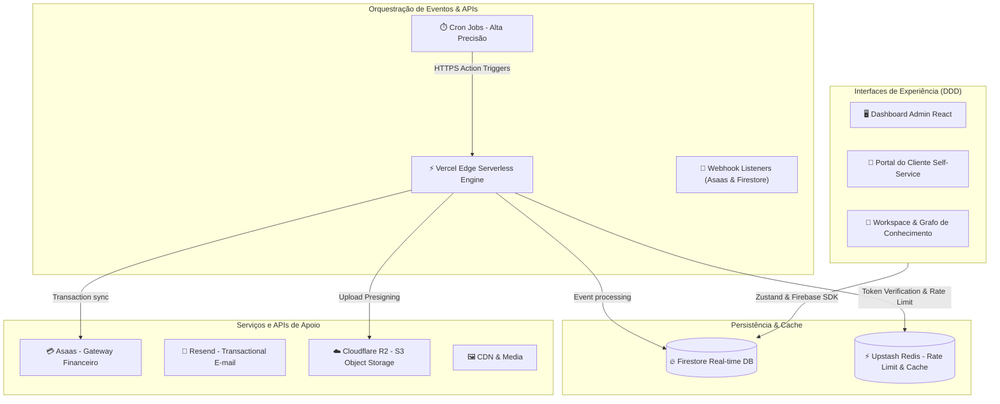

# 🔐 HUB CENTRAL — CRM ENTERPRISE

Plataforma corporativa de CRM de alta performance construída com arquitetura **Modular Domain-Driven Design (DDD)** no Frontend e **Serverless Micro-services** no Backend.

---

## 🏗️ Arquitetura Técnica

O sistema utiliza persistência reativa orientada a eventos em tempo real no Firestore, com camada de cache/rate-limiting via Upstash Redis e automações via Vercel Serverless Functions.



---

## 🛠️ Stack Tecnológica

*   **Frontend:** React 19, TypeScript, Vite, Tailwind CSS.
*   **Gerenciamento de Estado:** Zustand 5.x & React Context.
*   **Banco de Dados & Real-time:** Firebase Firestore & Firebase Auth.
*   **Cache & Rate Limiting:** Upstash Redis.
*   **Object Storage (S3):** Cloudflare R2 (com assinatura de uploads via *Presigned URLs* locais).
*   **Mídia & CDN:** Cloudinary & ImgBB.
*   **E-mails:** Resend API (e-mails transacionais).
*   **Gateway Financeiro:** Asaas API (assinaturas, carnês, splits e notificações automáticas).
*   **Observabilidade:** Sentry (erros e performance) & Axiom.

---

## ⚡ Otimizações & Performance

1.  **Lazy-Loading Arquitetural:** Roteamento em `AppRouter.tsx` otimizado para carregar views e portais pesados sob demanda via `React.lazy()`. Apenas o `DashboardView` inicial carrega de forma síncrona.
2.  **Code Splitting (Rollup Chunks):** Configuração do `vite.config.ts` com chunks manuais específicos para isolar dependências pesadas (`tldraw`, `three`, `recharts`), preservando cache de pacotes estáticos.
3.  **Paralelização de Queries & Loops:** APIs (`portal_finance.ts`) e Cron Jobs (`daily_cron.ts` e `finance_engine.ts`) otimizados usando `Promise.all()` e `Promise.allSettled()` para evitar chamadas síncronas sequenciais (waterfalls).
4.  **Limpeza de Bundle:** Remoção completa de dependências mortas e módulos legados de IA (como SDK do Gemini).
5.  **Indexação do Firestore:** Mapeamento explícito de índices de `collectionGroup` e compostos em `firestore.indexes.json` para suportar consultas complexas de monitoramento e crons.

---

## 🚀 Como Rodar o Projeto

### Pré-requisitos
*   Node.js (LTS)
*   Firebase CLI & Vercel CLI (opcional)

### Instalação & Execução
```bash
# Instalar dependências
npm install

# Iniciar servidor de desenvolvimento
npm run dev

# Rodar a suíte de testes (Vitest)
npm run test

# Verificar tipos e sintaxe (Lint)
npm run lint
```

---

## 🔑 Variáveis de Ambiente (.env)

Copie `.env.example` para `.env` e configure os parâmetros obrigatórios:

| Variável | Descrição / Origem |
| :--- | :--- |
| `VITE_FIREBASE_API_KEY` | Chave de API do Firebase Auth/Firestore |
| `VITE_FIREBASE_PROJECT_ID` | ID do projeto do Firebase |
| `VITE_UPSTASH_REDIS_REST_URL` | Endpoint REST do Redis (Upstash) |
| `VITE_UPSTASH_REDIS_REST_TOKEN`| Token de segurança do Upstash Redis |
| `ASAAS_API_KEY` | Token de autenticação da API do Asaas |
| `R2_ACCOUNT_ID` | ID da conta do Cloudflare R2 |
| `R2_ACCESS_KEY_ID` | Chave de acesso R2 S3 |
| `R2_SECRET_ACCESS_KEY` | Chave secreta de escrita e leitura R2 |
| `R2_BUCKET_NAME` | Nome do bucket Cloudflare R2 |
| `RESEND_API_KEY` | Chave de envio de e-mails do Resend |
| `CRON_SECRET` | Token de validação de Cron Jobs |

---

## 🧪 Suíte de Testes (Vitest)

A integridade do CRM é assegurada por testes unitários e de integração:
*   `crmSlice.test.ts`: Regras de negócio, risco de churn e cálculo de renovação.
*   `nexusStore.test.ts`: Controle de estante virtual, progresso de leitura e moedas.
*   `webhook.test.ts`: Validação de requisições de webhook financeiro (Asaas).

---

> [!CAUTION]
> **PROPRIEDADE INTELECTUAL HUB SYMPLES LTDA**
> Software proprietário. Uso restrito a colaboradores autorizados.
