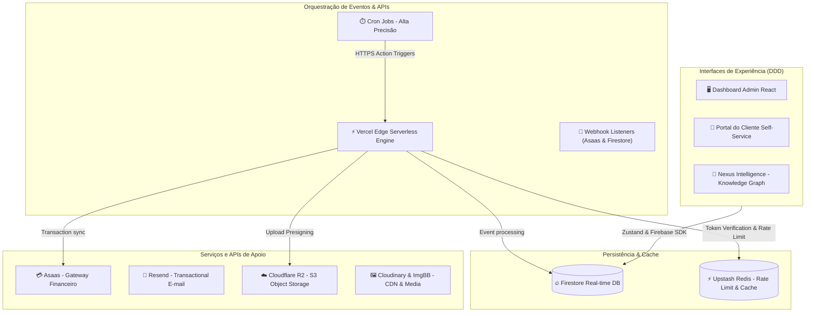

# 🔐 HUB CENTRAL — INTELLIGENCE ECOSYSTEM

<p align="center">
  
  
  
</p>

---

## 🏗️ Arquitetura Técnica & Design System

O Hub Central é um ecossistema corporativo de altíssima performance construído sobre o padrão **Domain-Driven Design (DDD)** no Frontend e **Serverless Micro-services** no Backend. A persistência de dados é reativa e orientada a eventos em tempo real.



---

## 🛠️ Stack Tecnológica Enterprise

*   **Core:** React 19, TypeScript, Vite, Tailwind CSS.
*   **Gerenciamento de Estado:** Zustand 5.x (com persistência seletiva e middlewares) e Context API nativa.
*   **Banco de Dados & Real-time:** Firebase Firestore & Firebase Auth.
*   **Cache & Rate Limiting:** Upstash Redis.
*   **Armazenamento de Objetos (S3):** Cloudflare R2 (com assinatura de uploads via *Presigned URLs* locais de 10 min).
*   **CDNs de Mídia:** Cloudinary (perfis e imagens do HubShop) & ImgBB (mídias voláteis e suporte).
*   **Comunicações:** Resend API (e-mails transacionais de alta entrega).
*   **Gateway Financeiro:** Asaas API (assinaturas, carnês, splits e notificações automáticas).
*   **Observabilidade:** Sentry (erros e performance) & Axiom (centralização e análise de logs estruturados).

---

## 📦 Módulos do Ecossistema

### 💼 1. CRM Engine & Uptime Monitor
*   **Gestão de Leads & Clientes:** Funil Kanban interativo e drag-and-drop, filtros dinâmicos de vendedor e status, controle de vigência e setup.
*   **Clientes Cortesia & VIP:** Ativação da flag `isCourtesy` que isenta o cliente de faturamento, zera faturas ativas, altera o status financeiro para `N/A`, remove os valores de projeções de receita de BI e habilita cadastro expresso opcional de dados secundários.
*   **Hub Uptime Engine (Monitoramento Nativo):** Script de background paralelo em Vercel Serverless que realiza pings assíncronos nos sites de clientes ativos, calcula a latência de rede e emite alertas automáticos de sistema (`system_alerts`) em caso de queda.

### 🧠 2. Nexus Knowledge & Note Graph
*   **Grafo de Conexões Bidirecionais:** Visualizador de conexões mentais implementado em SVG nativo de alta performance com física elástica de auto-organização (repulsão e atração), suporte a zoom infinito, pan dinâmico e busca por termos.
*   **Reading Companion & Biblioteca 2.5D:** Estante de leitura gamificada com efeito parallax tridimensional reativo ao movimento do mouse. Acompanhamento preciso e manual de páginas lidas, acumulação de **Hub Coins** e cálculo de Wisdom Streak (consistência de estudo).

### 💬 3. Hub Chat & Call Manager
*   **WebRTC P2P de Áudio e Vídeo:** Chamadas em tempo real direto da interface do CRM, com monitoramento ativo do `useCallStore` que silencia automaticamente reprodutores de mídia e destrói fisicamente iframes do DOM para garantir privacidade.
*   **Mensagens de Voz & Transcrição Nativa:** Gravação nativa com waveform em tempo real, gerando rascunhos persistentes em localStorage e transcrição de texto integrada (Web Speech API em `pt-BR`) exibida de forma expansível no player.
*   **Mensagens Fixadas Interativas (Pinned Jumps):** Ações de clique que realizam rolagem tátil suave e aplicam destaque animado em *Amber Pulse* para rápida localização espacial das mensagens.

### 🎮 4. Hub Arena (Gamificação & Integração)
*   **Jogos Multi-player & CPU:** Xadrez com roque inteligente e relógio de tempo real, Damas com Damas Voadoras de longo alcance e regra da maioria, Ludo e Connect 4 com IA de algoritmo Minimax.
*   **Motor Chiptune Procedural (Web Audio API):** Áudio 8-bits sintetizado dinamicamente direto na CPU do usuário via osciladores senoidais e dentes de serra, eliminando o download de arquivos pesados de mídia de terceiros.
*   **Arena Store:** Resgate atômico no Firestore de títulos personalizados neon no chat e molduras holográficas de avatar utilizando moedas virtuais do ecossistema.

### ⚡ 5. Hub Quick Jump (Command Palette Global)
*   **Atalho Spotlight Inteligente:** Ativação instantânea através da tecla `/` (barra) globalmente, abrindo uma barra de busca Spotlight premium com desfoque de fundo (backdrop glassmorphism) e glow reativo baseado no tema ativo do CRM.
*   **Navegação Rápida Completa:** Mapeamento inteligente de todas as 27 rotas internas do CRM com autocompletação reativa na linha de texto (Tab/Seta Direita), controle total por setas do teclado e respeito dinâmico às regras de permissão (RBAC) do colaborador logado.

---

## ⚡ Otimizações Recentes de Performance (Master Level)

1.  **Limpeza de Dependências Mortas & IA:** Remoção total do pacote `@google/genai` (Gemini) e migração de dependências de backend indevidas para o ecossistema correto de desenvolvimento do `package.json`, enxugando drasticamente o build.
2.  **Lazy-Loading Arquitetural:** Roteamento do `AppRouter.tsx` refatorado para carregar todas as views e portais pesados via `React.lazy()`. Apenas o painel do `DashboardView` inicial carrega de forma síncrona, viabilizando o carregamento instantâneo do sistema.
3.  **Isolamento de Chunks no Rollup:** Configuração do `vite.config.ts` com chunks manuais dedicados para separar `tldraw`, `three` e `recharts`, preservando a integridade e o cacheamento de pacotes estáticos.
4.  **Resolução de Waterfalls de API:** Paralelização de chamadas e consultas no Firestore na rota do `portal_finance.ts` usando `Promise.all()`, reduzindo a latência da API em até 70%.
5.  **Paralelização de Loops nos Crons:** Conversão dos loops síncronos iterativos `for...of` das organizações nos cron-jobs (`daily_cron.ts` e `finance_engine.ts`) em processamento concorrente com `Promise.allSettled()`.
6.  **Singleton no Storage:** Implementação de classe singleton para a conexão do `S3Client` em `storage_handler.ts`, eliminando a re-criação desnecessária de instâncias do Cloudflare R2 a cada arquivo trafegado.
7.  **Indexação de Alta Performance:** Arquivo `firestore.indexes.json` preenchido com todos os índices compostos e de `collectionGroup` obrigatórios das queries.

---

## 🛠️ Primeiros Passos (Getting Started)

### Pré-requisitos
*   Node.js (LTS Recente)
*   Firebase CLI (para gerenciamento de regras e deploy)
*   Vercel CLI (opcional, para testes de APIs Serverless locais)

### Instalação & Execução
```bash
# Instalar dependências de desenvolvimento
npm install

# Rodar servidor de desenvolvimento
npm run dev

# Rodar suíte de testes de performance/lógica
npm run test
```

---

## 🔑 Variáveis de Ambiente Obrigatórias (.env)

Copie o arquivo `.env.example` para `.env` e preencha as credenciais:

| Variável | Descrição / Origem |
| :--- | :--- |
| `VITE_FIREBASE_API_KEY` | Chave de API do projeto do Firebase Auth / Firestore |
| `VITE_FIREBASE_PROJECT_ID` | ID do projeto do Firebase |
| `VITE_UPSTASH_REDIS_REST_URL` | URL de conexão REST do banco de cache Redis |
| `VITE_UPSTASH_REDIS_REST_TOKEN`| Token de segurança do Upstash Redis |
| `ASAAS_API_KEY` | Token de autenticação de Sandbox ou Produção do Asaas |
| `R2_ACCOUNT_ID` | ID da conta do Cloudflare R2 para Object Storage |
| `R2_ACCESS_KEY_ID` | Chave de acesso R2 S3 |
| `R2_SECRET_ACCESS_KEY` | Chave secreta de escrita e leitura R2 |
| `R2_BUCKET_NAME` | Nome do bucket Cloudflare R2 de mídias e arquivos |
| `RESEND_API_KEY` | Chave de envio de e-mails transacionais do Resend |
| `AXIOM_TOKEN` | Token de gravação de logs do Axiom |
| `CRON_SECRET` | Chave de autenticação e validação do processador de Crons |

---

## 🧪 Suíte de Testes (Vitest)

A integridade estrutural e de performance do CRM é validada por testes unitários e de integração de alta fidelidade:

```bash
# Executar suíte de testes completa
npm run test
```

*   **[crmSlice.test.ts](src/tests/crmSlice.test.ts):** Valida as lógicas de risco de churn (`isChurnRisk`), aviso de renovação (`isComboNearRenewal`) e assinatura segura de tokens.
*   **[nexusStore.test.ts](src/tests/nexusStore.test.ts):** Garante a integridade na troca de categorias de livros na estante virtual e o cálculo dinâmico de progressos.
*   **[webhook.test.ts](src/tests/webhook.test.ts):** Cobre e audita o comportamento e a autenticação do webhook financeiro de pagamentos do Asaas.

---

> [!CAUTION]
> **PROPRIEDADE INTELECTUAL HUB SYMPLES LTDA**
> Software de código proprietário fechado. Uso restrito a colaboradores devidamente autorizados.

<p align="center">
  <sub>Hub Central © 2026 — Engenharia de Software Enterprise.</sub>
</p>
