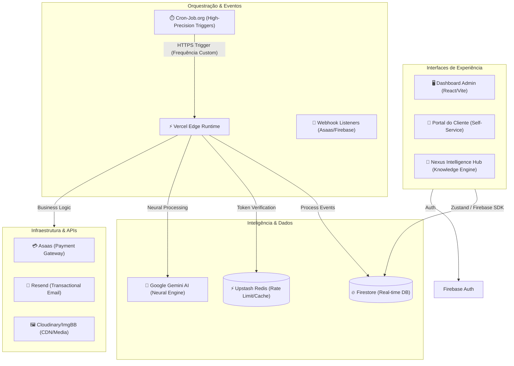
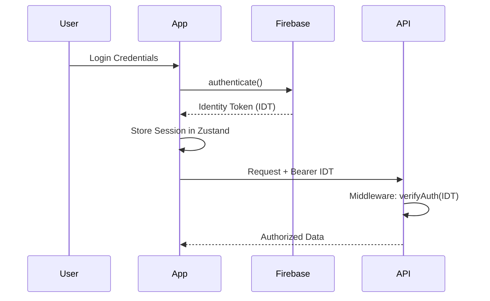

# <p align="center">🔐 HUB CENTRAL — INTELLIGENCE ECOSYSTEM</p>

<p align="center">
  
  
  
</p>

---

## 🏗️ Technical Architecture

O Hub Central utiliza uma arquitetura baseada em **Domain-Driven Design (DDD)** no Frontend e **Serverless Micro-services** no Backend, com uma camada de **Event-Driven Automation** para processos financeiros.

### 📚 Documentação Técnica Aprofundada
- **[Guia de Arquitetura & Padrões](docs/ARCHITECTURE.md)**: Detalhamento de DDD, Camadas e Regras de Engenharia.
- **[Referência de API & Webhooks](docs/API.md)**: Documentação completa dos endpoints e automações.



---

## 🌐 Ecossistema de APIs

O Hub Central integra-se com provedores líderes de mercado para garantir escalabilidade, inteligência e autonomia total.

### 💳 Financeiro & Pagamentos (Asaas)
- **Escopo:** Geração de boletos, cartões, faturamento recorrente e antecipação.
- **Automação:** O Hub processa webhooks do Asaas para atualizar status de faturas e liberar acessos instantaneamente.

### 🤖 Inteligência Artificial (Google Gemini)
- **Escopo:** Processamento de linguagem natural e análise inteligente de dados.
- **Integração:** Utilizado para geração de insights, resumos de atividades e assistente inteligente dentro do ecossistema.

### 📧 Comunicação & E-mail (Resend)
- **Escopo:** Transmissão de e-mails transacionais e de marketing.
- **Funcionalidades:** Disparo de boas-vindas, envio de faturas, convites de equipe, comunicados internos e alertas de aniversário com templates dinâmicos.

### 📚 Inteligência Bibliográfica (Open Library)
- **Escopo:** Utilizada pelo módulo **Nexus** para catalogação manual e automática.
- **Funcionalidade:** Fornece metadados de obras (autor, título, descrição) e busca de capas via `cover_id`, eliminando a dependência do Google Books.

### ☁️ Documentos & Media (Google Drive, Cloudflare R2, Cloudinary & ImgBB)
- **Google Drive:** Integração transparente para visualização de PDFs e manuais. O Hub transforma automaticamente links de compartilhamento em links de `preview` otimizados.
- **Cloudflare R2:** Provedor de armazenamento em nuvem S3-compatible utilizado para guardar arquivos pesados de PDFs e documentos da biblioteca.
  > [!IMPORTANT]
  > **Configuração Obrigatória de CORS para R2:** Para que o visualizador de PDF inteligente (Premium Reader) consiga fazer o download dos arquivos via AJAX e renderizá-los com sincronia de progresso e controles avançados de zoom, você **deve** configurar a política de CORS no bucket correspondente no painel do Cloudflare R2.
  > 
  > Devido ao validador rígido de segurança do R2 (que rejeita o curinga `"*"` para origens gerais e o método `OPTIONS`), utilize as origens específicas do seu ambiente local e de produção:
  > ```json
  > [
  >   {
  >     "AllowedOrigins": [
  >       "http://localhost:3000",
  >       "http://localhost:5173",
  >       "https://hubsymples.com.br",
  >       "https://www.hubsymples.com.br",
  >       "https://app.hubsymples.com.br"
  >     ],
  >     "AllowedMethods": [
  >       "GET",
  >       "HEAD"
  >     ],
  >     "ExposeHeaders": [
  >       "Content-Length",
  >       "Content-Range",
  >       "Accept-Ranges"
  >     ]
  >   }
  > ]
  > ```
  > 
  > 🧠 **Leitor Premium & Sincronização Estritamente Manual (Strict Manual Sync):** A fim de evitar qualquer tipo de sobregravação acidental e garantir autonomia total do usuário, a atualização automática de progresso foi desabilitada a partir da navegação do visualizador. O Nexus Premium Reader agora conta com sincronização estritamente manual: o progresso atualiza e salva de forma 100% confiável somente quando o usuário interage com o Companion ou altera ativamente os controles de página no painel do CRM. Os logs de atividade correspondentes são persistidos no Firestore sob uma regra de segurança robusta na subcoleção `activity_logs` (liberada explicitamente no `firestore.rules`), o que garante a perfeita exibição em tempo real do Heatmap de Atividades, Streak de Sabedoria e demais métricas de consistência no Dashboard, eliminando qualquer quebra ou bloqueio silencioso do banco. Para máxima precisão de status, livros sem progresso real (`currentPage == 0`) são filtrados e exibidos de forma inteligente como "Quero Ler" (`want_to_read`), sendo promovidos para "Lendo Agora" (`reading`) apenas quando possuírem páginas lidas de fato maiores que 0. Caso um livro volte para a página 0, seu status retorna automaticamente para "Quero Ler". O visualizador continua otimizado para rodar com Range Requests e streams desabilitados, garantindo compatibilidade absoluta com políticas CORS do Cloudflare R2.
- **Cloudinary:** Provider principal para ativos de longo prazo e alta qualidade. Utilizado para o upload e armazenamento de **fotos de perfil dos usuários** e **capas de livros na biblioteca Nexus**, garantindo estabilidade e redimensionamento dinâmico.
- **ImgBB:** CDN de alta performance focada em ativos transacionais e colaborativos. Utilizada em todo o sistema de **Chat (anexos de mensagens, ícones de grupos e canais)**, imagens do **Quadro Branco (Canvas Editor)**, anexos de **Tickets de Suporte** e logos temporários de onboarding.

### 🛡️ Monitoramento & Uptime (UptimeRobot & Sentry)
- **UptimeRobot:** Monitoramento de disponibilidade de serviços e sites, com status de saúde exibido no dashboard administrativo.
- **Sentry:** Rastreamento de erros e monitoramento de performance em tempo real, garantindo que falhas sejam identificadas e corrigidas antes de afetarem o usuário final.

### 🔐 Persistência & Identidade (Firebase)
- **Firestore:** Banco NoSQL em tempo real para sincronia multi-usuário.
- **Auth:** Gestão de sessões segura com suporte a MFA e persistência em memória.

### ⚡ Performance & Caching (Upstash Redis)
- **Escopo:** Camada de cache ultrarrápida e controle de taxa de requisições (Rate Limiting).
- **Finalidade:** Garante a estabilidade da API contra ataques de força bruta e melhora a latência de dados frequentes.

### ⏱️ Automação & Agendamento (Cron-Job.org)
- **Papel Crítico:** Diferente dos crons internos da Vercel, o **Cron-Job.org** atua como o metrônomo externo do sistema para tarefas de alta precisão e frequência.
- **Fluxos Automatizados:**
    - **Reconciliação Financeira:** Disparo periódico para consultar status de faturas no Asaas e garantir que o Firestore esteja em sincronia absoluta.
    - **Lembretes de Régua:** Ativação de gatilhos para disparo de e-mails/mensagens de cobrança ou boas-vindas com base em intervalos de tempo.
    - **Heartbeat de Sistema:** Verificação de integridade de serviços críticos e limpeza de estados temporários no Redis.
    - **Sincronia de Metas:** Recálculo de progressos globais para o dashboard do Nexus Hub.

### 📈 Observabilidade (Axiom)
- **Escopo:** Centralização de logs estruturados do cliente e servidor para auditoria e depuração técnica profunda.

### 🧠 Nexus Intelligence Hub v10.0 (High-Performance Analytics Engine)
- **Escopo:** Cérebro Operacional do Hub, evoluído para um ecossistema de dados inteligentes e gamificação.
- **Nexus Analytics Dashboard (Premium Insights):**
    - **Wisdom Streak:** Contador de dias consecutivos de atividade (leitura ou notas) para incentivo à consistência.
    - **Knowledge Heatmap:** Visualização anual estilo GitHub que destaca o volume de produção (Páginas Lidas + Notas Criadas com pesos diferenciados).
    - **Topics Radar (Spider Chart):** Gráfico de teia que mapeia as áreas de maior foco baseado no volume de páginas consumidas por categoria.
    - **Retention Ranking:** Métrica avançada que identifica quais obras geraram mais insights (Insights/100 Páginas), priorizando a retenção de conhecimento sobre o volume.
    - **Monthly Volume:** Gráfico comparativo em tempo real entre "Páginas Lidas" vs "Notas Criadas".
    - **Cruise Speed:** Estimativa de velocidade de leitura média por sessão, com bônus adaptativo por consistência (Streak).
- **Arquitetura Dual-View:**
    - **Neural Dashboard:** Visão sintetizada de Metas Críticas, Tarefas Ativas e Notas Recentes (Daily Briefing).
    - **Integrated Explorer:** Navegação hierárquica por pastas e notas com Drag & Drop e suporte a links bidirecionais `[[Link]]`.
- **Gerenciamento Total (CRUD):** 
    - Controle completo (Criar, Editar, Renomear, Excluir) de Notas, Pastas, Tarefas e Metas diretamente pela interface principal.
- **Reading Companion (Anotador Imersivo):**
    - Interface de leitura assistida com barra lateral de insights integrada ao visualizador de PDF ou ao painel de progresso manual.
    - **Speech-to-Text Integration:** Criação de notas e insights via voz em tempo real (pt-BR).
    - **Contextual Insights:** Exibição automática de "backlinks" e notas anteriores relacionadas à obra em leitura.
    - **Sincronia de Progresso:** Atualização instantânea da página atual diretamente pelo companion.
    - **Visualizador PDF Inteligente (Rastreamento Automático):** Leitor PDF customizado e de alto desempenho (PDF.js CDN) com controles *glassmorphic*, atalhos de teclado, zoom integrado e sincronização inteligente via `postMessage`. O leitor salva automaticamente o progresso no Firestore de forma debouncada e restaura a sessão de leitura na última página ao abrir o documento, contando com um *fallback* transparente e imediato para o visualizador padrão do Google Drive caso ocorram restrições de CORS.
    - **Painel de Foco Estético (Leitura Externa — Kindle & Livros Físicos):** Interface HUD glassmorphic de altíssimo nível estético com capas em 3D, controle e ajuste manual de páginas lidas (passos de -5, -1, +1, +5) e barra de progresso visual. Habilita o rastreamento inteligente de streak, velocidade de cruzeiro e heatmap para leitores de dispositivos físicos ou e-readers com suporte nativo a links de referência hospedados no Google Drive.
- **Biblioteca Nexus Premium:**
    - Catalogação imersiva com busca automática de capas e metadados via Open Library.
    - **Gestão de Progresso:** Acompanhamento visual da leitura com atualização instantânea.
    - **Neural Greeting & Weather:** Saudação dinâmica e clima local integrado ao dashboard.
    - **Categorias Dinâmicas:** Gestão completa de taxonomia personalizada.

---

## 📂 Project Structure

O projeto segue uma estrutura de **Monorepo Híbrido** para garantir a sincronia de contratos entre cliente e servidor.

```text
├── shared/             # [NEW] Single Source of Truth (Pure Types & Constants)
├── api/                # Serverless Functions (Backend Logic)
│   ├── _logic/         # Business Logic decoupling (Asaas, Auth)
│   ├── _utils/         # Shared utilities (Auth, DB, Audit)
│   └── handlers/       # Domain-specific endpoint handlers
├── src/
│   ├── domains/        # Business Domains (CRM, Nexus, Wiki, Finance)
│   ├── types/          # Frontend-specific types & Zod Schemas
│   ├── store/          # Zustand State Management
│   ├── lib/            # Shared libraries (Logger, API Client)
│   └── hooks/          # Global & Domain Hooks
├── tests/              # E2E & Unit Test Suites
└── firestore.rules     # Granular Security Rules
```

---

## 💳 Event-Driven Financial Autonomy

O sistema de faturamento é 100% autônomo e orientado a eventos.

- **Webhook Synchronization:** O sistema processa payloads do Asaas em tempo real.
- **Auto-Sync Logic:**
    - `PAYMENT_CREATED`: Atualiza automaticamente o `invoiceUrl` e `paymentStatus` no Firestore assim que uma fatura é gerada.
    - `PAYMENT_RECEIVED`: Calcula a próxima data de vencimento (`nextDueDate`) com base no ciclo (Mensal/Anual) e atualiza o status global do cliente.
- **Custom Pricing:** Suporte a negociações customizadas com campos de mensalidade e setup que sobrescrevem os valores padrão da oferta, garantindo faturamento preciso no Asaas.
- **Persona Filtering:** Inteligência no Portal do Cliente que agrupa produtos por CPF/CNPJ mas filtra automaticamente cards cancelados e faturas "lixo" de testes anteriores.
- **Zero Polling:** A interface do usuário reflete o status financeiro instantaneamente via listeners do Firestore, sem necessidade de recarregar a página ou fazer requisições manuais ao Asaas.
- **Serverless Consolidation:** Otimização de recursos na Vercel através de um `system_handler` unificado, permitindo escalar múltiplos serviços sem atingir os limites do plano Hobby.

---

## 🏗️ Unified Type System (Shared Types)

Implementamos uma camada de tipos compartilhados (`/shared`) que elimina o "Technical Debt" de duplicidade.

- **Contracts:** Interfaces de `Client`, `Lead`, `Transaction` e `UserProfile` são definidas uma única vez.
- **Type Safety:** Mudanças na estrutura de dados no Backend quebram o build do Frontend em tempo de compilação, garantindo integridade total do contrato.
- **Zod Integration:** O Frontend consome os tipos puros e adiciona camadas de validação `zod` para formulários e inputs.

---

## 🔐 Authentication & Security Flow

O fluxo de autenticação é híbrido: Firebase Auth para identidade e JWT/Custom Tokens para integração com APIs externas.



### Security Conventions
1. **RBAC (Role-Based Access Control):** Centralizado no hook `usePermissions`. Proibido checar strings de roles diretamente no JSX.
2. **Privacy Shield:** Dados de perfil são restritos a membros da mesma organização via Firestore Rules.
3. **Audit Log:** Toda ação mutável na API deve invocar `logActivity`.

---

## 📊 State Management Patterns

Utilizamos **Zustand 5.0** com persistência seletiva e versionamento de cache.

- **Selective Persistence:** Apenas metadados e configurações são salvos no `localStorage`. Dados sensíveis (como Notas) são mantidos apenas em memória e sincronizados em tempo real com o Firestore.
- **Middleware:** Persistência configurada com `version` para garantir migrações de esquema seguras entre deploys.
- **Atomic Selectors:** Sempre utilize seletores atômicos `const value = useStore(state => state.value)` para evitar re-renderizações desnecessárias.

---

## ⚡ Master Level Evolution

Esta versão marca a transição para o padrão **Enterprise Master**, com foco em três pilares:

### 🚀 Performance (Lazy Listeners)
Para garantir latência zero em organizações com milhares de registros, implementamos o carregamento sob demanda:
- **Zero Overload:** Os módulos de Financeiro, Wiki, Suporte e Pessoas não consomem banda até serem acessados.
- **Lifecycle Management:** Listeners são ativados no `mount` da View e destruídos no `unmount`, garantindo que o banco de dados em tempo real não drene recursos em abas inativas.

### 🛡️ Hard Security (Firestore Hardening)
- **Isolation by Ownership:** Regras de segurança no Firestore garantem que um usuário só possa ler Leads/Clientes atribuídos a ele (`assignedTo == uid`), a menos que seja um Administrador com permissões explícitas.
- **Privacy First:** Dados sensíveis (como Notas do Nexus) foram excluídos da persistência local para evitar exposição no `localStorage` do navegador.

### 👁️ Observability (Axiom Shield)
- **Centralized Logs:** Substituição de todos os `console.error` pelo sistema `Logger.error`, enviando stack traces em tempo real para o Axiom.
- **Global Hijack:** Captura automática de erros não tratados (`uncaught exceptions`) e rejeições de promises no nível de aplicação.

### 🌐 Client Portal Security (Public API Shield)
- **Token-Based Auth:** Acesso ao portal público é restrito via `publicToken`. Links gerados sem token ou com token inválido são bloqueados pela API `portal_finance`.
- **API Consolidation:** O portal não lê mais diretamente do Firestore via `onSnapshot` público. Todas as informações (faturamento, chamados, marketplace) são servidas por uma API centralizada que sanitiza os dados antes de expô-los.
- **Auto-Sync:** Ao converter um lead ou criar um cliente, o sistema gera automaticamente os tokens de segurança e sincroniza o primeiro link de pagamento do Asaas.

---

## 🧪 Testing & CI/CD Strategy

A qualidade do código é assegurada por três camadas de verificação:

1. **Unit Testing (Vitest):** Focado em helpers, utilitários e lógica de cálculo.
   - `npm run test:unit`
2. **Integration Testing:** Validação de fluxos de API e integração com Firestore (via Emulator).
3. **E2E Testing (Playwright):** Testes de fumaça e fluxos críticos de usuário (Checkout, Login, Cadastro de Lead).
   - `npm run test:e2e`

### CI/CD Pipeline
- **Linting:** Pre-commit hooks validam tipos e estilo via ESLint + Prettier.
- **Preview Deploy:** Toda PR gera um ambiente de preview na Vercel com logs do Axiom ativos para depuração pré-merge.
- **Production:** Deploy automático após aprovação de testes E2E.

---

## 🛠️ Getting Started

### Prerequisites
- Node.js (Latest LTS)
- Firebase CLI
- Vercel CLI (para local API testing)

### Installation
```bash
npm install
npm run dev
```

### Environment Variables
Copie o `.env.example` para `.env` e preencha as chaves do Firebase, Axiom e Upstash.

---

> [!CAUTION]
> **PROPRIEDADE INTELECTUAL HUB SYMPLES LTDA**
> Software proprietário. Uso restrito a colaboradores autorizados.

<p align="center">
  <sub>Hub Central © 2026 — Engenharia de Software Enterprise.</sub>
</p>
