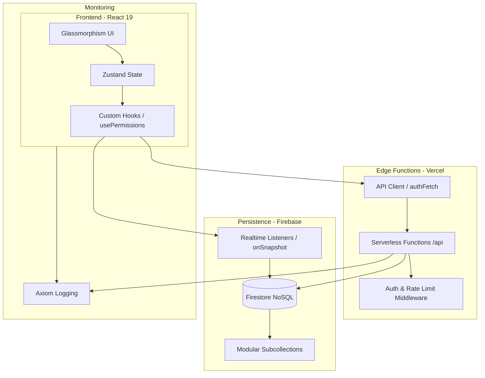
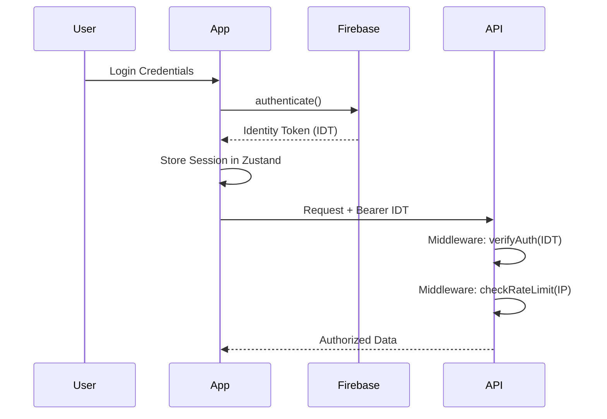

# <p align="center">🔐 HUB CENTRAL — INTELLIGENCE ECOSYSTEM</p>

<p align="center">
  
  
  
</p>

---

## 🏗️ Technical Architecture

O Hub Central utiliza uma arquitetura baseada em **Domain-Driven Design (DDD)** no Frontend e **Serverless Micro-services** no Backend, focada em latência zero e segurança estrita.

### 🌐 System Overview


---

## 📂 Project Structure

O projeto segue uma estrutura modular para garantir o desacoplamento entre domínios de negócio.

```text
├── api/                # Serverless Functions (Backend Logic)
│   ├── _utils/         # Shared utilities (Auth, DB, Audit)
│   └── handlers/       # Domain-specific endpoint handlers
├── src/
│   ├── core/           # Configurações base (Firebase, Axiom)
│   ├── domains/        # Lógica de Negócio (CRM, Nexus, Wiki, Finance)
│   │   ├── components/ # Componentes exclusivos do domínio
│   │   ├── views/      # Páginas de alto nível
│   │   └── hooks/      # Hooks específicos do domínio
│   ├── store/          # Zustand Slices (State Management)
│   ├── shared/         # Componentes e tipos reutilizáveis
│   ├── lib/            # Bibliotecas e utilitários (Logger, API Client)
│   └── hooks/          # Hooks globais (useAuth, usePermissions)
├── tests/              # Test Suites (E2E & Integration)
└── firestore.rules     # Segurança Granular de Dados
```

---

## 🔐 Authentication & Security Flow

O fluxo de autenticação é híbrido: Firebase Auth para identidade e JWT/Custom Tokens para integração com APIs externas.



### Security Conventions
1. **RBAC (Role-Based Access Control):** Centralizado no hook `usePermissions`. Proibido checar strings de roles diretamente no JSX.
2. **Privacy Shield:** Dados de perfil são restritos a membros da mesma organização via Firestore Rules.
3. **Audit Log:** Toda ação mutável na API deve invocar `logActivity`.

---

## 📊 State Management Patterns

Utilizamos **Zustand 5.0** com persistência seletiva e versionamento de cache.

- **Selective Persistence:** Apenas metadados e configurações são salvos no `localStorage`. Dados sensíveis (como Notas) são mantidos apenas em memória e sincronizados em tempo real com o Firestore.
- **Middleware:** Persistência configurada com `version` para garantir migrações de esquema seguras entre deploys.
- **Atomic Selectors:** Sempre utilize seletores atômicos `const value = useStore(state => state.value)` para evitar re-renderizações desnecessárias.

---

## 🧪 Testing & CI/CD Strategy

A qualidade do código é assegurada por três camadas de verificação:

1. **Unit Testing (Vitest):** Focado em helpers, utilitários e lógica de cálculo.
   - `npm run test:unit`
2. **Integration Testing:** Validação de fluxos de API e integração com Firestore (via Emulator).
3. **E2E Testing (Playwright):** Testes de fumaça e fluxos críticos de usuário (Checkout, Login, Cadastro de Lead).
   - `npm run test:e2e`

### CI/CD Pipeline
- **Linting:** Pre-commit hooks validam tipos e estilo via ESLint + Prettier.
- **Preview Deploy:** Toda PR gera um ambiente de preview na Vercel com logs do Axiom ativos para depuração pré-merge.
- **Production:** Deploy automático após aprovação de testes E2E.

---

## 🛠️ Getting Started

### Prerequisites
- Node.js (Latest LTS)
- Firebase CLI
- Vercel CLI (para local API testing)

### Installation
```bash
npm install
npm run dev
```

### Environment Variables
Copie o `.env.example` para `.env` e preencha as chaves do Firebase, Axiom e Upstash.

---

> [!CAUTION]
> **PROPRIEDADE INTELECTUAL HUB SYMPLES LTDA**
> Software proprietário. Uso restrito a colaboradores autorizados.

<p align="center">
  <sub>Hub Central © 2026 — Engenharia de Software Enterprise.</sub>
</p>
