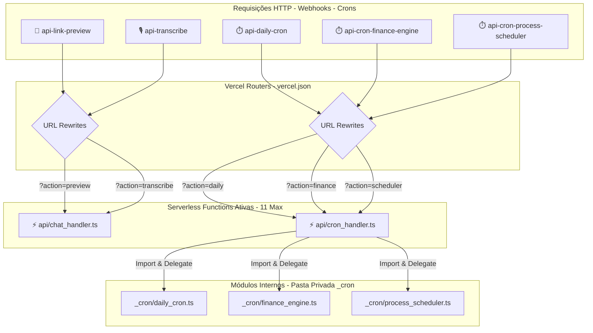
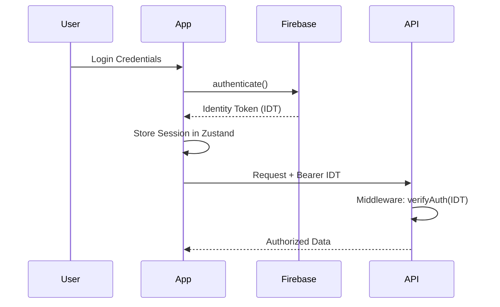
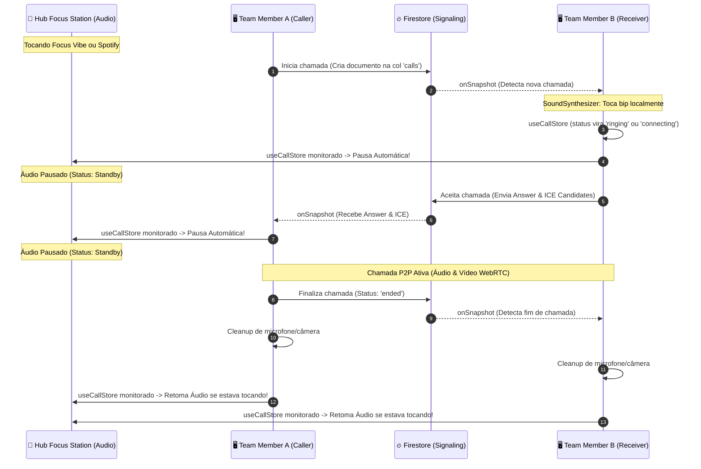

# <p align="center">🔐 HUB CENTRAL — INTELLIGENCE ECOSYSTEM</p>

<p align="center">
  
  
  
</p>

---

## 🏗️ Technical Architecture

O Hub Central utiliza uma arquitetura baseada em **Domain-Driven Design (DDD)** no Frontend e **Serverless Micro-services** no Backend, com uma camada de **Event-Driven Automation** para processos financeiros.

### 📚 Documentação Técnica Aprofundada
- **[Guia de Arquitetura & Padrões](docs/ARCHITECTURE.md)**: Detalhamento de DDD, Camadas e Regras de Engenharia.
- **[Referência de API & Webhooks](docs/API.md)**: Documentação completa dos endpoints e automações.


---

## 🌐 Ecossistema de APIs

O Hub Central integra-se com provedores líderes de mercado para garantir escalabilidade, inteligência e autonomia total.

### 💳 Financeiro & Pagamentos (Asaas)
- **Escopo:** Geração de boletos, cartões, faturamento recorrente e antecipação.
- **Automação:** O Hub processa webhooks do Asaas para atualizar status de faturas e liberar acessos instantaneamente.

### 🤖 Inteligência Artificial (Google Gemini)
- **Escopo:** Processamento de linguagem natural e análise inteligente de dados.
- **Integração:** Utilizado para geração de insights, resumos de atividades e assistente inteligente dentro do ecossistema.

### 📧 Comunicação & E-mail (Resend)
- **Escopo:** Transmissão de e-mails transacionais e de marketing.
- **Funcionalidades:** Disparo de boas-vindas, envio de faturas, convites de equipe, comunicados internos e alertas de aniversário com templates dinâmicos.

### 📚 Inteligência Bibliográfica (Open Library)
- **Escopo:** Utilizada pelo módulo **Nexus** para catalogação manual e automática de livros.
- **Funcionalidade:** Fornece metadados de obras (autor, título, descrição) e busca de capas via `cover_id`, eliminando a dependência de APIs externas de terceiros.

### ☁️ Documentos & Media (Google Drive, Cloudflare R2, Cloudinary & ImgBB)
- **Google Drive:** Integração transparente para visualização de PDFs e manuais. O Hub transforma automaticamente links de compartilhamento em links de `preview` otimizados.
- **Cloudflare R2:** Provedor de armazenamento em nuvem S3-compatible utilizado para guardar arquivos de PDFs e documentos da biblioteca, além de servir como repositório central de mídias de chat (áudios, imagens, PDFs e planilhas).
  
  > [!IMPORTANT]
  > **Configuração Obrigatória de CORS para R2:** Para que o visualizador de PDF inteligente (Premium Reader) consiga fazer o download dos arquivos via AJAX e renderizá-los com sincronia de progresso e controles avançados de zoom, você **deve** configurar a política de CORS no bucket correspondente no painel do Cloudflare R2.
  > 
  > Devido ao validador rígido de segurança do R2 (que rejeita o curinga `"*"` para origens gerais e o método `OPTIONS`), utilize as origens específicas do seu ambiente local e de produção:
  > ```json
  > [
  >   {
  >     "AllowedOrigins": [
  >       "http://localhost:3000",
  >       "http://localhost:5173",
  >       "https://hubsymples.com.br",
  >       "https://www.hubsymples.com.br",
  >       "https://app.hubsymples.com.br",
  >       "https://hubcrm.hubsymples.com.br"
  >     ],
  >     "AllowedMethods": [
  >       "GET",
  >       "HEAD",
  >       "PUT",
  >       "POST"
  >     ],
  >     "AllowedHeaders": [
  >       "*"
  >     ],
  >     "ExposeHeaders": [
  >       "Content-Length",
  >       "Content-Range",
  >       "Accept-Ranges"
  >     ],
  >     "MaxAgeSeconds": 3600
  >   }
  > ]
  > ```
  > 
  > 🧠 **Leitor Premium & Sincronização Estritamente Manual (Strict Manual Sync):** A fim de evitar qualquer tipo de sobregravação acidental e garantir autonomia total do usuário, a atualização automática de progresso foi desabilitada a partir da navegação do visualizador. O Nexus Premium Reader agora conta com sincronização estritamente manual: o progresso atualiza e salva de forma 100% confiável somente quando o usuário interage com o Companion ou altera ativamente os controles de página no painel do CRM. Os logs de atividade correspondentes são persistidos no Firestore sob uma regra de segurança robusta na subcoleção `activity_logs` (liberada explicitamente no `firestore.rules`), o que garante a perfeita exibição em tempo real do Heatmap de Atividades, Streak de Sabedoria e demais métricas de consistência no Dashboard, eliminando qualquer quebra ou bloqueio silencioso do banco. Para máxima precisão e foco de status, o Nexus removeu os estados intermediários obsoletos ("Quero Ler" e "Abandonados"). Livros cadastrados entram diretamente no status "Lendo Agora" (`reading`) e são automaticamente classificados como "Finalizados" (`finished`) assim que o progresso do usuário atinge o total de páginas do livro. O visualizador continua otimizado para rodar com Range Requests e streams desabilitados, garantindo compatibilidade absoluta com políticas CORS do Cloudflare R2.
  >
  > 💬 **Integração no Hub Chat, Mensagens de Voz, Drag & Drop & Fixação Inteligente:** O Hub Chat utiliza o Cloudflare R2 como repositório de mídias de chat. Os usuários podem enviar imagens de alta resolução, planilhas de relatórios, PDFs, vídeos demonstrativos e áudios gravados de voz diretamente no chat. Os uploads são assinados de forma segura e dinâmica no backend por meio de *Presigned URLs* com tempo de expiração de 10 minutos e servidos globalmente de forma ultraveloz sob o domínio customizado **`storage.hubsymples.com.br`**, protegendo chaves privadas e ocultando a infraestrutura com marca corporativa.
  >   - 🎙️ **Mensagens de Voz Premium & Transcrição Inteligente Nativa:** Gravação nativa de áudio (usando `MediaRecorder` nativo) revestida em uma interface de **Glassmorphism Premium** com desfoque de fundo e uma incrível **Waveform de onda sonora em tempo real** desenhada com gradientes fluidos e dinâmicos que acompanham perfeitamente o tema ativo selecionado no CRM (seja azul, verde, laranja, cyberpunk, branco-elite, etc.). Conta com **Transcrição de Voz Inteligente em tempo real e silenciosa** (utilizando a Web Speech API no idioma `pt-BR`) rodando em paralelo à gravação física. A transcrição é persistida diretamente no Firestore e exibida de forma espetacular em um acordeão translúcido expansível **"📝 Ver Transcrição"** integrado ao player da mensagem, com botão de cópia de texto direta em um clique. Os arquivos WebM gravados salvam sua duração em segundos codificada no nome para decodificação instantânea via Regex.
  >   - 🎤 **Digitação por Voz Premium (Speech-to-Text):** Adição de um botão de microfone na barra de ferramentas superior do editor de texto que, ao ser ativado, dita e escreve textos em tempo real no campo de entrada à medida que o usuário fala, oferecendo feedback em *pulse* visual e toasters intuitivos de toggle de estado.
  >   - 📌 **Mensagens Fixadas Interativas & Inteligentes (Pinned Jumps):** A barra de mensagens fixadas no topo do Hub Chat agora detecta e formata dinamicamente qualquer tipo de mensagem fixada (como enquetes, áudios, imagens, aprovações, bots e mídias), exibindo descrições elegantes e eliminando o travamento em "Carregando...". Toda a barra de mensagens fixadas é interativa e clicável: ao clicar em um fixado, a tela realiza um scroll suave até a mensagem correspondente no chat e aplica um elegante efeito visual de piscar e expandir em *Amber Pulse* (classe `.animate-highlight-message`) para que o usuário localize a mensagem instantaneamente.
  >   - 📥 **Drag & Drop Inteligente:** Suporte completo para arrastar e soltar imagens, áudios, PDFs, vídeos e planilhas em qualquer parte do contêiner de mensagens do chat, acionando o upload dinâmico em tempo real com overlays visuais reflexivos e feedback instantâneo via toasters de status.
  >   - ↩️ **Encaminhamento de Mensagens Nativo:** Modal nativo elegante para encaminhar qualquer tipo de mensagem (mídias, enquetes, aprovações, bot e blocos de código) para outros canais ou grupos ativos do workspace, com cabeçalho indicativo `↩️ Encaminhada de...` preservando a origem de quem enviou.
  >   - 📝 **Markdown Text Render:** Processamento de markdown ultraleve no frontend convertendo de forma segura e limpa citações, negrito, itálicos, tags e blocos de código em JSX interativo e com realce visual.
  >   - 👥 **"Lido por" Detalhado (Hover Tooltip):** Exibição detalhada de quem visualizou a mensagem, exibindo avatares e nomes em tempo real diretamente do mapa reativo de leituras do Firestore no canal, eliminando redundância de escrita e melhorando consideravelmente o desempenho e o feedback da equipe.
  >   - 💾 **Rascunhos Persistentes de Mensagens (Local Drafts):** Salva e restaura rascunhos de mensagens em tempo real por chat de forma automatizada no `localStorage` por meio do middleware Zustand, evitando perdas acidentais de textos ao fechar abas, dar F5 ou alternar rapidamente entre canais do CRM.
  >   - 🔴 **Divisor Dinâmico de Novas Mensagens:** Um divisor translúcido e premium em gradiente vermelho vibrante posicionado na primeira mensagem não lida de uma sessão, sumindo com animação suave assim que o usuário rola a tela ou clica para interagir com o chat, garantindo clareza sem poluição visual.
  >   - 🚀 **Superpoderes do Hub Chat (Fases 2 & 3):**
  >     - 📥 **Seleção Múltipla & Ações em Lote (Duplo Clique):** Seleção ágil de múltiplas mensagens ativada com um **duplo clique** sobre a bolha da mensagem. Suporta ações em lote direto na barra inferior (Copiar textos, Excluir em massa e Encaminhar mensagens selecionadas para múltiplos chats simultaneamente).
  >     - 🚨 **Mensagens Prioritárias & Alertas Urgentes:** Envio de mensagens com nível de prioridade "Urgente". Mensagens prioritárias ganham um destaque vibrante em vermelho neon pulsante com o badge interativo `🚨 URGENTE` abaixo do texto.
  >     - 📋 **Checklist Inline Colaborativo:** Criação inline de checklists colaborativos reativos e interativos usando `/checklist` ou através do seletor. Atualizações em tempo real com estado persistido no Firestore.
  >     - 🔗 **Preview Rico de Links (Open Graph):** Detecção inteligente de URLs de internet em mensagens normais de texto com renderização enriquecida (título, descrição, imagem de capa e domínio principal) abaixo da mensagem, estilo cartões de redes sociais.
  >     - ⚡ **Gerenciador de Templates Rápidos Customizáveis:** Barra de ferramentas no editor contendo o botão de atalhos rápidos (⚡) integrado a um **modal premium de gerenciamento** (cadastro e exclusão de templates recorrentes em tempo real). Conta com fallback resiliente de alta qualidade para inicialização do sistema, permitindo que a equipe crie respostas rápidas instantaneamente.
  >     - ↩️ **Atalho de Resposta Inteligente:** Um novo botão flutuante "Responder" (usando o ícone `<Reply size={14} />`) adicionado à barra de ações rápida de cada mensagem, permitindo contextualizar a conversa instantaneamente de forma visual e simples.
  >     - 🔍 **Busca Global Integrada & Exportação de Histórico:** Localização de mensagens na conversa por meio de busca global na janela do chat (atalho `Ctrl+Shift+F`), com destaques visuais e navegação ágil com scroll automático, além da funcionalidade de exportar todo o histórico de conversas em formato `.txt` formatado.
  >     - ⬇️ **Scroll Rápido Teams Style:** Botão flutuante premium ("Ir para o fim") desenhado com glassmorphism e animações táteis do Framer Motion. Surge de forma fluida no canto inferior direito quando o usuário rola significativamente para cima (>350px), deslizando suavemente até o final das mensagens com apenas um toque.
  >     - 🔔 **Sincronização Ativa de Notificações de Bots:** Correção definitiva no listener do Firestore e na store do Zustand que marca chats como lidos automaticamente ao abrir a conversa ou receber mensagens de bots (como o comando `/ajuda`) em tempo real, zerando definitivamente notificações fantasma na barra lateral.
  >
  > 🛠️ **Configuração Local do Servidor (.env):** Para que o servidor local (emulação da Vercel) consiga fazer o upload e a assinatura das URLs para o R2 com sucesso, certifique-se de copiar as credenciais do R2 para o seu arquivo `.env` local na raiz do projeto, baseado nas chaves especificadas no arquivo `.env.example`.
- **Cloudinary:** Provider principal para ativos de longo prazo e alta qualidade. Utilizado para o upload e armazenamento de **fotos de perfil dos usuários**, **imagens cadastradas de prêmios do HubShop** e **capas de livros na biblioteca Nexus**, garantindo estabilidade e redimensionamento dinâmico.
- **ImgBB:** CDN secundária focada em ativos transacionais leves. Utilizada para imagens do **Quadro Branco (Canvas Editor)**, anexos de **Tickets de Suporte** e logos temporários de onboarding.

### 🛡️ Monitoramento & Uptime (Hub Uptime Engine & Sentry)
- **Hub Uptime Engine (Nativo):** Motor de monitoramento de sites de clientes integrado diretamente no Firestore e executado em background por pings paralelos assíncronos. Elimina limites de cota ou chaves externas, suporta sanitização inteligente contra domínios locais e emite alertas vermelhos em tempo real (`system_alerts`) se um site ativo sair do ar.
- **Sentry:** Rastreamento de erros e monitoramento de performance em tempo real, garantindo que falhas sejam identificadas e corrigidas antes de afetarem o usuário final.

### 🔐 Persistência & Identidade (Firebase)
- **Firestore:** Banco NoSQL em tempo real para sincronia multi-usuário.
- **Auth:** Gestão de sessões segura com suporte a MFA e persistência em memória.

### ⚡ Performance & Otimização Arquitetural (Fases 1 & 2 💻)
- **Escopo:** Camada de cache ultrarrápida (Upstash Redis), controle de taxa de requisições, e otimização total de código (Frontend/Backend).
- **Finalidade:** Garante a estabilidade da API, velocidade instantânea de carregamento e redução drástica de processamento em memória e banco de dados.
- **Otimizações Recentes (Master Level 🚀):**
  - **Remoção de Bibliotecas de IA Inativas:** Limpeza completa no `package.json`, removendo o `@google/genai` (Gemini) e outras dependências de servidor indevidas, enxugando o bundle final.
  - **Lazy-Loading de Views Pesadas:** Roteamento do `AppRouter.tsx` otimizado para carregar views pesadas (Chat, Suporte, Calendário, Mapas, Monitoramento e Portais Públicos) via `React.lazy()`, acelerando o primeiro carregamento (Time-To-Interactive).
  - **Isolamento de Chunks Manuais (Vite/Rollup):** Separação de bibliotecas grandes (`tldraw`, `three`, `recharts`) em chunks dedicados para proteger o chunk principal e otimizar o cache de navegador.
  - **Fim dos Waterfalls de API:** Paralelização de requisições no Firestore e requests externos na API `portal_finance.ts` com `Promise.all()`, reduzindo o tempo de carregamento pela metade.
  - **Paralelização de Crons com Concorrência:** Modificados os scripts de crons (`daily_cron.ts` e `finance_engine.ts`) de loop serial N+1 para concorrência concorrente utilizando `Promise.allSettled()`, evitando timeouts no ambiente Serverless da Vercel.
  - **Conexão Persistente de Storage (S3 Singleton):** API `storage_handler.ts` agora utiliza cache singleton do `S3Client` para assinar uploads no Cloudflare R2, eliminando o overhead de re-instanciação de conexões.
  - **Índices Firestore Estruturados:** Configuração de índices de `collectionGroup` e compostos em `firestore.indexes.json` para suportar queries reativas e crons de forma estável.

### ⏱️ Automação & Agendamento (Cron-Job.org)
- **Papel Crítico:** Diferente dos crons internos da Vercel, o **Cron-Job.org** atua como o metrônomo externo do sistema para tarefas de alta precisão e frequência.
- **Fluxos Automatizados:**
    - **Monitoramento de Sites (Hub Uptime Engine):** Pings periódicos paralelos que testam a integridade dos sites ativos no CRM, calculam a latência em tempo real (ms) e geram alertas críticos (`system_alerts`) se o serviço sair do ar.
    - **Reconciliação Financeira:** Disparo periódico para consultar status de faturas no Asaas e garantir que o Firestore esteja em sincronia absoluta.
    - **Lembretes de Régua:** Ativação de gatilhos para disparo de e-mails/mensagens de cobrança ou boas-vindas com base em intervalos de tempo.
    - **Heartbeat de Sistema:** Verificação de integridade de serviços críticos e limpeza de estados temporários no Redis.
    - **Sincronia de Metas:** Recálculo de progressos globais para o dashboard do Nexus Hub.

### 📈 Observabilidade (Axiom)
- **Escopo:** Centralização de logs estruturados do cliente e servidor para auditoria e depuração técnica profunda.

---

### 🧠 Nexus Intelligence Hub v10.0 (High-Performance Analytics Engine)

O Nexus é o cérebro operacional do Hub Central, oferecendo um ecossistema completo de dados inteligentes, gestão de notas wiki e gamificação de leitura.

#### 📈 Nexus Analytics & Stats (Premium Insights)
O painel de estatísticas (`NexusStats.tsx`) consolida as seguintes métricas visuais avançadas:
- **Wisdom Streak:** Contador de dias consecutivos de leitura ou criação de notas de estudo para incentivo à consistência profissional.
- **Knowledge Heatmap:** Calendário anual interativo estilo GitHub que destaca com intensidade de cores a densidade das atividades do usuário (páginas lidas e notas criadas com pesos ponderados).
- **Topics Radar (Spider Chart):** Gráfico de teia (Radar) que mapeia a distribuição temática do conhecimento consumido baseado no volume de páginas por categoria literária.
- **Retention Ranking:** Métrica de qualidade de aprendizagem que ranqueia as obras com maior densidade de insights gerados (fórmula: `Insights / 100 Páginas`), valorizando a retenção qualitativa frente ao volume de leitura.
- **Monthly Volume:** Gráfico de barras comparativo (`BarChart`) que exibe nos últimos 6 meses a relação de "Páginas Lidas" contra "Notas Criadas".
- **Ritmo de Leitura & Consistência:** Monitora a média diária de páginas absorvidas no mês e o percentual de dias consistentes.

#### 📚 Biblioteca Nexus Premium & Visualização
- **Busca de Metas via Open Library:** Catalogação rápida com busca automática de capas e metadados via Open Library API.
- **Design de Visualização de Capas 2.5D (Glass Parallax):** Efeito visual sofisticado onde badges, progresso e botões flutuam sobre a capa do livro com profundidade 3D real e se movem com as coordenadas do mouse, criando reflexos de luz dinâmica sobre o vidro.
- **Estrutura de Categorias Dinâmicas:** Edição, criação e deleção centralizada de categorias taxonômicas. Ao renomear ou excluir categorias no `useNexusStore`, todos os livros associados são migrados atomicamente para garantir a integridade dos dados.

#### 🧠 Note Graph View (Grafo de Conexões Force-Directed)
Mapeador interativo de conexões mentais implementado em **SVG nativo de alta performance**:
- **Simulação de Física Real:** Aplicação de física elástica (Repulsão magnética de Coulomb + Atração por mola de Hooke + Gravidade central) para a auto-organização dinâmica dos nós em tempo real.
- **Mapeamento de Relacionamentos:** Conecta Notas, Metas, Tarefas e referências cruzadas bidirecionais de links wiki (`[[Link]]`).
- **Interações Fluidas:** Suporte a gestos de arrastar tela (Pan), rolagem de mouse para zoom-in/zoom-out infinito, arremesso elástico de nós com o cursor e barra superior de pesquisa neon para iluminar nós selecionados.

#### 📝 Estante Wiki & Reading Companion (Anotador Imersivo)
- **Reading Companion:** Barra lateral de insights com suporte a controle manual passo a passo de páginas e vinculação direta de anotações no contexto do livro.
- **Digitação por Voz (Speech-to-Text):** Criação de anotações e insights ditados pelo usuário por voz nativa (Web Speech API no idioma `pt-BR`) no Reading Companion.
- **Links Bidirecionais & Backlinks:** Suporte nativo ao processamento de tags `[[Link]]` que conectam notas entre si, exibindo de forma reflexiva as notas anteriores relacionadas.
- **Estrutura Hierárquica Drag & Drop:** Movimentação e organização visual ágil de notas e subpastas via Drag & Drop na árvore central do workspace.

---

### 👥 Módulo de Pessoas & PDI Kanban

Localizado no domínio de Pessoas (`src/domains/people/`), este módulo centraliza o desenvolvimento de times e acompanhamento de metas de carreira.
- **PDI Kanban Premium (Meu PDI):** Sistema interativo de metas e objetivos 100% reativo e livre de race-conditions.
- **Edição Inline de Elite:** Suporte à edição instantânea via duplo clique direto no título do card ou clicando no ícone de lápis (`Edit3`) no hover.
- **Exclusão Premium:** Botão de lixeira (`Trash2`) com efeito hover premium para remoção imediata e atrativa.
- **Atualizações Atômicas:** Manipulação de array de itens no Firestore com atualização em tempo real de forma atômica síncrona, eliminando perdas por concorrência de escrita ao arrastar cards rapidamente.

---

### 🎨 Personalização & Temas Estéticos Premium

O Hub Central conta com um motor de personalização visual dinâmico que permite ao usuário adaptar o CRM ao seu estilo de trabalho, promovendo foco e bem-estar através de experiências visuais imersivas e micro-animações de partículas de altíssimo nível (`ThemeEffects.tsx`).

#### 🌟 Temas Estéticos Disponíveis
- **⚪ Branco Elite (`branco-elite`):** Um tema claro super clean e sofisticado. Sobrescreve as propriedades de fundo tradicionais para oferecer um visual minimalista iluminado, com cartões elevados em glassmorphism e sombras extremamente suaves que reduzem a fadiga ocular. Conta com partículas de luz branca e cinza flutuando serenamente no background.
- **🥈 Prata Platinum (`prata-platinum`):** Um visual metálico futurista de altíssimo padrão, combinando fundos titânio/grafite escuro com realces em platina e cristais metálicos flutuantes que simulam reflexos dinâmicos.
- **⚫ Preto Absoluto (`preto-absoluto`):** Um tema escuro AMOLED de luxo absoluto. Fundo inteiramente preto puro (`#000000`) integrado a cartões elevados em cinza-escuro (`#09090b`), bordas douradas e estrelas cintilantes e brasas douradas flutuando lentamente pelo ecossistema.
- **🌐 Cyberpunk (`cyberpunk`):** Interface com brilho neon ciano e lilás, equipada com linhas de varredura (scanlines) retrô e animações eletrizantes.
- **🌿 Forest (`forest`):** Visual natural e orgânico, com folhas verdes flutuando suavemente pelo painel em um fundo verde-floresta escuro.
- **❄️ Nordic (`nordic`):** Uma experiência limpa com textura de geada e flocos de neve flutuando em um fundo azul-glacial elegante.
- **🌌 Midnight (`midnight`):** Um céu estrelado e imersivo com constelações cintilantes em tons de violeta e azul escuro profundo.
- **🎀 Barbie (`barbie`):** Estética vibrante em rosa neon com corações e brilhos em 3D flutuando no background.
- **🕶️ Minimalista (`minimalist`):** Visual monocromático de alto contraste focado exclusivamente na eficiência operacional.

#### 📊 Tabela Comparativa de Experiências Visuais (Temas)
| Tema Premium | ID Técnico | Paleta de Cores Predominante | Partículas de Background | Proposta de Experiência / UX |
| :--- | :--- | :--- | :--- | :--- |
| **⚪ Branco Elite** | `branco-elite` | Neve translúcida, Cinza suave, Platina | Flocos de luz branca e cinza | Minimalista, clean e ideal para reduzir cansaço visual diurno |
| **🥈 Prata Platinum** | `prata-platinum` | Titânio metálico, Grafite escuro, Platina | Cristais metálicos de platina reflexivos | Sofisticação futurista industrial, acabamento premium e metálico |
| **⚫ Preto Absoluto** | `preto-absoluto` | Preto AMOLED (`#000000`), Ouro, Grafite | Brasa de carvão e estrelas douradas | Luxo AMOLED absoluto com contraste extremo e conforto noturno |
| **🌐 Cyberpunk** | `cyberpunk` | Ciano Neon, Violeta Elétrico, Magenta | Scanlines de TV retrô e fagulhas neon | Imersão futurista e vibrante para foco e foco operacional noturno |
| **🌿 Forest** | `forest` | Verde Floresta, Oliva Escuro, Esmeralda | Folhas verdes flutuando serenamente | Calma orgânica natural e relaxamento mental durante tarefas complexas |
| **❄️ Nordic** | `nordic` | Azul Glacial, Geada Translúcida, Branco Polar| Flocos de neve caindo levemente | Limpeza nórdica elegante, foco cristalino e bem-estar |
| **🌌 Midnight** | `midnight` | Violeta Profundo, Azul Escuro, Índigo | Estrelas cadentes e constelações ativas| Sky celestial estrelado e inspiração profunda em sessões noturnas |
| **🎀 Barbie** | `barbie` | Rosa Vibrante, Rosa Chiclete, Lilás | Corações 3D e brilhos flutuando | Expressividade divertida, dinâmica, calorosa e viva |
| **🕶️ Minimalista** | `minimalist` | Monocromático, Escala de cinzas, P&B | Nenhuma (Foco estrito em texto) | Foco utilitário absoluto na eficácia de dados de negócio |

---

## 📂 Estrutura de Pastas do Projeto

O projeto segue uma estrutura de **Monorepo Híbrido** para garantir a sincronia de contratos entre cliente e servidor.

```text
├── shared/             # Single Source of Truth (Pure Types & Constants)
├── api/                # Serverless Functions (Backend Logic)
│   ├── _logic/         # Business Logic decoupling (Asaas, Auth)
│   ├── _utils/         # Shared utilities (Auth, DB, Tokens)
│   └── handlers/       # Domain-specific endpoint handlers
├── src/
│   ├── core/           # Core Shell & Global Settings
│   ├── domains/        # Business Domains (CRM, Nexus, Chat, Shop, Portal, Arena, People)
│   ├── types/          # Frontend-specific types & Zod Schemas
│   ├── store/          # Zustand State Management (Zustand 5.x)
│   ├── lib/            # Shared libraries (Logger, API Client)
│   ├── hooks/          # Global & Domain Hooks (WebRTC, Permissions)
│   └── tests/          # Unit Test Suite (Vitest)
├── vitest.config.ts    # Vitest Testing Configuration
└── firestore.rules     # Granular Security Rules
```

---

## 💳 Event-Driven Financial Autonomy

O sistema de faturamento é 100% autônomo e orientado a eventos.

- **Webhook Synchronization:** O sistema processa payloads do Asaas em tempo real.
- **Auto-Sync Logic:**
    - `PAYMENT_CREATED`: Atualiza automaticamente o `invoiceUrl` e `paymentStatus` no Firestore assim que uma fatura é gerada.
    - `PAYMENT_RECEIVED`: Calcula a próxima data de vencimento (`nextDueDate`) com base no ciclo (Mensal/Anual) e atualiza o status global do cliente.
- **Custom Pricing:** Suporte a negociações customizadas com campos de mensalidade e setup que sobrescrevem os valores padrão da oferta, garantindo faturamento preciso no Asaas.
- **Clientes Cortesia / VIP (Isenção de Faturamento & Cadastro Expresso):** Suporte completo à criação de clientes isentos de cobrança com a flag `isCourtesy`. A ativação desta flag faz com que o sistema pule a integração com o Asaas, zere faturas pendentes caso o cliente já existisse, configure o status financeiro como `N/A` e remova a receita das projeções de MRR para proteger as métricas de BI. **Além disso, a ativação do switch VIP torna opcional dinamicamente todos os campos secundários de cadastro (WhatsApp, CPF/CNPJ, E-mail, Origem do Lead e Vendedor/Responsável) tanto nos atributos HTML5 quanto visualmente (ocultando os asteriscos `*`), permitindo que a equipe crie cards expressos de parceiros e cortesias contendo exclusivamente o Nome.** No Portal do Cliente, os usuários VIP contam com uma interface exclusiva de estética roxa neon com o badge `VIP / CORTESIA` e status `Acesso Vitalício Ativo`.
- **Persona Filtering:** Inteligência no Portal do Cliente que agrupa produtos por CPF/CNPJ mas filtra automaticamente cards cancelados e faturas "lixo" de testes anteriores.
- **Zero Polling:** A interface do usuário reflete o status financeiro instantaneamente via listeners do Firestore, sem necessidade de recarregar a página ou fazer requisições manuais ao Asaas.
- **Serverless Consolidation:** Otimização de recursos na Vercel através de handlers unificados (como o `system_handler` para rotas de utilidades do sistema, o `chat_handler` para as APIs de chat e transcrição, e o `cron_handler` que consolida os 3 cron-jobs do ecossistema: auditoria diária, motor financeiro e agendador de processos), garantindo o funcionamento do sistema completo com apenas 11 funções físicas, dentro do limite de 12 Serverless Functions do plano Hobby da Vercel.



---

## 🏗️ Unified Type System (Shared Types)

Implementamos uma camada de tipos compartilhados (`/shared`) que elimina o "Technical Debt" de duplicidade.

- **Contracts:** Interfaces de `Client`, `Lead`, `Transaction` e `UserProfile` são definidas uma única vez.
- **Type Safety:** Mudanças na estrutura de dados no Backend quebram o build do Frontend em tempo de compilação, garantindo integridade total do contrato.
- **Zod Integration:** O Frontend consome os tipos puros e adiciona camadas de validação `zod` para formulários e inputs.

---

## 🔐 Flow de Autenticação e Segurança

O fluxo de autenticação é híbrido: Firebase Auth para identidade e JWT/Custom Tokens para integração com APIs externas.



### Convenções de Segurança
1. **RBAC (Role-Based Access Control):** Centralizado no hook `usePermissions`. Proibido checar strings de roles diretamente no JSX.
2. **Privacy Shield:** Dados de perfil são restritos a membros da mesma organização via Firestore Rules.
3. **Audit Log:** Toda ação mutável na API deve invocar `logActivity`.

---

## 📊 State Management Patterns

Utilizamos **Zustand 5.0** com persistência seletiva e versionamento de cache.

- **Selective Persistence:** Apenas metadados e configurações são salvos no `localStorage`. Dados sensíveis (como Notas) são mantidos apenas em memória e sincronizados em tempo real com o Firestore.
- **Middleware:** Persistência configurada com `version` para garantir migrações de esquema seguras entre deploys.
- **Atomic Selectors:** Sempre utilize seletores atômicos `const value = useStore(state => state.value)` para evitar re-renderizações desnecessárias.

---

## ⚡ Master Level Evolution

Esta versão marca a transição para o padrão **Enterprise Master**, com foco em três pilares:

### 🚀 Performance (Lazy Listeners)
Para garantir latência zero em organizações com milhares de registros, implementamos o carregamento sob demanda:
- **Zero Overload:** Os módulos de Financeiro, Wiki, Suporte e Pessoas não consomem banda até serem acessados.
- **Lifecycle Management:** Listeners são ativados no `mount` da View e destruídos no `unmount`, garantindo que o banco de dados em tempo real não drene recursos em abas inativas.

### 🛡️ Hard Security (Firestore Hardening)
- **Isolation by Ownership:** Regras de segurança no Firestore garantem que um usuário só possa ler Leads/Clientes atribuídos a ele (`assignedTo == uid`), a menos que seja um Administrador com permissões explícitas.
- **Privacy First:** Dados sensíveis (como Notas do Nexus) foram excluídos da persistência local para evitar exposição no `localStorage` do navegador.

### 👁️ Observability (Axiom Shield)
- **Centralized Logs:** Substituição de todos os `console.error` pelo sistema `Logger.error`, enviando stack traces em tempo real para o Axiom.
- **Global Hijack:** Captura automática de erros não tratados (`uncaught exceptions`) e rejeições de promises no nível de aplicação.

### 🌐 Client Portal Security (Public API Shield)
- **Token-Based Auth:** Acesso ao portal público é restrito via `publicToken`. Links gerados sem token ou com token inválido são bloqueados pela API `portal_finance`.
- **API Consolidation:** O portal não lê mais diretamente do Firestore via `onSnapshot` público. Todas as informações (faturamento, chamados, marketplace) são servidas por uma API centralizada que sanitiza os dados antes de expô-los.
- **Auto-Sync:** Ao converter um lead ou criar um cliente, o sistema gera automaticamente os tokens de segurança e sincroniza o primeiro link de pagamento do Asaas.

---

### 🎵 Hub Focus Station (Streaming Unificado: Spotify Embed, YouTube & Lofi Focus Beats)

Integração global, reativa e persistente de áudio para produtividade e bem-estar operacional, com design deslumbrante em **Vidro Líquido (Liquid Glass)** e acoplamento de estados inteligentes:
- **Design Liquid Glass Premium:** Uma interface visual deslumbrante revestida em um contêiner glassmorphic com desfoque profundo (`backdrop-blur-[24px]`), fundo translúcido suave (`bg-slate-950/40`), bordas reflexivas finas (`border-white/10`) e sombras flutuantes 3D.
- **Duas Abas Independentes:** Seletor limpo e fluido com duas áreas distintas:
  - `🧠 Focus Vibes`: Sons instrumentais de Lofi relaxantes tocados via streaming estável de áudio HTML5 local.
  - `📺 Streaming`: Uma aba única e unificada que mescla playlists do **Spotify** (via Iframe Embed gratuito de alta confiabilidade) e do **YouTube** (via Embed interativo).
- **Gerenciamento Completo de Playlists de Streaming**:
  - **Adição e Edição Flexível**: Permite cadastrar e alterar links de vídeos e playlists de ambas as plataformas na mesma lista.
  - **Exclusão Definitiva & Confirmação**: Qualquer playlist, inclusive a corporativa padrão da empresa ("Hub SiYmples"), pode ser excluída definitivamente de forma segura. Um modal elegante de confirmação ("Tem certeza que quer excluir essa playlist?") é exibido antes de efetivar a remoção.
  - **Persistência de Exclusões**: Utiliza um estado persistido de IDs excluídos no LocalStorage para garantir que a playlist corporativa deletada não retorne na hidratação da página.
- **Integração Refinada com YouTube:** Suporte nativo a vídeos e playlists do YouTube. Faz comunicação via `enablejsapi=1` e captura silenciosamente eventos `postMessage` transmitidos pelo iframe do YouTube para sincronizar o estado real de reprodução de play/pause e controlar o volume de forma suave direto do slider do CRM.
- **Headphones Giratório Cirúrgico:** O ícone do fone de ouvido na barra superior do CRM ("Dynamic Island" quando minimizado) agora brilha em verde e rotaciona em tempo real sincronizado de acordo com o estado de reprodução real de qualquer reprodutor ativo (áudio nativo Lofi, postMessage do YouTube ou Embed do Spotify).
- **Navegação Contínua Ininterrupta:** Widget flutuante com design ultrapremium em Glassmorphism (Dynamic Island style) que pode ser arrastado ou minimizado. Por coexistência simultânea de estados no DOM (controlados por opacidade e escala CSS), o áudio do Spotify, do YouTube e das Vibes Locais permanece tocando de forma ininterrupta nas trocas de páginas ou rotas internas, mesmo quando o widget é minimizado.
- **Pausa Inteligente WebRTC:** Sincronização automática com o `useCallStore`. O reprodutor de áudio (local ou o controle do widget) suspende a reprodução automaticamente ao iniciar ou receber uma ligação telefônica P2P de áudio/vídeo e retoma o estado inicial assim que a chamada é encerrada.
- **Intelligent Iframe DOM Kill Switch (Spotify & YouTube):** Por rodarem em sandbox cross-origin protegida contra CORS, os reprodutores de terceiros impedem que a aplicação externa regule ou corte seu som em situações críticas. Para garantir privacidade absoluta no ambiente de trabalho corporativo, implementamos um estado de renderização física estrita (`shouldRenderSpotify` / `shouldRenderYoutube`). Se o sistema for mutado, o volume geral for zerado (`0`) ou uma chamada WebRTC estiver ativa (`ringing` ou `connected`), o React remove e destrói fisicamente os elementos iframe do DOM de imediato, cortando o áudio de forma 100% limpa, instantânea e infalível.
- **Neon Visualizer:** Barras animadas nativamente em CSS com gradientes fluidos neon no player (`Visualizer.tsx`) que pulsam harmonicamente de acordo com o estado de reprodução (`isPlaying`), fornecendo feedback de equalização gráfica premium.



### ⌨️ Tabela de Atalhos Rápidos do Ecossistema
| Atalho / Ação Visual | Ação Executada no CRM | Contexto de Aplicação |
| :--- | :--- | :--- |
| **`Ctrl` + `Shift` + `F`** | Abre o Modal de Busca Global no Histórico | Janela de Chat Ativa |
| **`ArrowUp` (Seta para Cima)** | Ativa edição rápida da última mensagem enviada pelo usuário | Campo de entrada de texto vazio |
| **`Escape` (ESC)** | Cancela o modo de resposta, de edição de mensagem, de seleção múltipla e fecha popups/modais | Interface Global / Ativa |
| **`Double Click` (Duplo Clique)** | Seleciona mensagem para Ações em Lote (excluir, copiar ou encaminhar em massa) | Bolha de Mensagem no Chat |
| **`Double Click` (Duplo Clique)** | Abre o campo de edição inline instantâneo para alterar o objetivo | Título de card no Kanban de PDI |
| **`/checklist`** | Insere o atalho para criação de bloco de tarefas colaborativas | Campo de texto do Chat |
| **`Enter`** | Confirma e salva a edição de texto inline do card no Firestore | Modo de Edição Inline no PDI |

---

## 🎮 Hub Arena - Gamificação & Entretenimento em Tempo Real

A **Hub Arena** é o centro de entretenimento e integração social integrada diretamente na interface principal do Hub Central. Projetada para aproximar os colaboradores através de uma experiência gamificada de alto padrão, ela permite partidas em tempo real contra colegas ou contra a inteligência artificial.

### 🏆 Jogos Disponíveis & Regras Avançadas

| Jogo | Tipo | Tecnologias & Regras Aplicadas | Destaques Visuais, Sons & Efeitos Retro |
| :--- | :--- | :--- | :--- |
| **Chess (Xadrez)** | Multiplayer / CPU | • Mecanismo de regras puras com validação de xeque/mate.<br>• **Roque Inteligente**: O jogador pode fazer o roque simplesmente clicando no **Rei** e na **Torre aliada** correspondente.<br>• Relógio de tempo profissional duplo integrado (10 min). | • Turnos marcados por luzes e efeitos HSL neon.<br>• Sons 8-bits: blip de movimento, impacto de captura, alerta chiptune de Xeque.<br>• Chuva de confetes triunfantes e fanfarra ao vencer o oponente. |
| **Checkers (Damas)** | Multiplayer / CPU | • **Damas Brasileiras Estritas**: tabuleiro 8x8 e a dinâmica de **Dama Voadora de Longo Alcance**.<br>• **Regra da Maioria**: Obrigatoriedade recursiva de capturar a maior quantidade de peças possíveis.<br>• **Retirada Tardia**: Peças puladas ganham opacidade e "✕" vermelho pendentes de eliminação física definitiva apenas no fim do combo. | • Destaque luminoso neon das diagonais de saltos válidos.<br>• Animação de **Coroação Majestosa** com flash dourado e coroa pixelada.<br>• Combo Streak Chiptune flutuante ("DOUBLE CAPTURE!" e "COMBO STREAK!").<br>• Confetes reais e fanfarra na vitória. |
| **Ludo 4-Player** | Multiplayer / 3 CPUs | • Suporta 4 jogadores simultâneos no mesmo tabuleiro ou contra 3 CPUs inteligentes independentes.<br>• Mecânica orbital com regras de barreira, zona segura e capturas tradicionais. | • Garagens base com nichos/soquetes circulares 3D de relevo.<br>• Trilhas comuns desenhadas em acrílico translúcido de vidro.<br>• Sons 8-bits: dado arpejado contínuo e passos digitais curtos.<br>• Confetes reais e faíscas ao atingir o triângulo central de chegada. |
| **Connect 4** | Multiplayer / CPU | • IA baseada no algoritmo **Minimax** com profundidade ajustável.<br>• Tabuleiro de grade clássico com física elástica e de colisão. | • **Física Vibracional Premium**: grade de tabuleiro que treme (shake) no impacto e expande shockwaves SVG de poeira neon HSL.<br>• Queda de ficha com plop chiptune e vitória celebrada com chuva de confetes reais e fanfarra. |

### ⚡ Características Técnicas, Áudio Procedural & Skins CRT Retro
1. **Matchmaking via Firestore**: Convites dinâmicos gerados em tempo real através da coleção `invites` com sincronização instantânea.
2. **Dynamic Island de Convite**: Pop-up global no topo da tela (`MatchInviteListener`) com aceitação instantânea de partidas online e redirecionamento automático.
3. **Leaderboard Real**: Exibição dinâmica contendo recordes de solução dos Puzzles no Firestore (`winnerId == user.uid && status == 'finished'`).
4. **Motor Chiptune Procedural 8-Bits (Web Audio API)**:
   * **Trilha de Fundo**: Síntese de ondas triangulares e arpejos arrojados contínuos de fundo (*C -> G -> Am -> F*) de baixa amplitude, eliminando arquivos pesados de áudio locais.
   * **Efeitos Clássicos (Sound Effects)**: Sintetizadores baseados em ondas quadradas, triangulares e dentes de serra gerados dinamicamente com filtros e decay exponencial para movimentos, capturas, arpejos de rolagens e comemorações.
   * **Mute Dinâmico**: Botão e barras de equalizador neon integrados ao painel lateral para silenciar sons e músicas de forma unificada.
5. **Skin Premium Arcade CRT**: Skin visual opcional `"arcade"` que reveste a arena em um contêiner de fliperama retrô, sobrepondo uma cintilação fosforescente animada de scanlines analógicos e textura CRT clássica (Tailwind + CSS Keyframes).
6. **Modo CPU Autônomo com Recomeço**: IA local avançada em cada jogo e botão inteligente `🔄 Recomeçar Partida` sob demanda para partidas de um jogador.
7. **Central de Ajuda & Regras Unificadas**: Cada um dos 4 jogos da Arena possui um botão interativo de ajuda (`HelpCircle`) que exibe de forma premium, fluida (framer-motion) e reativa a regras, objetivos e dicas táticas oficiais formatadas de acordo com o tema selecionado.

### 🛍️ Arena Store - Cosméticos Premium
A **Arena Store** (`ArenaStoreModal.tsx`) é integrada à gamificação da equipe com efeitos chiptune e Web Audio API integrados:
* **Resgate de Molduras de Avatar:** Molduras exclusivas para personalizar a foto de perfil do usuário (Cyberpunk, Gold, Ruby, Ocean, Rainbow, Silver, Neon).
* **Resgate de Títulos de Chat:** Títulos neon com realce em gradiente e auras pulsantes que acompanham as bolhas de chat do usuário logado (ex: "Grão-Mestre de Vendas", "Lenda do Connect 4").
* **Transação Segura:** A moeda utilizada é unificada como **Hub Coins**. A compra desconta o saldo do Firestore de forma atômica e atualiza instantaneamente a moldura equipada no perfil do usuário e no chat.

### 🧩 Desafios Diários de Tabuleiro (Daily Puzzles)
Uma dinâmica leve de aquecimento lógico e competição de agilidade intelectual para os colaboradores:
* **Banco de Puzzles Offline**: Problemas pré-definidos de **Xadrez (Mate em 1)** e **Connect 4 (Alinhamento tático)** com rotatividade inteligente local baseada no dia do mês, garantindo carregamento instantâneo.
* **Cronômetro Neon de Alta Precisão**: Calcula em tempo real os segundos gastos pelo colaborador para resolver a tática diária.
* **Tabela Diária de Cérebros Rápidos (Leaderboard)**: O lobby exibe um ranking diário específico do puzzle classificando os solucionadores pelo menor tempo de conclusão.
* **Bonificação Econômica**: Solucionar o puzzle do dia concede automaticamente **+50 Hub Coins** na conta do colaborador no Firestore, limitado a uma resolução premiada por dia.

---

### 📚 Clubes de Leitura & Metas Coletivas (Nexus)

Integração de alta sinergia unindo desenvolvimento profissional contínuo à economia gamificada da Arena:
* **Divisão de Times Corporativos**: Sincronização automática com a propriedade `department` (Vendas, Desenvolvimento, Suporte, Recursos Humanos, Marketing e Geral) do perfil do colaborador no Firestore.
* **Termômetros de Vidro Neon (Progress Thermometers)**: Barras de progresso cilíndricas 3D tridimensionais translúcidas e neon desenhadas em **Glassmorphism**, onde o fluido neon reflete com brilho a cor do respectivo time e o progresso médio acumulado de páginas lidas.
* **Dropdown Seletor de Livros Integrado**: O formulário de criação/edição de clubes conta com um dropdown que lista de forma reativa os livros disponíveis na **Aba Comunidade** (Firestore `/communityBooks`) e na **Biblioteca Pessoal** do usuário (`useNexusStore`) organizados por categoria. Ao selecionar uma obra, todos os dados do livro (Título, Autor, Imagem de Capa e Meta de Páginas) são preenchidos e associados de forma automática.
* **Sincronização Bidirecional de Progresso em Tempo Real**: Conexão inteligente em tempo real entre a estante pessoal e o clube. Ao avançar a leitura de um livro correspondente na Biblioteca Pessoal ou ReadingCompanion, o progresso do time no Clube de Leitura correspondente é atualizado de imediato. Do mesmo modo, registrar leituras diretamente no painel do clube atualiza instantaneamente a biblioteca pessoal correspondente do usuário logado, mantendo a integridade absoluta dos dados sem loops de rede.
* **Meta Coletiva Batida**: Quando o departamento atinge 100% de progresso acumulado no livro oficial do mês, um painel especial holográfico de celebração é liberado para todos os participantes do time.
* **Resgate de Recompensas Enterprise**: Botão neon arco-íris pulsante que concede **+200 Hub Coins** ao colaborador ao bater a meta coletiva. Possui validação atômica para impedir resgates múltiplos e reproduz efeitos procedural de arpejo de triunfo via Web Audio API.

---

### 📚 Trilhas de Conhecimento (Learning Paths)

Ecossistema voltado para capacitação técnica, metas de carreira e desenvolvimento contínuo dos colaboradores (`LearningPathsPanel.tsx`):
* **Construção de Trilhas (Admin):** Administradores podem consolidar jornadas de aprendizado dando um nome, descrição, meta cognitiva e recompensa de HubCoins, e selecionando a aura neon temática.
* **Bônus de Aceite e Antifraude:** Ao aceitar uma trilha pela primeira vez, o colaborador é contemplado com um bônus imediato de `+50 HubCoins` para incentivar a sua jornada. A flag `welcomeRewardClaimed: true` é persistida no Firestore para impedir que ele ganhe esse bônus repetidamente caso desista e reinicie a mesma trilha futuramente.
* **Ciclo de Vida Dinâmico (Pausar, Retomar e Desistir):**
  * **Pausar Missão ⏸️:** Altera o status da trilha para `'PAUSED'`, congelando o progresso mas **removendo reativamente as auras neon** de todos os livros vinculados àquela trilha na estante do usuário para indicar visualmente a pausa.
  * **Retomar Missão ⚡:** Retorna o status para `'ACTIVE'`, **restabelecendo reativamente o brilho neon** original e vibrante em todas as capas e lombadas de livros da missão.
  * **Desistir da Trilha 🛑:** Zera o progresso no Firestore (mantendo a flag antifraude de aceite), desvincula e limpa totalmente as auras neon dos livros na estante, resetando o progresso das páginas lidas daquele livro para zero. As HubCoins já adquiridas continuam com o usuário de forma protegida (sem diminuição de saldo), e ele poderá recomeçar do zero futuramente quando quiser.
* **Auras e Bordas Neon Dinâmicas:** Ao aceitar e iniciar uma trilha, o progresso individualizado é ativado. Os livros pertencentes àquela trilha são clonados na estante do usuário e ganham **fundo, bordas e lombada neon pulsantes** na cor específica da trilha. Livros avulsos ou de trilhas não ativas permanecem com o design padrão (sem luminosidade).
* **Proteções Estritas Contra Fraude de Leitura (Strict Anti-Fraud Engine):**
  * **Trava de 24 Horas:** Uma vez que o progresso de leitura (página) de um livro é alterado, o usuário fica impedido de realizar novas alterações nesse livro nas próximas 24 horas. Tentativas de fraude acionam um toast educativo bloqueando a gravação.
  * **Anti-Fraude de "Voltar Páginas" (`maxPageRead`):** O ganho de moedas (`+1 HubCoin` por página lida) é calculado de forma atômica com base no recorde histórico de páginas lidas para cada obra. Caso o colaborador retroceda o livro e depois avance de novo, ele **não** recebe moedas de forma duplicada. A recompensa só é ativada quando ele ultrapassa a marca recorde registrada (`currentPage > maxPageRead`). Ao desistir da trilha, esse recorde é redefinido para zero, permitindo que ele ganhe moedas relendo do zero futuramente.
* **Unificação Econômica de HubCoins:** Concluir cada página dos livros de trilhas ativas concede automaticamente `+1 HubCoin`. Compartilhar insights concede `+20 HubCoins`. Bater a maestria da trilha finalizando todos os livros integrantes confere um jackpot de conclusão de `+200 HubCoins` com toasters e comemorações reativas na tela.

---

### 🛒 HubShop - Loja Corporativa

A e-commerce central de resgates corporativos por HubCoins (`HubShopView.tsx`):
* **Vitrine Premium de Prêmios:** Um grid de cartões Glassmorphism exibindo prêmios físicos (canecas, moletons), vouchers digitais (Ifood, Uber) e experiências de prestígio (almoço com CEO, folgas).
* **Upload Integrado via Cloudinary:** O administrador pode cadastrar novos prêmios instantaneamente anexando imagens reais que são salvas de forma segura na CDN do **Cloudinary** e retornam URLs públicas otimizadas.
* **Transação Segura e Controle de Estoque:** O sistema valida o saldo em tempo real, debita as HubCoins do colaborador, decrementa o estoque atómicamente e registra o pedido em `/hubShopOrders` com status pendente de entrega pelo time de RH/Gestão.
* **Modais Customizados Premium (Zero Diálogos Nativos):** Todas as confirmações cruciais de resgate de prêmios e exclusão de itens do catálogo foram substituídas por overlays customizados de alta estética com blur translúcido (`backdrop-blur-sm`), bordas reflexivas finas e micro-animações do Framer Motion em português do Brasil.
* **Ajuste de Carteira de Testes (Admin):** Administradores (`isAdmin`) contam com uma ferramenta de governança financeira na carteira para reduzir ou zerar seu saldo de HubCoins na loja física de testes, calculando e sincronizando a diferença negativa com o Firestore de forma transparente e evitando a injeção indevida de saldo positivo por esse caminho.

---

### 🏆 Gamificação Cognitiva & Trilhas de Conhecimento (Nexus)

O sistema de trilhas corporativas gamificadas (`LearningPathsPanel.tsx`):
* **Modais Personalizados de Missão:** Substituição das caixas `confirm` nativas de desistência de trilhas (abandono) e de exclusão de trilhas pelo Administrador por modais de alta fidelidade visual. O modal de abandono de missão detalha claramente que as HubCoins obtidas permanecem com o usuário, enquanto os livros vinculados perdem o glow e têm o progresso de leitura zerado de forma segura para futuro reinício.
* **Borda Neon de Trilhas Ativas nos Livros:** Todos os livros pertencentes a uma trilha ativa pelo usuário recebem uma borda neon brilhante de `2.5px` (estilo neon grosso e contornos coloridos reativos baseados em `NEON_AURA_MAP`) tanto em sua estante particular quanto na aba da Comunidade. Caso a missão seja pausada ou abandonada, o glow e a borda neon cessam reativamente de forma automática em todas as visões (2D Clássico, 2.5D Glass Parallax, 3D Realista e Lista).

---

## 🧪 Testing & CI/CD Strategy

A qualidade do código é assegurada por testes unitários e de integração de alta cobertura usando **Vitest**:

1. **Unit & Integration Testing (Vitest):** Focado em testar lógicas puras de negócio, estados do Zustand, formatação de dados e rotas serverless do Asaas.
   - **Comando para executar:** `npm test` (roda `vitest run`)
   - **Suítes de Testes Principais:**
     - **[crmSlice.test.ts](src/tests/crmSlice.test.ts):** Valida a lógica de churn (`isChurnRisk`), regras de renovação de combos (`isComboNearRenewal`) e geração segura de tokens criptográficos (`publicToken`).
     - **[nexusStore.test.ts](src/tests/nexusStore.test.ts):** Testa lógicas puras do Nexus Hub como atualização e remoção de categorias de livros e atualização do status de progresso de leitura.
     - **[webhook.test.ts](src/tests/webhook.test.ts):** Cobre os comportamentos de segurança e integridade do endpoint serverless de Webhooks do Asaas (idempotência, autenticação via Token, busca de clientes e handlers de eventos).

### CI/CD Pipeline
- **Linting:** Pre-commit hooks validam tipos e estilo via ESLint + Prettier.
- **Preview Deploy:** Toda PR gera um ambiente de preview na Vercel com logs do Axiom ativos para depuração pré-merge.
- **Production:** Deploy automático após aprovação de testes E2E.

---

## 🛠️ Getting Started

### Prerequisites
- Node.js (Latest LTS)
- Firebase CLI
- Vercel CLI (para local API testing)

### Installation
```bash
npm install
npm run dev
```

### Environment Variables
Copie o `.env.example` para `.env` e preencha as chaves do Firebase, Axiom e Upstash.

---

> [!CAUTION]
> **PROPRIEDADE INTELECTUAL HUB SYMPLES LTDA**
> Software proprietário. Uso restrito a colaboradores autorizados.

<p align="center">
  <sub>Hub Central © 2026 — Engenharia de Software Enterprise.</sub>
</p>
