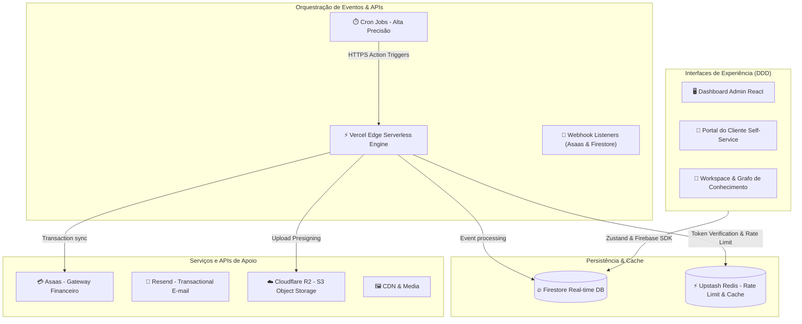

# 🔐 HUB CENTRAL — CRM ENTERPRISE

Plataforma corporativa de CRM de alta performance construída com arquitetura **Modular Domain-Driven Design (DDD)** no Frontend e **Serverless Micro-services** no Backend.

---

## 💎 Recursos Premium Recentes (Chat & UX)

Recentemente, adicionamos uma série de recursos de ponta no **Hub Chat** e no CRM para elevar a produtividade e a colaboração da equipe a um patamar corporativo elite:

1.  **🎥 Loom Nativo (Widget de Gravação Global):**
    *   Widget flutuante avançado ativado diretamente a partir do Header de qualquer tela do CRM.
    *   Captura inteligente de tela + voz (microfone) com alta definição usando Web APIs nativas.
    *   Upload assíncrono otimizado direto para o **Cloudflare R2 Object Storage** via *Presigned URLs*.
    *   Cópia automática do link público para a Área de Transferência e menu rápido para compartilhamento direto em canais de chat recentes com 1 clique.
2.  **🎉 Física de Emojis Festivos:**
    *   Reações com física de partículas realista na tela ao clicar em emojis, usando `canvas-confetti` com formas de emojis customizadas.
3.  **📢 Glow/Neon para Comunicados:**
    *   Destaques visuais vibrantes estilo neon dourado/âmbar com pulsação suave em bolhas de chat com prefixo `[AVISO]`.
5.  **🕰️ Sistema de Ponto Eletrônico & Time Tracking Avançado (CLT vs PJ):**
    *   **Badges de Regime e Jornada Cadastrada:** Atribuição simplificada e segura no painel do Perfil (editável apenas por Admin/RH) definindo colaboradores como CLT ou PJ. Administradores são tratados automaticamente como PJ por padrão.
    *   **Fluxo Inteligente de Reabertura:**
        *   *Profissional PJ:* Expediente livre de travas que nunca bloqueia. Permite reabrir com apenas um clique para contagem normal de horas.
        *   *Colaborador CLT:* Expediente que bloqueia ao fim ou encerramento. A reabertura requer a informação do período de **horas extras planejadas** (em minutos) via prompt elegante integrado ao `useDialog`.
    *   **Background Worker de Expiração (CLT):** Monitoramento contínuo a cada 10 segundos no hook `usePresence.ts` que encerra e bloqueia o expediente do CLT de forma autônoma assim que o período de hora extra autorizada expirar.
    *   **Auditoria Centralizada de Expediente no People:** A aba de expedientes ao vivo do painel People lista todos os colaboradores da empresa (online/offline) com badges inteligentes de conformidade (Atraso de entrada > 10 min, Pausa de almoço excedida > 1h, regime de Hora Extra).
    *   **Modal de Detalhes Integrado (`AttendanceDetailsModal`):** O clique na linha do expediente do time abre instantaneamente um modal super premium contendo totalizadores, gráfico semanal de produção e o espelho de ponto mensal completo do colaborador, evitando navegação de telas e carregando 100% no cache local do Zustand.
    *   **Exportação CSV Avançada:** Logs consolidados exportáveis em CSV já incluindo indicadores de atraso de entrada, pausas de almoço excedidas e horas extras realizadas para facilitar a folha de pagamento do RH.
    *   **Segurança no Backend:** Proteção robusta contra payload direto no backend (Vercel handler) impedindo que colaboradores comuns burlem o regime de contratação ou alterem seus horários de expediente.
    *   **useDialog Integrado:** Substituição completa de diálogos de alerta e confirmação nativos por modais interativos e personalizados (`useDialog`) integrados à identidade visual do CRM.
4.  **📊 CFO Simulator & DRE Table Automatizada (Financeiro Inteligente):**
    *   **Configuração Fiscal Oficial:** Painel administrativo de Porte (MEI, ME, EPP, LTDA) e Regime Tributário (Simples Nacional III, V, Lucro Presumido) persistidos de forma segura no banco de dados.
    *   **Simulador de Contratação & Pró-labore:** Slider interativo de alta precisão com algoritmo de Gross-up que calcula o Salário Bruto contratual com base no Salário Líquido desejado no bolso (aplicando alíquotas e faixas progressivas brasileiras vigentes de INSS e IRRF).
    *   **Suporte a Pró-labore Zero:** Flexibilidade total para sócios e administradores trabalharem sem remuneração direta, definindo a retirada do pró-labore simulado ou contratado como R$ 0,00.
    *   **Diagnóstico de Fator R:** Gráfico visual de meta de 28% do faturamento acumulado, indicando a elegibilidade para redução tributária do Anexo V (15.5%) para o Anexo III (6.0%) no Simples Nacional.
    *   **DRE Gerencial Reativa (Folha & Impostos Automáticos):** Integração total do financeiro da empresa que lê os perfis de equipe e as preferências da organização no Firestore para deduzir, de forma automática e sem lançamentos manuais, as despesas de pessoal reais (salário + provisões de 13º, férias + 1/3, FGTS, multa) e as deduções tributárias mensais na DRE, recalculando inclusive o Fator R dinâmico de cada mês para definir a alíquota do Simples.

---

## 🏗️ Arquitetura Técnica

O sistema utiliza persistência reativa orientada a eventos em tempo real no Firestore, com camada de cache/rate-limiting via Upstash Redis e automações via Vercel Serverless Functions.



---

## 🛠️ Stack Tecnológica

*   **Frontend:** React 19, TypeScript, Vite, Tailwind CSS.
*   **Gerenciamento de Estado:** Zustand 5.x & React Context.
*   **Banco de Dados & Real-time:** Firebase Firestore & Firebase Auth.
*   **Cache & Rate Limiting:** Upstash Redis.
*   **Object Storage (S3):** Cloudflare R2 (com assinatura de uploads via *Presigned URLs* locais).
*   **Mídia & CDN:** Cloudinary & ImgBB.
*   **E-mails:** Resend API (e-mails transacionais).
*   **Gateway Financeiro:** Asaas API (assinaturas, carnês, splits e notificações automáticas).
*   **Observabilidade:** Sentry (erros e performance) & Axiom.

---

## ⚡ Otimizações & Performance

1.  **Lazy-Loading Arquitetural:** Roteamento em `AppRouter.tsx` otimizado para carregar views e portais pesados sob demanda via `React.lazy()`. Apenas o `DashboardView` inicial carrega de forma síncrona.
2.  **Code Splitting (Rollup Chunks):** Configuração do `vite.config.ts` com chunks manuais específicos para isolar dependências pesadas (`tldraw`, `three`, `recharts`), preservando cache de pacotes estáticos.
3.  **Paralelização de Queries & Loops:** APIs (`portal_finance.ts`) e Cron Jobs (`daily_cron.ts` e `finance_engine.ts`) otimizados usando `Promise.all()` e `Promise.allSettled()` para evitar chamadas síncronas sequenciais (waterfalls).
4.  **Limpeza de Bundle:** Remoção completa de dependências mortas e módulos legados de IA (como SDK do Gemini).
5.  **Indexação do Firestore:** Mapeamento explícito de índices de `collectionGroup` e compostos em `firestore.indexes.json` para suportar consultas complexas de monitoramento e crons.
6.  **Otimização de Escritas no Uptime (Debounce do Firestore):** API do scheduler (`process_scheduler.ts`) otimizada para monitorar sites a cada 1 minuto mas atualizar o status no Firestore apenas a cada 15 minutos (ou em caso de mudança de status), reduzindo as operações de escrita em 93.3% para blindar o projeto contra o estouro de cotas no plano gratuito.

---

## 🚀 Como Rodar o Projeto

### Pré-requisitos
*   Node.js (LTS)
*   Firebase CLI & Vercel CLI (opcional)

### Instalação & Execução
```bash
# Instalar dependências
npm install

# Iniciar servidor de desenvolvimento
npm run dev

# Rodar a suíte de testes (Vitest)
npm run test

# Verificar tipos e sintaxe (Lint)
npm run lint
```

---

## 🔑 Variáveis de Ambiente (.env)

Copie `.env.example` para `.env` e configure os parâmetros obrigatórios:

| Variável | Descrição / Origem |
| :--- | :--- |
| `VITE_FIREBASE_API_KEY` | Chave de API do Firebase Auth/Firestore |
| `VITE_FIREBASE_PROJECT_ID` | ID do projeto do Firebase |
| `VITE_UPSTASH_REDIS_REST_URL` | Endpoint REST do Redis (Upstash) |
| `VITE_UPSTASH_REDIS_REST_TOKEN`| Token de segurança do Upstash Redis |
| `ASAAS_API_KEY` | Token de autenticação da API do Asaas |
| `R2_ACCOUNT_ID` | ID da conta do Cloudflare R2 |
| `R2_ACCESS_KEY_ID` | Chave de acesso R2 S3 |
| `R2_SECRET_ACCESS_KEY` | Chave secreta de escrita e leitura R2 |
| `R2_BUCKET_NAME` | Nome do bucket Cloudflare R2 |
| `RESEND_API_KEY` | Chave de envio de e-mails do Resend |
| `CRON_SECRET` | Token de validação de Cron Jobs |

---

## 🧪 Suíte de Testes (Vitest)

A integridade do CRM é assegurada por testes unitários e de integração:
*   `crmSlice.test.ts`: Regras de negócio, risco de churn e cálculo de renovação.
*   `nexusStore.test.ts`: Controle de estante virtual, progresso de leitura e moedas.
*   `webhook.test.ts`: Validação de requisições de webhook financeiro (Asaas).

---

> [!CAUTION]
> **PROPRIEDADE INTELECTUAL HUB SYMPLES LTDA**
> Software proprietário. Uso restrito a colaboradores autorizados.
