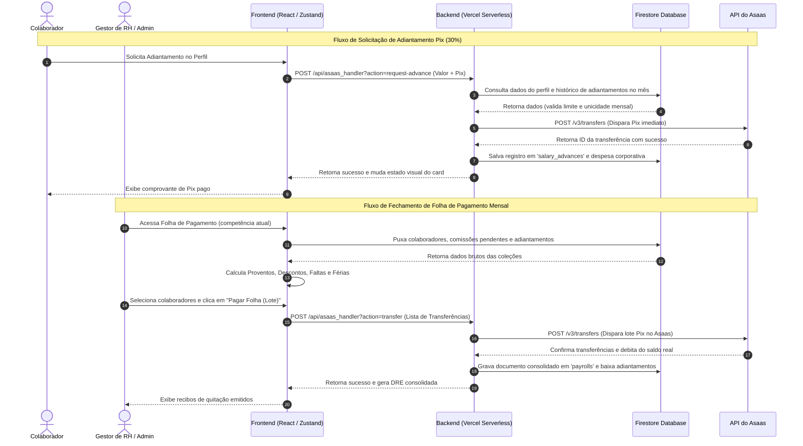

# 🔐 HUB CENTRAL — CRM ENTERPRISE

Plataforma corporativa de CRM de alta performance construída sob a arquitetura de **Modular Domain-Driven Design (DDD)** no Frontend e **Serverless Micro-services** no Backend. O sistema foi desenvolvido para centralizar a operação de vendas, gestão de equipes, conformidade ética (Compliance) e automação financeira integrada a bancos reais.

---

## 🎯 Índice
1. [Recursos Premium Atuais](#-recursos-premium-atuais)
2. [Comparativo de Regimes (CLT vs PJ)](#%EF%B8%8F-comparativo-de-regimes-clt-vs-pj)
3. [Arquitetura Técnica & Fluxo de Dados](#%EF%B8%8F-arquitetura-t%C3%A9cnica--fluxo-de-dados)
4. [Persistência & Modelagem no Firestore](#-persist%C3%AAncia--modelagem-no-firestore)
5. [Stack Tecnológica](#%EF%B8%8F-stack-tecnol%C3%B3gica)
6. [Configuração de Variáveis de Ambiente](#-configura%C3%A7%C3%A3o-de-vari%C3%A5veis-de-ambiente-env)
7. [Como Rodar e Validar o Projeto](#-como-rodar-e-validar-o-projeto)
8. [🚀 Roadmap: Direct Response & WhatsApp X1](./docs/ROADMAP_DIRECT_RESPONSE_WHATSAPP.md)

---

## 💎 Recursos Premium Atuais

### 1. 💵 Folha de Pagamento & Adiantamento Salarial Automatizados via Asaas
Integração ponta a ponta com a API do Asaas para automatizar a folha de pagamento corporativa da empresa, mitigando erros contábeis e operacionais:
*   **Fechamento Mensal em Lote (`PayrollPanel`):** Consolidação automática dos proventos de colaboradores (salário proporcional, comissões de negócios fechados no CRM e horas extras integradas ao ponto eletrônico) e descontos (faltas CLT com DSR, coparticipações de plano de saúde, VT/VR e adiantamentos de 30% ativos).
*   **Portal de Adiantamento Salarial:** O colaborador visualiza de forma segura em seu perfil o limite disponível (exatamente 30% do seu salário base) e pode solicitar um Pix imediato. O backend do CRM dispara a transferência Pix segura no Asaas, cria o registro de adiantamento (`salary_advances`) e lança uma despesa contábil. A amortização ocorre de forma automática no fechamento da folha do mês correspondente.
*   **Módulo de Férias CLT (Art. 130 e 145 CLT):**
    *   *Desconto de Faltas Aquitivas:* Redução proporcional de dias de férias gozadas baseada na tabela legal:
        
        | Faltas no Período Aquisitivo | Dias de Férias Concedidos |
        | :---: | :---: |
        | Até 5 faltas | 30 dias |
        | De 6 a 14 faltas | 24 dias |
        | De 15 a 23 faltas | 18 dias |
        | De 24 a 32 faltas | 12 dias |
        | Mais de 32 faltas | Perda do direito |
        
    *   *Adiantamento Financeiro:* Agendamento de Pix antecipado contendo o líquido de férias (Dias de Gozo + 1/3 Constitucional - impostos retidos) com disparo obrigatório **2 dias antes** do início do gozo.
    *   *Dedução de Retorno:* O fechamento da folha mensal seguinte identifica de forma automática o período de férias gozado e desconta a proporção de dias que já foi paga de forma antecipada no salário normal.
*   **Rescisão Automatizada (CLT & PJ):** Módulo que calcula com base na admissão e desligamento os saldos de salário, 13º proporcional, férias vencidas/proporcionais acrescidas de 1/3, avisos prévios indenizados/trabalhados e apresenta cards informativos sobre guias governamentais externas (como a multa de 40% do FGTS).
*   **Sincronização de Saldo Bancário:** Monitoramento em tempo real do caixa corporativo do Asaas integrado ao módulo de Fluxo de Caixa Projetado (`CashFlowProjected.tsx`), alimentando o Saldo Inicial automaticamente.

### 2. 📊 CFO Simulator & DRE Table Reativa
Painel de BI financeiro inteligente que converte dados fiscais e operacionais em inteligência estratégica:
*   **Preferências Fiscais da Organização:** Cadastro administrativo de Porte de Empresa (MEI, ME, EPP, LTDA) e Regime Tributário (Simples Nacional Anexos III ou V, Lucro Presumido).
*   **Simulador de Contratação & Pró-labore:** Painel de cálculo com algoritmo de Gross-up que projeta o custo bruto da empresa (incluindo INSS patronal, RAT, Terceiros) a partir do salário líquido desejado no bolso pelo sócio/administrador, aplicando tabelas progressivas vigentes de INSS e IRRF brasileiro.
*   **Diagnóstico do Fator R:** Gráfico reativo demonstrando a meta de 28% do faturamento acumulado em folha de pagamento, necessária para enquadrar empresas de tecnologia no Simples Nacional do Anexo V (Alíquota de 15.5%) para o Anexo III (Alíquota de 6.0%).
*   **DRE Gerencial Reativa:** Consolidação contábil automática que cruza os dados do perfil de funcionários (salários, regimes e descontos de benefícios) para lançar despesas de pessoal e impostos devidos na DRE sem necessidade de digitação manual de caixa.

### 3. 📜 Contratos Digitais (Signature Gate)
Segurança jurídica avançada na admissão e manutenção de colaboradores:
*   **Templates Dinâmicos:** Criação e edição de contratos corporativos padrão usando Markdown e variáveis automáticas (`{NOME_COLABORADOR}`, `{SALARIO}`, `{TIPO_CONTRATO}`).
*   **Classificação de Documentos:** Suporte a três tipos integrados ao ERP: Contrato de Trabalho CLT (`work_clt`), Contrato de Prestação de Serviços PJ (`work_pj`) e Termo de Responsabilidade Patrimonial de Ativo (`asset_term`).
*   **Onboarding Automático por Convite:** Integração do fluxo de convite de colaboradores com o acervo contratual. O administrador pré-define qual contrato (CLT/PJ) deve ser atrelado ao e-mail de convite; ao aceitar o convite e criar a conta no primeiro login, o colaborador é direcionado diretamente ao Signature Gate correspondente.
*   **Signature Gate & Abas de Triagem:** Bloqueador de tela em Glassmorphism que impede o acesso ao CRM se houver documentos pendentes, exigindo leitura ativa, CPF/RG e assinatura. A Central de Documentos do colaborador organiza e separa os itens assinados/pendentes em três sub-abas ("Contratos CLT", "Contratos PJ" e "Termos de Equipamentos").
*   **Carimbo Jurídico Digital:** Ao assinar, é gerado um selo holográfico incorporado ao contrato com Hash Criptográfico SHA-256, endereço IP do assinante, timestamp Unix, sistema operacional do usuário e fonte cursiva elegante, em conformidade com a MP nº 2.200-2/2001.

### 5. 🛍️ Checkout Transparente Dinâmico por Produto
Sistema de checkout transparente público de alta conversão, permitindo que cada oferta ou produto possua identidade visual própria e alta credibilidade:
*   **Branding & Capa Específica por Produto:** Cada produto ou oferta cadastrada pode ter sua própria **Logo** (com recomendação e suporte para fundo transparente em formato PNG/SVG) e **Cor Temática (Accent Color)** que molda reativamente a paleta visual, botões, gradientes e sombras da página de checkout.
*   **Lista de Benefícios Inclusos:** Exibição lateral em cards com efeito de vidro (*Glassmorphism*) contendo os bullets de vantagens e recursos do produto em destaque.
*   **Link Direto de Checkout:** O painel de gestão de produtos no CRM disponibiliza o botão *"Link Checkout"*, gerando links diretos (`/checkout/:orgId?offerId=ID_DO_PRODUTO`) para vendas com 1 clique.
*   **Minuta Contratual Customizada por Produto:** Suporte a termos de aceite jurídicos específicos para cada produto ou serviço oferecido.
*   **Selos de Confiança Padronizados (Trust Badges):** Exibição em todas as páginas de checkout dos selos de **Criptografia SSL de 256 bits**, métodos aceitos (**Pix**, **Cartões de Crédito** em até 12x e **Boleto**) e a chancela oficial de processamento seguro via **Asaas**.

### 6. 🛡️ Ouvidoria & Linha Ética
Canal corporativo seguro voltado para compliance corporativo em conformidade com a **Lei nº 14.457/2022**:
*   **Garantia de Anonimato Real:** O backend do Firestore descarta o `userId` e o `IP` de manifestações anônimas, impossibilitando rastreamento de autoria.
*   **Acompanhamento por Chave de Protocolo:** Manifestantes anônimos recebem uma chave única (`ETH-XXXXXX`) para consultar o andamento e conversar de forma bidirecional e segura com o RH/Compliance.
*   **Painel Administrativo do RH:** Triagem das denúncias com classificação de status (`Recebido`, `Em Análise`, `Resolvido`) e chat interno dedicado para resposta ao manifestante de forma segura.

### 5. 🎥 Loom Nativo & Recursos de UX
*   **Loom Widget:** Gravador de tela e webcam global embutido no cabeçalho do CRM. Efetua a captura via Web APIs do navegador, gera o arquivo de vídeo e faz o upload assíncrono otimizado para o **Cloudflare R2 Object Storage** via *Presigned URLs* locais, copiando o link final para a área de transferência com 1 clique.
*   **Física de Emojis:** Sistema de micro-interações que reproduz física de gravidade e vetores com emojis reais na tela do chat através do `canvas-confetti`.
*   **Glow para Comunicados:** Efeitos visuais vibrantes em neon âmbar para destacar bolhas de mensagens corporativas marcadas como `[AVISO]`.
*   **Acessibilidade e Contraste Premium:** Todas as abas, botões, filtros e campos selecionados do CRM utilizam uma regra de contraste global robusta no CSS. Ao serem marcados com a classe de destaque primário (`bg-primary-500`), o texto e os ícones internos são forçados a exibir-se em branco claro (`#ffffff`), eliminando o contraste baixo de textos escuros indesejados.
*   **Botão de Salvamento Animado (SaveButton):** Botão animado de feedback com Framer Motion integrado em locais estratégicos (configurações do perfil, aparência da empresa, simulador de CFO, mural de avisos e edição de cargos). Substitui toasts de sucesso convencionais por uma transição interna de cor para verde neon com checkmark desenhado dinamicamente em SVG, e oferece feedback visual de falha por efeito de vibração (shake) em tom rosa/vermelho com mensagem dinâmica.


### 6. 🤖 Conciliação Bancária Inteligente & Robô Contábil (Asaas)
Fluxo financeiro sem erro humano e categorização contábil autônoma:
*   **Captura Diária de Extrato (Cron Job):** Sincronização automatizada diária que consome o extrato da API do Asaas e importa as despesas reais do caixa (taxas bancárias, faturas de servidores, compras com cartão corporativo, etc.) para o CRM.
*   **Robô Contábil com Aprendizado Contínuo:** Utiliza correspondência de similaridade textual e padrões de descritivos históricos de despesas da organização para auto-classificar os lançamentos nos centros de custos corretos de forma autônoma.
*   **Painel de Conciliação em Lote:** Central de controle financeiro reativa que apresenta de forma ágil lançamentos inéditos classificados como *"A Categorizar"*. O gestor pode classificar os itens pendentes com base em sugestões da IA e o robô aprende dinamicamente com as novas associações contábeis.
*   **Rastreabilidade Resiliente de Webhooks (`TRANSFER_CONFIRMED` & `TRANSFER_FAILED`):** Interceptação de eventos de transferências Pix na API Asaas que atualiza e estorna automaticamente adiantamentos de salários, férias e folhas de pagamento no banco de dados do CRM caso o Pix falhe ou seja rejeitado pelo banco receptor.

### 7. 📢 Mural de Comunicados Gerenciável & Central Comunitária (Bento Grid)
Integração e cultura corporativa de alto impacto:
*   **Central Hub Matinal (Home):** Layout bento-grid de abertura do CRM com visual Glassmorphism contendo cotações em tempo real, calendário de animes (lançamento geek) com busca inteligente (autocomplete Jikan), agenda semanal de reuniões em tempo real (`FeedSchedule.tsx`) e o Desafio da Trivia Geral (`FeedTrivia.tsx`) reformulado com 40 perguntas locais em Português do Brasil, que premia o colaborador com 50 Hub Coins por acerto uma vez ao dia com trava de persistência no Firestore.
*   **Mural de Avisos Dinâmico (Painel Administrativo):** Painel que permite criar, editar e excluir comunicados do time, com opção de destaque urgente em Glow Neon âmbar. O gerenciamento foi unificado no painel do administrador sob duas sub-abas:
    *   **Mural do Time:** Avisos internos para todos os colaboradores (CRUD do `AnnouncementManager`).
    *   **Aviso do Portal (Clientes):** Formulário dedicado para emitir avisos globais (como recesso, fim de ano e atualizações) exibidos no topo do portal corporativo de todos os clientes, persistidos em tempo real na raiz da organização.
*   **Tempo de Expiração Automatizado:** Cada aviso possui configuração de validade em dias e sai do ar de forma autônoma após expirar.
*   **Celebrações do Mês Reais:** Listagem em tempo real dos aniversariantes da empresa integrados com perfis do Firestore, incluindo disparo de confete ao festejar com os aniversariantes de hoje.

### 8. 🏷️ Módulo de Gestão de Ativos Corporativos & QR Code
Módulo especializado integrado a Pessoas & Cultura para controle patrimonial físico distribuído aos colaboradores (MacBooks, celulares, cadeiras, periféricos, etc.):
*   **Controle e Atribuição Patrimonial:** Cadastro completo com data de aquisição/compra, especificações técnicas detalhadas, número de série e geração de código de patrimônio unificado (`CRM-AST-XXXXXX`).
*   **Termos de Responsabilidade Patrimonial:** Vínculo obrigatório de um Termo de Responsabilidade cadastrado no momento da atribuição de um ativo a um colaborador, gerando o documento digital do tipo `asset_term` correspondente para assinatura no perfil.
*   **Geração Inteligente de QR Code de Posse:** Quando o ativo é vinculado a um colaborador (status *Em uso*), o sistema gera um QR Code dinâmico que aponta para um portal de visualização pública.
*   **Impressão Térmica de Etiquetas (50x30mm):** Layout otimizado em CSS `@media print` para impressoras térmicas físicas de patrimônio. A etiqueta divide-se em duas metades: à esquerda, o QR Code de alta precisão; à direita, a marca da empresa, nome do ativo, código patrimonial, nome do colaborador portador e seu cargo.
*   **Portal Público de Patrimônio:** Rota livre de autenticação e exposta de forma segura no Firestore (`allow get: if true`) que permite que qualquer pessoa ou câmera de celular escaneie o equipamento e visualize imediatamente quem é a empresa proprietária do item, a data de aquisição do patrimônio e a identificação do colaborador responsável atualmente pela sua custódia (com nome, cargo e data/hora do recebimento).

### 9. 🎲 Arena de Jogos Multiplayer & Lobbies Online
Módulo de descompressão integrado voltado para gamificação e cultura da equipe:
*   **Lobbies Multi-jogador (Ludo):** Criação de salas de espera reativas no Firestore para até 4 jogadores humanos simultâneos. O Host tem total autonomia para preencher slots vagos com robôs inteligentes (CPU) e convidar colegas da empresa.
*   **Inteligência Artificial Baseada no Host:** Execução de IA de robôs no cliente do Host, sincronizando decisões e dados no Firestore para todos os participantes em tempo real.
*   **Casas Seguras & Regras Clássicas:** Motor de regras de Ludo completo com validações rígidas de barreiras (bloqueio de passagem/parada para 2+ peças da mesma cor) e casas seguras (impedindo a captura em saídas e intermediárias com estrelas neon piscantes), além de turnos extras estritos para jogadas de dado de valor 6.

### 10. 🎨 Fábrica de Sites & Projetos (Módulo Operacional Unificado)
Integração operacional que centraliza o acompanhamento de entregas de sites com uma central de templates e prompts de IA:
*   **Acompanhamento de Projetos:** Monitoramento em tempo real do progresso de desenvolvimento dos clientes vindos do CRM, com medição de SLA e acompanhamento de estágios de entrega.
*   **Catálogo de Templates White Label (R2/Cloudinary):** Armazenamento estrutural de layouts focado em nicho e tipo (Landing Page, SaaS, Institucional), com envio opcional de print de preview e colagem/edição direta de códigos HTML/CSS/JS.
*   **Variáveis Clicáveis com Injeção no Cursor:** Painel de chips de variáveis clicáveis (ex: `{COR_PRIMARIA}`, `{TITULO_HERO}`, `{LINK_WHATSAPP}`) abaixo do editor de HTML. Ao clicar em um chip, a variável é injetada na posição do cursor do editor e ativada no formulário de preenchimento dinâmico do cliente automaticamente.
*   **Biblioteca de Prompts Globais de IA:** Biblioteca modular de prompts de engenharia reversa para o Gemini Canvas. Permite inserir variáveis dinâmicas no cursor e associar o prompt de forma dinâmica apenas na tela de geração ao cliente (Split Screen), gerando um prompt final completo e polido com 1 clique.
*   **Execução de Demos Locais:** Abertura e renderização dos templates em uma nova aba usando injeção direta via JavaScript (`document.write`), permitindo visualizar a demo estática do catálogo ou a demo personalizada com as variáveis informadas do cliente já substituídas.

### 11. 📚 Nexus Hub — Biblioteca de Sabedoria Corporativa & Gamificação
Plataforma integrada de incentivo à leitura e gestão de conhecimento corporativo com mecânicas avançadas de gamificação:
*   **Gerenciamento de Estante (LibraryTab):** Organiza o catálogo de livros corporativos, leituras recomendadas e obras da comunidade corporativa em layouts dinâmicos e fluidos de grade ou lista.
*   **Estilo Visual 3D Realista (Lombada):** Nova tecnologia de renderização tridimensional nativa no CSS (`Book.tsx`) baseada no design clássico de Ali Imam. Exibe cada obra com lombadas em degradê tridimensional, miolo de folhas detalhado nas laterais, contracapa com profundidade física real calculada pela contagem de páginas do livro, e um marcador de páginas (Bookmark) flutuante reativo para obras favoritadas.
*   **Sincronização com Clubes de Leitura & Trilhas:** Monitoramento em tempo real do progresso de leitura dos colaboradores. O progresso é sincronizado de forma bidirecional com os Clubes de Leitura da organização e com as Trilhas de Conhecimento Ativas.
*   **Recompensas em HubCoins por Página Nova:** Sistema cognitivo de incentivo à leitura com trava temporal de segurança de 24 horas por obra, que concede HubCoins de forma proporcional a cada página lida inédita do colaborador, integrada ao seu saldo e ranking na Arena.

### 12. 🎨 Experiência do Usuário (UX) & Componentes Premium Refinados
Plataforma modernizada com foco em usabilidade e performance, integrando componentes estilizados com Tailwind CSS e ícones premium para interações de alta performance e visual impecável:
*   **Comemorações com Balões Flutuantes (`balloons-js`):** Efeito estético festivo com balões flutuantes que sobe na tela do colaborador no dia do seu aniversário.
*   **Medidores de Armazenamento Reativos (Nativos Refinados):** Painel administrativo de controle de consumo ("Consumo") com barras de progresso nativas HTML5 altamente customizadas e estilizadas para exibir a volumetria em tempo real das nuvens Firebase, Cloudflare R2 e Cloudinary com sinalização visual clara de limite de uso.
*   **Tabelas de Negócios com Ordenação e Status:** Listagem reativa de Leads, Contratos e Projetos que aceitam ordenação por colunas, e exibem status em badges e fotos de responsáveis com Avatares circulares otimizados.
*   **Central de Chats Favoritos Fixados:** Ordenação reativa na `ChatSidebar` que fixa no topo os chats marcados como favoritos com coração reativo e suporte ao local storage do navegador.
*   **Toggles de Notificação Premium:** Alternador lógico reativo no menu de contexto das conversas, utilizando os ícones `BellFill` e `BellSlash` para mutar e desmutar contatos de forma silenciosa.
*   **Toolbar e Anotações com Formatação:** Barra de estilo para Wiki e anotações de leads/clientes para estilo em Negrito, Itálico e Sublinhado usando ícones premium.
*   **Campos de Data e Hora Avançados:** Modais de lembrete e agendador de mensagens adaptados para inputs nativos HTML5 altamente responsivos e com ampla compatibilidade de sistema.
*   **Indicador Neon Deslizante de Pilar Ativo (`Sidebar.tsx`):** Filete neon vertical luminoso na lateral esquerda dos botões da Sidebar que acompanha o grupo de navegação correspondente à rota ativa, realizando um deslizamento vertical físico suave (`layoutId` do Framer Motion) à medida que a URL do navegador é alterada.
*   **Profile Hover Card com Monitoramento de Expediente (`ProfileHoverCard.tsx`):** Componente de cartão de perfil flutuante (Hover Card) em Glassmorphism injetado no `document.body` via React Portal (evitando cortes por `overflow: hidden`). Possui atraso inteligente de hover de 250ms (debounce) para otimização de banda e inicia um listener de Ponto Eletrônico temporário em tempo real para exibir o status do expediente atual, tempo decorrido correndo na tela, cargo e e-mail do colaborador ao passar o mouse.

### 13. 🔐 Portal Hub — Canal do Cliente Independente (Desacoplado)
O Canal do Cliente foi extraído e desacoplado do repositório do CRM administrativo para um repositório independente (**Portal Hub**), hospedado em **`https://portahub.hubsymples.com.br`** e pronto para deploy automático na Vercel:
*   **Autenticação Obrigatória Integrada:** Exige login inicial obrigatório com Firebase Auth (/login) para acesso às áreas restritas de faturamento, chamados e agenda.
*   **Ativação Desacoplada por Código Único:** Implementa fluxo com código de 6 dígitos (ex: `HUB-A7B8C9`) para ativação inicial. O cliente cria sua conta no portal usando qualquer e-mail/senha pessoal desejados, e insere o código único gerado pelo CRM para vincular definitivamente sua conta do portal ao seu card de cliente administrativo.
*   **Integração Nativa de Dados:** Compartilha o mesmo banco de dados do Firebase Firestore com o CRM administrativo para a sincronização em tempo real de chamados, agendamentos e contratos.
*   **CORS Habilitado na API Administrativa:** O endpoint `/api/portal_handler` no CRM administrativo está configurado para receber requisições de origem cruzada (CORS) da origem `https://portahub.hubsymples.com.br` para consultas contábeis (Asaas) seguras.
*   **Endpoints de API Públicos e Seguros [NOVO]:** O endpoint `/api/portal_handler` suporta ações de acesso seguro utilizando a validação do `publicToken` gerado para cada cliente no CRM:
    *   `public_get_appointment`: Retorna informações básicas do agendamento (nome do cliente, serviço, data, hora, preço) e o logotipo do assinante.
    *   `public_confirm_appointment`: Executa atualizações de status de presença do cliente final (`confirmed` ou `cancelled`).
    *   `support_create` (POST): Permite a outros softwares (SaaS parceiros) criarem chamados de suporte diretamente no CRM.
    *   `support_reply` (POST): Permite aos clientes enviarem réplicas para chamados ativos no CRM.
    *   `support_list` (GET): Retorna a lista completa de chamados e conversas de suporte daquele cliente.

### 14. 💼 Módulo "Meu Negócio" & Lucro Real por Projeto no Portal Hub
Ferramental de produtividade completo disponível na área restrita do cliente no **Portal Hub**:
*   **Controle de Estoque de Insumos (`PortalInventory.tsx`):** Gestão de materiais e quantidade mínima crítica com alertas de estoque baixo.
*   **Calculadora de Orçamentos (`PortalCalculator.tsx`):** Simulador de precificação com base em materiais, horas de trabalho e margem deslizante, permitindo salvar propostas no Firestore.
*   **Performance Financeira por Projeto (`PortalCRMFinance.tsx`):** Permite aos clientes acompanhar custos de insumos e registrar despesas operacionais atreladas a agendamentos, gerando relatórios de margem e lucro líquido por projeto (com sinalização visual verde/amarela/vermelha de performance).

### 15. 🚀 Hub de Crescimento (Área de Sucesso do Cliente)
Backoffice, infraestrutura de dados e portal do cliente para o Hub de Crescimento, disponibilizando recursos de sucesso e materiais aos clientes:
*   **Dados Individuais (Cofre da Marca):** Aba dedicada no CRM ("Cofre da Marca") e seção do Portal do Cliente ([PortalGrowthHub.tsx](../hubcrm-portal/src/views/PortalGrowthHub.tsx)) que exibe múltiplos logotipos da marca (ex: SVG, PNG transparente) para visualização e download individual, a paleta de cores HEX (com cópia rápida com 1 clique), a tipografia configurada e múltiplos links e templates customizados.
*   **Dados Globais (Ativos Globais):** Tela geral no menu do CRM com CRUD completo de materiais de sucesso, e renderização reativa no Portal do Cliente segregada por abas: "Templates Rápidos" (com detecção inteligente de links para aplicar badges e botões dedicados de plataformas como Canva, Trello e Google Drive), "Arsenal de Vendas" (scripts com botão de cópia rápida) e "Treinamentos" (player de vídeo incorporado e links externos).
*   **Dicas & Insights (Blog Dinâmico):** Nova sub-aba administrativa no CRM que permite gerenciar artigos ricos formados por metadados e blocos de conteúdo reordenáveis (parágrafo, subtítulo, citação e botão CTA para abas do portal). Os artigos são exibidos no feed do Portal em tempo real a partir da coleção global `/blog_posts` com incrementos atômicos de visualizações e curtidas.
*   **Segurança no Firestore & API:** Regras de segurança granulares no Firestore e atualização no payload da API do portal (`api/portal_handler.ts`) para incluir o objeto `brandAssets` no carregamento seguro do cliente.

### 16. 📢 HubAds — Módulo de Gestão de Criativos & Tráfego Pago
Módulo especializado para controle de criativos de tráfego pago, organização de referências e atribuição de leads:
*   **Grid Visual de Criativos:** Visualização em grade responsiva com design Glassmorphism, exibindo miniatura de mídias, tags, badges de plataforma e status de veiculação.
*   **Métricas Financeiras em Tempo Real:** Entrada de investimento, impressões, cliques, conversões e faturamento por criativo, com cálculo automático no frontend de CTR, CPC, CPL e ROAS.
*   **Upload de Mídia (Cloudinary):** Upload direto de peças de anúncios (imagens e vídeos) integrado com o serviço de Cloudinary.
*   **Classificação e Atribuição de Leads:** Rastreamento dinâmico que cruza o código único de rastreamento gerado (`HUBADS-XXX`) com o campo `leadSource` dos leads e clientes cadastrados no CRM para contabilizar conversões e faturamento real em tempo real.

### 17. 💳 Checkout Transparente White-Label (Asaas API v3)
Integração e processamento seguro de cobranças sob a própria identidade visual do HubCRM, sem redirecionar para páginas externas do Asaas:
*   **Centralização de Motor Financeiro:** Rota de API pública `/api/checkout_handler.ts` atuando como ponte server-to-server entre o cliente e a API Asaas.
*   **Suporte Multi-Métodos:** Suporta PIX (com QR code dinâmico e código copia-e-cola), Boleto Bancário (com linha digitável, código de barras e link de PDF) e Cartão de Crédito (tokenização imediata anti-fraude com envio de IP remoto).
*   **Validação por publicToken:** Segurança baseada em chaves criptográficas geradas para cada cliente, cruzadas com o ID do pagador Asaas.
*   **Suporte a Assinaturas e latest:** Lógica inteligente que resolve o pagamento mais recente de forma automática (`latest`) e extrai as faturas abertas de assinaturas (`sub_xxx`) de forma transparente.
*   **Integração de Webhooks:** Totalmente compatível com os webhooks existentes que atualizam o status financeiro para `RECEIVED`, atualizam o Firestore e geram lançamentos contábeis.

### 18. 🗺️ Funis & Orquestração de Processos (Quadro Infinito & Auto-Layout)
Módulo visual interativo no estilo Funnelytics/Miro para planejamento e desenho de jornadas de vendas, réguas multicanais e esteiras comerciais:
*   **Biblioteca Rica com 60+ Subtipos Especializados:** Suporte completo à realidade do mercado de vendas (WhatsApp X1 / Closer, Chatbot IA / Typebot, Grupo VIP de Lançamento, Webchat no Site, Meta Ads, Parcerias/Influenciadores, Tráfego Nativo, Páginas de Aplicação High-Ticket, Upsell 1-Click OTO, Área de Membros, Oferta Tripwire, Combo Promocional, Tag/Lead Scoring, Recuperação Pix Imediata e Programa Indique e Ganhe).
*   **⚡ Auto-Organização Semântica por Estágios da Jornada (Smart Stage Layout):** Algoritmo inteligente que reconhece o papel de cada bloco e reordena a lousa automaticamente em colunas progressivas da esquerda para a direita (Tráfego ➡️ Consciência & Captura ➡️ Nutrição & VSL ➡️ Apresentação de Vendas ➡️ Fechamento/WhatsApp X1/Checkout ➡️ Bumps & Upsells ➡️ Pós-Venda & Retenção), mantendo alinhamento vertical simétrico e harmônico.
*   **📋 Copiar, Colar & Duplicar (Ctrl+C / Ctrl+V / Ctrl+D):** Suporte nativo a cópia e colagem de blocos individuais ou seleções em lote na lousa, clonando com deslocamento suave e recriando conexões internas entre os blocos duplicados de forma automática.
*   **Seleção em Lote & Área (Marquee Box Selection):** Seleção de múltiplos blocos desenhando um retângulo no canvas com o mouse ou via `Shift + Drag`.
*   **Arraste Sincronizado a 60fps & Exclusão em Grupo:** Movimentação fluida de blocos selecionados em conjunto mantendo o espaçamento relativo, e exclusão em massa com `Delete`.
*   **Barra Flutuante de Ações:** Painel de ação rápida para duplicar, copiar, criar molduras automáticas em volta dos blocos selecionados, alinhar vertical/horizontalmente e gerenciar grupos.
*   **Destaque Inteligente e Dimming (Modo Foco):** Ao passar o mouse ou selecionar um bloco, isola a trilha ativa e reduz a opacidade do ruído visual.
*   **Roteamento Ortogonal (90° Grid) & Portas Inteligentes:** Alternador entre curvas Bézier e linhas ortogonais com portas de retorno (topo/base) para evitar cruzamento de cards.
*   **Simulador de Tráfego e Gargalos:** Projeção em tempo real de visitantes, faturamento projetado, custo de tráfego (CPC) e ROAS.

---

## ⚖️ Comparativo de Regimes (CLT vs PJ)

O sistema de Ponto Eletrônico e Fechamento de Folha processa e valida dados de forma diferente com base no regime de contratação:

| Característica | Regime CLT (Consolidação das Leis do Trabalho) | Regime PJ (Prestador de Serviço) |
| :--- | :--- | :--- |
| **Flexibilidade de Ponto** | Rígido. Bloqueia o expediente ao bater a saída normal ou as horas extras autorizadas. | Livre. Não bloqueia o expediente e permite reabertura imediata a qualquer momento. |
| **Hora Extra** | Exige aprovação prévia em minutos pelo RH. Controlado por um worker que expira em background. | Não aplicável. Horas de prestação de serviços baseadas em entregas ou contratos fixos. |
| **Adiantamento Salarial** | Permitido até 30% do salário contratual. Amortizado em folha. | Permitido de acordo com limite prévio (30% do contrato), amortizado no fechamento. |
| **Férias / Recesso** | Remuneradas com 1/3 constitucional. Faltas injustificadas reduzem os dias de direito (Art. 130). | Descrito no histórico financeiro como recesso remunerado contratual (se aplicável). |
| **Deduções Legais** | INSS, IRRF retidos na fonte e coparticipações/descontos de benefícios. | Apenas retenções contratuais de prestação de serviços. |
| **Rescisão** | Multas de aviso prévio, 13º proporcional, férias proporcionais + 1/3 e cálculo do FGTS. | Multa de quebra contratual baseada em valores fixos ou porcentagem (conforme contrato). |

---

## ⚙️ Arquitetura Técnica & Fluxo de Dados

O sistema opera de forma integrada utilizando reatividade no frontend e processamento serverless no backend:



---

## 🗄️ Persistência & Modelagem no Firestore

O banco de dados é sustentado por 6 coleções fundamentais, protegidas por regras de acesso baseadas em regras de negócio (RBAC) em `firestore.rules`:

### 1. Coleção `/profiles/{uid}` (Cadastro e Contratos)
Armazena a ficha funcional e dados bancários criptografados para recebimento:
```typescript
interface UserProfile {
  uid: string;
  email: string;
  displayName: string;
  role: 'admin' | 'manager' | 'employee';
  contractType?: 'CLT' | 'PJ';
  salary?: number;
  pixKeyType?: 'CPF' | 'CNPJ' | 'EMAIL' | 'PHONE' | 'RANDOM';
  pixKey?: string;
  bankAccount?: {
    bankCode: string;
    bankName?: string;
    agency: string;
    account: string;
    accountDigit: string;
    accountType: 'CHECKING' | 'SAVINGS';
    holderName: string;
    holderCpfCnpj: string;
  };
  benefitDeductions?: {
    healthInsuranceCopay?: number;
    mealVoucherDiscount?: number;
    transportVoucherDiscount?: number;
  };
  resignationDetails?: {
    resignationDate: string;
    reason: 'dismissal_without_cause' | 'dismissal_with_cause' | 'employee_resignation' | 'pj_termination';
    noticeType: 'worked' | 'indemnified' | 'none';
    penaltyPercentage?: number;
  };
}
```

### 2. Coleção `/organizations/{orgId}/payrolls` (Folha Consolidada)
Registra o histórico e recibo de pagamentos efetuados nas folhas de competência mensal:
```typescript
interface PayrollPeriod {
  id: string;               // Ex: "2026-06"
  month: string;            // Formato "YYYY-MM"
  startDate: number;        // Timestamp início apuração
  endDate: number;          // Timestamp término apuração
  paymentDate: number;      // Data do Pix Asaas
  status: 'draft' | 'paid';
  totalPaid: number;        // Saldo líquido total pago em lote
  createdAt: number;
  items: PayrollItem[];
}
```

### 3. Coleção `/organizations/{orgId}/salary_advances` (Controle de Pix de 30%)
Mantém o rastreamento dos adiantamentos salariais solicitados para evitar duplicidades no mês:
```typescript
interface SalaryAdvance {
  id: string;
  userId: string;
  userName: string;
  amount: number;           // Valor adiantado (máx. 30% do salário)
  month: string;            // Competência (Ex: "2026-06")
  createdAt: number;
  status: 'pending_repayment' | 'repaid';
  asaasTransferId?: string; // ID retornado pelo gateway de pagamento
}
```

### 4. Coleção `/organizations/{orgId}/vacation_payments` (Controle de Férias CLT)
Documenta e controla os pagamentos antecipados de recesso/férias de funcionários:
```typescript
interface VacationPayment {
  id: string;
  userId: string;
  vacationId: string;       // ID da ausência correspondente em 'vacations'
  daysCount: number;        // Dias de recesso (gozo)
  grossAmount: number;      // Valor bruto (Salário proporcional + 1/3)
  netAmount: number;        // Valor líquido pago 2 dias antes das férias
  paymentDate: number;      // Timestamp do pagamento
  status: 'pending' | 'paid' | 'failed';
}
```

### 5. Coleção `/organizations/{orgId}/supportRequests` (Central de Atendimento)
Armazena as solicitações de suporte abertas pelos clientes no Portal ou geradas internamente (WhatsApp/Telefone). Possui suporte a comunicação bidirecional em tempo real e controle de SLA:
```typescript
interface SupportRequest {
  id: string;
  clientId: string;
  clientName: string;
  category: string;
  priority: 'baixa' | 'media' | 'alta';
  message: string;        // Relato original e histórico de mensagens concatenadas
  reply?: string;         // Resposta enviada pelo consultor
  repliedAt?: any;        // Timestamp da resposta
  status: 'aberto' | 'em_analise' | 'concluido';
  origin: 'portal' | 'whatsapp' | 'internal';
  createdAt: any;
  updatedAt?: any;
}
```

---

## 🛠️ Stack Tecnológica

*   **Interface (Frontend):** React 19, TypeScript, Vite, Tailwind CSS (Vanilla CSS para componentes complexos).
*   **Gerenciamento de Estado & Cache de Dados:** React Query (TanStack Query v5) para sincronização e cache lazy em tempo real do Firestore, e Zustand 5.x para estados reativos leves de UI e preferências (otimizado para evitar conexões duplicadas e reduzir leituras no banco).
*   **Persistência & Real-time:** Firebase Firestore & Firebase Auth SDK.
*   **Bancos & APIs Financeiras:** Asaas REST API (Integração de Contas, Cobranças e Pix Lote).
*   **Mídia & Object Storage:** Cloudflare R2 Object Storage (Gravação de vídeos via Presigned URLs) + Cloudinary.
*   **E-mails Transacionais:** Resend API.
*   **Banco de Dados Auxiliar & Cache:** Upstash Redis (Implementação de Rate Limiting em rotas críticas).
*   **Ferramenta de Testes:** Vitest (Testes unitários e mocks avançados de gateways).

---

## 🔑 Configuração de Variáveis de Ambiente (.env)

Copie as credenciais de homologação/produção e as configure no arquivo `.env` na raiz do projeto:

```bash
# Firebase Client Credentials
VITE_FIREBASE_API_KEY=AIzaSyA1...
VITE_FIREBASE_PROJECT_ID=hubcrm-prod-123

# Upstash Redis Serverless
VITE_UPSTASH_REDIS_REST_URL=https://gilded-rat-123.upstash.io
VITE_UPSTASH_REDIS_REST_TOKEN=AbCdEfGhIjK...

# Asaas Gateway Financeiro
ASAAS_API_KEY=$prod_or_sandbox_token
ASAAS_WEBHOOK_TOKEN=my_secure_webhook_token_123

# Cloudflare R2 Storage (S3 API)
R2_ACCOUNT_ID=cloudflare_account_id_here
R2_ACCESS_KEY_ID=r2_access_key_id_here
R2_SECRET_ACCESS_KEY=r2_secret_access_key_here
R2_BUCKET_NAME=hubcrm-media-bucket

# E-mails (Resend)
RESEND_API_KEY=re_123456...
```

---

## 🔍 Grafo de Conhecimento (Graphify)

O projeto possui um grafo de conhecimento gerado semanticamente e estruturalmente através do `graphify`, localizado em `graphify-out/`. Este grafo mapeia todos os componentes, rotas, coleções do Firestore, relações de dependências e comunidades do projeto para auxiliar na navegação rápida do repositório tanto para desenvolvedores quanto para agentes de IA.

*   **Relatório da Base de Código:** Visualize os principais abstractions (God Nodes), ciclos de importações e divisões de módulos em [GRAPH_REPORT.md](graphify-out/GRAPH_REPORT.md).
*   **Visualização Interativa:** Abra o arquivo [graph.html](graphify-out/graph.html) no navegador para explorar as relações de forma visual.
*   **Consultas Rápidas (CLI):** Execute consultas diretas baseadas na estrutura do grafo:
    ```bash
    python -m graphify query "Quais componentes usam useAuth?"
    ```
*   **Manutenção:** Sempre que fizer alterações estruturais relevantes no código, atualize o grafo localmente (AST local e gratuito) executando:
    ```bash
    python -m graphify update .
    ```

---

## 🧪 Como Rodar e Validar o Projeto

O ambiente local de desenvolvimento foi configurado e agora dispõe do runtime do Node.js (v26.3.0) e npm (v11.16.0) instalados e prontos para uso. Utilize os seguintes comandos no terminal para desenvolvimento e validação:

```bash
# 1. Instalar as dependências globais e locais
npm install

# 2. Iniciar o servidor de desenvolvimento
npm run dev

# 3. Executar toda a suíte de testes unitários e de integração (Vitest)
npm run test

# 4. Rodar o compilador do TypeScript (Linter de tipagem e estático)
npm run lint
```

### Arquivos de Teste Unitário Principais
*   `api/__tests__/request-advance.test.ts`: Valida regras de limite de 30%, duplicidade e chamadas Pix Asaas.
*   `api/__tests__/webhook.test.ts`: Garante a segurança de tokens do Webhook e idempotência.
*   `api/__tests__/checkout.test.ts`: Valida checkout de assinaturas e envio de e-mails transacionais.
*   `src/tests/crmSlice.test.ts`: Testa regras de negócio e cálculo de faturamento DRE/renovação de clientes.

---

> [!CAUTION]
> **PROPRIEDADE INTELECTUAL HUB SYMPLES LTDA**
> Código-fonte privado de uso estrito a colaboradores autorizados. A reprodução e distribuição sem consentimento prévio da gerência estão sujeitas a sanções legais sob a Lei de Software nº 9.609/98.
